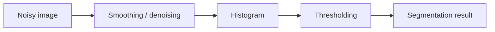

> [!info] 课件来源
> 原始课件：[[../附件/Part 2 - Image Transformation, Colour Images and Image Filtering/6 EBU6230_image_filtering.pdf]]  
> 本节对应 **Part 2 的第 3 个 PPT：Image Filtering**，主题是图像噪声、图像质量度量、卷积、空间域滤波、平滑与去噪。

---

## 0. 本节课的整体框架

这节课讲的是 **Image Filtering 图像滤波**。它承接前两节：

- PPT 1 讲图像变换，包括像素值变换和几何变换；
- PPT 2 讲彩色图像和颜色空间；
- PPT 3 开始讲如何利用邻域像素改善图像质量。

滤波的核心思想是：

> **一个像素的新值，不只由它自己决定，还由它周围邻域像素共同决定。**

因此，滤波比 point operation 点操作更强大。点操作只看单个像素，例如 $g(x,y)=2f(x,y)$；滤波会看一个窗口中的多个像素，例如 $3\times3$、$5\times5$ 或更大的邻域。

本节主要分成四块：

1. **Noise 噪声**：图像采集过程中为什么会出现噪声；
2. **Image quality measurement 图像质量度量**：怎样用 SNR、MSE、PSNR 评价失真；
3. **Convolution 卷积**：线性滤波的数学基础；
4. **Image smoothing and noise reduction 平滑与降噪**：均值滤波、高斯滤波、中值滤波等。

---

## 1. Learning objectives：学习目标

PPT 给出的学习目标包括：

- 熟悉图像采集中的各种噪声来源；
- 知道怎样度量数字图像中的图像质量和失真误差；
- 理解数字图像处理中线性滤波，也就是 convolution 卷积；
- 熟悉用于增强数字图像的线性、非线性和自适应滤波器。

从考试和作业角度，本节最重要的是：

| 主题 | 需要掌握 |
|---|---|
| 噪声 | 传感器噪声、热噪声、shot noise、量化噪声等 |
| 图像质量 | MSE、SNR、PSNR、error image |
| 卷积 | kernel/mask、翻转、加权求和、2D convolution |
| 边界处理 | zero-padding、periodic extension、mirroring |
| 平滑滤波 | mean filter、Gaussian filter |
| 非线性滤波 | median filter，尤其适合 salt-and-pepper noise |

---

## 2. Image function 与 digital image

PPT 先回顾图像的基本表示。

连续图像可以看作二维信号：

$$
f(x,y)
$$

其中：

- $x,y$ 表示空间位置；
- $f(x,y)$ 表示该位置的强度值。

数字图像是连续图像函数经过：

1. **sampling 采样**：把连续空间变成离散像素网格；
2. **quantization 量化**：把连续强度值变成有限个数值等级；

得到的离散版本。

因此数字图像可写作：

$$
f[x,y]
$$

这里方括号常用来强调离散坐标。

---

## 3. Image noise：图像噪声

### 3.1 什么是噪声

噪声是图像中不希望出现的随机扰动。它会让像素值偏离真实值，使图像变得粗糙、颗粒化或出现异常点。

可以把带噪图像写成：

$$
g(x,y)=f(x,y)+\eta(x,y)
$$

其中：

- $f(x,y)$ 是理想图像；
- $\eta(x,y)$ 是噪声；
- $g(x,y)$ 是观测到的图像。

### 3.2 传感器导致的噪声

PPT 提到 sensor induced noise，主要包括：

| 噪声来源 | 解释 |
|---|---|
| adjacent detectors interference | 相邻传感器单元之间互相干扰 |
| thermal noise | 热噪声，尤其在红外探测器中明显，可通过冷却降低 |
| leakage noise | 探测器表面导电导致的漏电噪声 |
| shot noise | 电子器件中电荷离散性带来的随机噪声 |
| analog-to-digital conversion noise | 模数转换时产生的误差 |
| quantum noise | 光子数量有限导致的随机波动 |

这些噪声的共同点是：它们来自成像系统本身，而不是图像内容本身。

### 3.3 SNR 降低的原因

PPT 列出 SNR 降低的原因：

- signal power 与 noise power 的比例变差；
- 原始信号太弱；
- 传输过程中有 propagation losses；
- 环境中有 background noise；
- 探测器温度带来 thermal fluctuations。

一句话：

> 信号越弱、噪声越强，SNR 越低，图像质量越差。

---

## 4. De-noising：去噪基本思想

去噪常用 **low-pass filter 低通滤波器**。

原因是很多噪声表现为快速变化的高频成分，而图像中的平滑区域主要由低频成分构成。

低通去噪的基本过程是：

1. 用一个滤波器窗口在图像上滑动；
2. 对窗口覆盖的像素做加权组合；
3. 用结果替换中心像素；
4. 得到更平滑的输出图像。

PPT 提到，大多数平滑滤波器具有两个特点：

- around origin symmetric：围绕中心对称；
- rapid fall-off from centre：离中心越远权重越小。

> [!note]
> 连续信号中会写成 convolution integral 卷积积分；数字图像中使用离散滤波器权重，也就是 kernel/mask。

---

## 5. Image quality measurement：图像质量度量

### 5.1 SNR：Signal-to-Noise Ratio

SNR 用于衡量信号相对于噪声有多强。

一般形式可以理解为：

$$
SNR=\frac{\text{signal power}}{\text{noise power}}
$$

SNR 越高，说明图像中真实内容越明显，噪声影响越小。

PPT 特别提醒：

> SNR 指标通常不能很好反映人类主观视觉感受。

也就是说，两个图像的 SNR 可能差不多，但人眼觉得一个明显更好；或者 PSNR 更高的图像，人眼并不一定更喜欢。

---

## 6. MSE 与 PSNR

### 6.1 MSE：Mean Squared Error

给定原图 $I(x,y)$ 和失真图像 $I'(x,y)$，图像大小为 $N\times M$，MSE 定义为：

$$
MSE=\frac{1}{NM}\sum_{x,y}[I(x,y)-I'(x,y)]^2
$$

含义：

- 每个像素都计算原图和失真图之间的差；
- 差值平方后求平均；
- MSE 越小，失真越小。

平方的作用是：

1. 消除正负号；
2. 放大较大的误差。

### 6.2 PSNR：Peak Signal-to-Noise Ratio

对于 8-bit 图像，最大像素值通常是：

$$
MAX_I=255
$$

标准 PSNR 公式是：

$$
PSNR=10\log_{10}\left(\frac{MAX_I^2}{MSE}\right)
$$

也可写作：

$$
PSNR=20\log_{10}\left(\frac{MAX_I}{\sqrt{MSE}}\right)
$$

对于 8-bit 图像：

$$
PSNR=20\log_{10}\left(\frac{255}{\sqrt{MSE}}\right)
$$

单位是 dB。

### 6.3 如何理解 PSNR

PPT 提到：

- PSNR 通常在 20 到 40 dB 之间；
- 常保留两位小数，例如 25.47 dB；
- 单个绝对数值不一定有意义；
- 比较两个重建图像时，PSNR 可以作为质量参考；
- 在视频编码中，0.5 dB 的提升常常可能被感知到。

> [!important]
> PSNR 越高，通常说明失真越小；但 PSNR 不是完美指标，因为它不完全符合人眼视觉感知。

---

## 7. Distortion error visualization：失真误差可视化

直接看原图和失真图的差值：

$$
D(x,y)=I(x,y)-I'(x,y)
$$

问题是：大多数误差数值很小，显示出来接近黑色，很难看清。

解决方法是把差值放大，构造 error image：

$$
E(x,y)=255\frac{D(x,y)-D_{min}}{D_{max}-D_{min}}
$$

其中：

- $D_{min}$ 是误差图中的最小差值；
- $D_{max}$ 是误差图中的最大差值；
- 通过线性拉伸，把误差映射到 $[0,255]$。

这样可以让肉眼看出哪些区域失真更明显。

---

## 8. Image enhancement：图像增强

PPT 把 image enhancement 的目的总结为：让图像更有用。

具体包括：

- highlight interesting details：突出有用细节；
- remove noise：去除噪声；
- make image visually appealing：让图像看起来更舒服。

图像增强技术大致分两类：

### 8.1 Spatial domain techniques

直接操作图像像素值。

常见目标：

- reduce noise 降噪；
- enhance edges 增强边缘。

### 8.2 Frequency domain techniques

先用 Fourier Transform 或 Wavelet Transform 把图像变到频率域，再处理。

本节主要讲空间域，频率域后续课程再讲。

---

## 9. Point operations 与 filtering

### 9.1 Point operations：点操作

点操作只根据当前像素自己的值来决定输出。

例如：

$$
g[x,y]=2f[x,y]
$$

每个像素乘以 2，亮度整体提高。

常见点操作包括：

- brightness adjustment 亮度调整；
- contrast adjustment 对比度调整；
- colour transformations 颜色空间变换；
- histogram equalization 直方图均衡化。

### 9.2 Filtering：滤波

滤波不只看当前像素，还看邻域。

可以写成：

$$
g[x,y]=F(\text{neighborhood of } f[x,y])
$$

其中 $F$ 可以是线性加权和，也可以是非线性操作，比如取中位数。

滤波更强大，但计算成本比点操作高。

---

## 10. Filter / Mask / Kernel 是什么

PPT 中 filter、mask、kernel 基本可以理解为同一类东西：一个小矩阵。

例如一个 $3\times3$ 均值滤波器：

$$
\frac{1}{9}
\begin{bmatrix}
1&1&1\\
1&1&1\\
1&1&1
\end{bmatrix}
$$

其中：

- 矩阵中的数叫 weights 权重；
- kernel 有一个 origin 原点，通常在中心；
- kernel 的选择决定滤波器效果。

常见操作：

| 滤波目的 | 效果 |
|---|---|
| blurring / smoothing | 平滑图像，减少噪声，边缘变软 |
| sharpening | 增强细节和边缘 |
| edge detection | 检测边缘或变化强烈区域 |

---

## 11. Linear filtering：线性滤波

线性滤波的定义：输出像素是输入邻域像素的线性组合。

设 kernel 为 $w(i,j)$，则：

$$
g(x,y)=\sum_i\sum_j w(i,j)f(x+i,y+j)
$$

或者根据卷积定义会出现 kernel 翻转，写法略有不同。

关键点是：

- 每个邻域像素乘以一个权重；
- 所有乘积相加；
- 得到输出像素。

线性滤波器包括：

- mean filter；
- Gaussian filter；
- Sobel operator；
- Prewitt operator；
- Laplace operator。

---

## 12. Correlation 与 Convolution

PPT 明确区分两种线性滤波方法：

### 12.1 Correlation：相关

Correlation 直接把 mask 套在图像上，不翻转 mask。

它常被看作一种相似度度量。

### 12.2 Convolution：卷积

Convolution 与 correlation 类似，但要先把 mask：

1. 水平方向翻转；
2. 垂直方向翻转；

再进行加权求和。

> [!tip]
> 如果 kernel 是中心对称的，比如均值滤波器或高斯滤波器，翻转前后一样，所以 correlation 和 convolution 的结果相同。  
> 如果 kernel 不对称，两者结果不同。

---

## 13. Convolution 的应用

PPT 中列出 convolution 的应用：

- **deconvolution**：去除之前线性操作带来的影响，例如去模糊；
- **noise removal**：通过滤波分离噪声和信号；
- **feature detection**：检测图像特征；
- **periodic noise removal**：去除周期噪声；
- **feature enhancement**：例如用 high-pass filter 增强细节。

因此卷积是图像处理里的基础工具。

---

## 14. 1D continuous convolution

连续一维卷积可以写成：

$$
c(t)=\int_{-\infty}^{+\infty}r(\tau)h(t-\tau)d\tau
$$

其中：

- $r(t)$ 是输入信号；
- $h(t)$ 是系统的 transfer function 或 filter function；
- $c(t)$ 是输出。

卷积的直观过程是：

1. 翻转一个函数；
2. 平移；
3. 与另一个函数相乘；
4. 对乘积面积积分。

### 14.1 Dirac delta

PPT 提到 Dirac delta $\delta(x)$：

$$
\delta(x)=0,\quad x\ne0
$$

并且：

$$
\int_{-\infty}^{+\infty}\delta(x)dx=1
$$

它可以理解为理想单位脉冲。

重要性质：

- 函数与 $\delta(x)$ 卷积，得到原函数；
- 函数与 $\delta(x-t)$ 卷积，会产生平移。

---

## 15. Discrete 1D convolution

数字图像是离散的，因此更常用离散卷积。

对一维离散信号 $r$ 和滤波器 $h$，输出为：

$$
c(i)=r(i)*h(i)=\sum_j h(j)r(i-j)
$$

也可写成：

$$
c(i)=\sum_j r(j)h(i-j)
$$

含义：当前输出点是输入信号附近样本的加权平均。

PPT 例子中，一维平滑核为：

$$
h=\left(\frac{1}{9},\frac{2}{9},\frac{1}{3},\frac{2}{9},\frac{1}{9}\right)
$$

它对中心点权重最大，离中心越远权重越小。

---

## 16. Convolution 的基本性质

PPT 给出卷积的三个重要性质：

### 16.1 Linearity：线性

$$
f*(\alpha h+\beta g)=\alpha(f*h)+\beta(f*g)
$$

说明卷积满足加法和数乘分配。

### 16.2 Associativity：结合律

$$
(f*g)*h=f*(g*h)
$$

说明多个滤波器连续作用时，可以先合成滤波器。

### 16.3 Derivative：导数性质

$$
\frac{d}{dt}(f*g)=f'*g=f*g'
$$

这说明平滑和求导之间存在可交换关系，是边缘检测和高斯导数滤波的理论基础。

---

## 17. 2D convolution：二维卷积

二维图像上的卷积定义为：

$$
y(k,l)=x(k,l)*g(k,l)
$$

$$
y(k,l)=\sum_{k'=-\infty}^{+\infty}\sum_{l'=-\infty}^{+\infty}x(k-k',l-l')g(k',l')
$$

其中：

- $x$ 是输入图像；
- $g$ 是卷积核；
- $y$ 是输出图像；
- $g(k',l')$ 是权重；
- $x(k-k',l-l')$ 是对应邻域像素。

直观理解：

> 把 kernel 放在某个像素中心，邻域像素分别乘以 kernel 中对应权重，然后把结果加起来，作为该像素的新值。

---

## 18. 2D 卷积的性质

### 18.1 Commutativity：交换律

$$
x*g=g*x
$$

即图像和滤波器在数学上交换顺序，结果相同。

### 18.2 Associativity：结合律

$$
x*(g*h)=(x*g)*h
$$

这意味着连续应用两个滤波器，可以等价为先把滤波器卷积成一个新滤波器。

### 18.3 Linearity：线性

$$
x*(g+h)=x*g+x*h
$$

如果图像乘以一个标量，卷积结果也乘以同一个标量。

---

## 19. 卷积时需要做的三个选择

PPT 提到实际做卷积时要决定：

1. window/filter 的形状；
2. window/filter 的大小；
3. 如何处理边界问题。

### 19.1 形状

常见形状是方形，例如：

- $3\times3$；
- $5\times5$；
- $7\times7$。

也可以是近似圆形、十字形或其他结构。

### 19.2 大小

窗口越大：

- 平滑能力越强；
- 噪声减少越明显；
- 边缘和细节模糊越严重；
- 计算量越大。

### 19.3 边界处理

如果 kernel 覆盖到图像外部，就需要给图像外的虚拟像素赋值。

---

## 20. Convolution procedure：卷积步骤

对每个像素执行：

1. **Positioning**：把窗口中心放在当前像素上；
2. **Multiply**：窗口覆盖的原图像素与 kernel 对应权重相乘；
3. **Add**：把所有乘积相加；
4. **Write output**：把结果写入输出图像对应位置。

伪代码：

```text
for each pixel (x, y):
    sum = 0
    for each offset (i, j) in kernel:
        sum += kernel(i, j) * image(x - i, y - j)
    output(x, y) = sum
```

注意：如果严格按 convolution，需要 kernel 翻转；很多实现中如果 kernel 对称，翻不翻结果一样。

---

## 21. Border problem：边界问题

当 kernel 位于图像边缘时，窗口会越过图像边界。

例如 $3\times3$ kernel 放在左上角像素时，会需要图像外的像素值。

PPT 给出几种解决方法：

| 方法 | 思路 | 优点 | 缺点 |
|---|---|---|---|
| Change filter size | 边界处缩小窗口 | 不需要虚拟像素 | 滤波效果不一致 |
| Enlarge image | 扩大图像边界 | 统一处理 | 需要决定填充值 |
| Fill with zeros | 图像外填 0 | 简单 | 容易产生黑边/边界伪影 |
| Periodic extension | 周期延拓 | 适合傅里叶假设 | 边界不连续时会出问题 |
| Mirroring | 镜像边界 | 边界伪影较小 | 实现稍复杂 |

### 21.1 Zero-padding

图像外全部填 0。

优点是简单；缺点是边缘会被黑色影响，产生 border artifacts。

### 21.2 Periodic extension

把图像看作周期重复。

优点：

- 方便软件实现；
- 与 Fourier Transform 的周期假设一致；
- 通常比 zero-padding 更好。

### 21.3 Mirroring

把边界像素像镜子一样反射出去。

优点：

- 边界变化更连续；
- 能减少边界伪影；
- 常常是较好的边界处理方式。

---

## 22. Spatial domain filtering 总结

空间域滤波可以概括为：

- 输出像素由输入图像局部邻域计算得到；
- 局部邻域由 window/mask/kernel 定义；
- 通过移动窗口遍历整幅图像；
- 对每个位置执行同样的局部计算。

用一句话说：

> **空间滤波就是在图像上滑动一个小窗口，用邻域像素计算中心像素的新值。**

---

## 23. Spatial domain filtering 的分类

PPT 将空间域滤波分为：

### 23.1 Linear filters

线性滤波器包括：

- smoothing filters：mean filters、Gaussian filters；
- edge enhancing filters：Sobel、Prewitt、Laplace 等。

### 23.2 Non-linear filters

非线性滤波器包括：

- median；
- min；
- max。

它们不是加权求和，而是对邻域做排序、取极值等非线性操作。

---

## 24. Low-pass filtering：低通滤波

低通滤波的作用是：

> filter out high frequencies，保留低频，抑制高频。

在图像中：

- 低频对应缓慢变化的大结构；
- 高频对应快速变化的细节、边缘和噪声。

所以低通滤波常用于：

- 平滑图像；
- 降低随机噪声；
- 模糊细节。

最简单的低通滤波器是平均滤波器。

---

## 25. Mean filter：均值滤波

均值滤波器对邻域内所有像素赋予相同权重。

典型 $3\times3$ mean filter：

$$
\frac{1}{9}
\begin{bmatrix}
1&1&1\\
1&1&1\\
1&1&1
\end{bmatrix}
$$

输出为邻域平均值：

$$
g(x,y)=\frac{1}{9}\sum_{i=-1}^{1}\sum_{j=-1}^{1}f(x+i,y+j)
$$

### 25.1 为什么要归一化

PPT 提到 normalization 是为了保持图像总能量。

如果 kernel 权重和不为 1，图像整体亮度会改变。

对于均值滤波器：

$$
\sum w(i,j)=1
$$

所以平均后整体亮度不会系统性变亮或变暗。

### 25.2 均值滤波的优缺点

优点：

- 简单；
- 快速；
- 能降低随机噪声。

缺点：

- severe edge blurring，严重模糊边缘；
- kernel 越大，图像越模糊；
- 对 salt-and-pepper noise 效果不如中值滤波。

> [!warning]
> 均值滤波会把噪声和真实边缘一起平均掉，所以降噪的同时会牺牲细节。

---

## 26. Mean filter size 的影响

PPT 展示了 $5\times5$ 和 $9\times9$ 滤波器的效果。

结论：

- kernel 越大，参与平均的像素越多；
- 噪声被压得更强；
- 图像细节也被抹得更严重；
- 边缘更宽、更模糊。

因此选择滤波器大小时要权衡：

$$
\text{noise reduction} \quad vs. \quad \text{detail preservation}
$$

---

## 27. Gaussian filter：高斯滤波

高斯滤波器是一种中心权重更大的平滑滤波器。

二维高斯核为：

$$
G_\sigma(k,l)=\frac{1}{2\pi\sigma^2}\exp\left(-\frac{k^2+l^2}{2\sigma^2}\right)
$$

其中：

- $k,l$ 是相对于中心的位置；
- $\sigma$ 控制平滑尺度；
- 距离中心越远，权重越小。

### 27.1 高斯滤波相比均值滤波的优势

均值滤波器中窗口内所有像素权重相同；高斯滤波器中中心权重大、远处权重小。

这更符合直觉：

> 离当前像素越近的像素，通常越应该对当前像素有更大影响。

因此高斯滤波通常比简单均值滤波更自然。

### 27.2 sigma 的作用

$\sigma$ 越大：

- 高斯分布越宽；
- 平滑范围越大；
- 图像越模糊。

$\sigma$ 越小：

- 权重更集中在中心；
- 平滑较弱；
- 保留更多细节。

---

## 28. Gaussian filter 的可分离性

PPT 强调 Gaussian filter 是 separable 可分离的。

二维高斯可以写成两个一维高斯的乘积：

$$
G_\sigma(k,l)=G_\sigma(k)G_\sigma(l)
$$

其中一维高斯为：

$$
G_\sigma(k)=\frac{1}{\sqrt{2\pi}\sigma}\exp\left(-\frac{k^2}{2\sigma^2}\right)
$$

因此 2D 卷积可以分两步做：

1. 先对每一行做 1D 高斯滤波；
2. 再对每一列做 1D 高斯滤波。

这样比直接使用二维 kernel 快很多。

例如一个 $n\times n$ kernel：

- 直接二维卷积每个像素约需要 $n^2$ 次乘法；
- 分离卷积只需要约 $2n$ 次乘法。

这对大 kernel 很重要。

### 28.1 高斯的其他性质

PPT 还提到：

- Gaussian 的 Fourier transform 仍然是 Gaussian；
- 两个 Gaussian 卷积的结果仍然是 Gaussian。

这说明高斯滤波在空间域和频率域都有很好的数学性质。

---

## 29. Linear pyramidal filter

PPT 还提到 linear pyramidal filter。

它比 Gaussian filter 简单：

- kernel 元素从中心向外线性下降；
- 而 Gaussian 是指数形式下降。

直观理解：

- 均值滤波：窗口内权重全一样；
- 金字塔滤波：中心大，向外线性变小；
- 高斯滤波：中心大，向外按指数规律变小。

---

## 30. Non-linear de-noising and smoothing

### 30.1 线性滤波的缺点

PPT 指出，线性滤波用于平滑或去噪时，会把所有结构都模糊掉，包括：

- points 点；
- edges 边缘；
- lines 线结构；
- textures 纹理。

结果是：噪声减少了，但整体图像质量也均匀下降。

### 30.2 非线性滤波的目标

更高级的滤波器希望做到：

> 去除高频噪声，同时尽量保持边缘清晰。

非线性滤波器不使用简单线性加权和，而是使用非线性函数组合邻域像素。

常见例子：

- min filter；
- max filter；
- median filter。

---

## 31. Median filter：中值滤波

中值滤波是最重要的非线性去噪滤波器之一。

操作步骤：

1. 取当前像素周围的邻域，例如 $3\times3$；
2. 把邻域内像素灰度值排序；
3. 取中间值 median；
4. 用该中间值替换中心像素。

例如邻域值为：

$$
[2,3,4,5,100]
$$

中值是：

$$
4
$$

而均值是：

$$
\frac{2+3+4+5+100}{5}=22.8
$$

可以看到，一个异常大的噪声点会严重影响均值，但不会影响中值太多。

### 31.1 为什么中值滤波适合 salt-and-pepper noise

Salt-and-pepper noise 是随机出现的黑白点：

- salt：白色噪点，值接近 255；
- pepper：黑色噪点，值接近 0。

这些噪声通常是极端值。

中值滤波对极端值不敏感，因此能很好去除这类噪声，同时比均值滤波更能保留边缘。

### 31.2 中值滤波 vs 均值滤波

| 对比 | 均值滤波 | 中值滤波 |
|---|---|---|
| 类型 | 线性 | 非线性 |
| 计算方式 | 加权平均 | 排序取中值 |
| 对高斯噪声 | 有一定效果 | 也可用，但不一定最优 |
| 对椒盐噪声 | 容易被极端值影响 | 非常有效 |
| 边缘保持 | 较差 | 较好 |

---

## 32. Adaptive filters：自适应滤波器

PPT 的学习目标提到 adaptive filters，并在 smoothing filters 中出现 adaptive / steerable 的概念。

可以这样理解：普通滤波器对整幅图像使用同一个 kernel；自适应滤波器会根据局部内容改变滤波方式。

例如：

- 平滑区域：可以强一些地平滑，去掉噪声；
- 边缘区域：应该少平滑或沿边缘方向平滑，避免边缘变糊；
- 纹理区域：需要保留结构，不应简单平均。

这类方法的目标是：

$$
\text{remove noise while preserving edges}
$$

也就是去噪同时保边。

---

## 33. Noise in histogram thresholding

PPT 最后提到 noise in histogram thresholding。

直方图阈值分割依赖灰度分布。如果图像噪声较强，直方图会变得更散、更重叠，导致：

- 阈值不明显；
- 类间分离困难；
- 分割结果出现很多孤立噪点；
- 目标边界不稳定。

因此，在 thresholding 之前经常要先做滤波去噪。

常见流程：



---

## 34. 本节课高频考点

| 考点 | 需要掌握 |
|---|---|
| 图像噪声模型 | $g=f+\eta$ |
| 噪声来源 | 热噪声、shot noise、ADC 噪声、quantum noise 等 |
| SNR | 信号功率与噪声功率之比，越高越好 |
| MSE | 原图和失真图的平均平方误差 |
| PSNR | $10\log_{10}(MAX_I^2/MSE)$，通常用 dB 表示 |
| error image | 把像素差异放大可视化 |
| point operation | 只依赖单个像素 |
| filter/mask/kernel | 小权重矩阵，用于邻域操作 |
| correlation vs convolution | convolution 要翻转 kernel |
| 2D convolution | 局部邻域加权求和 |
| border problem | 边界处缺少图像外像素 |
| zero-padding | 简单但易产生边界伪影 |
| mirroring | 常能减少边界伪影 |
| mean filter | 简单平均，降噪但模糊边缘 |
| Gaussian filter | 中心权重大，可分离，常用平滑滤波器 |
| median filter | 非线性，对椒盐噪声特别有效 |

---

## 35. 易错点总结

1. **把 filtering 和 point operation 混为一谈**  
   点操作只看当前像素，滤波看邻域像素。

2. **忘记 convolution 需要翻转 kernel**  
   correlation 不翻转，convolution 翻转。对称 kernel 时结果一样，不对称时不同。

3. **认为 PSNR 越高就一定人眼越喜欢**  
   PSNR 是客观误差指标，但不完全符合主观视觉质量。

4. **忽略边界处理**  
   卷积到图像边缘时必须定义图像外像素，否则无法计算。

5. **认为 kernel 越大越好**  
   kernel 大会更强降噪，但也更强模糊边缘和细节。

6. **把均值滤波用于椒盐噪声时效果不好**  
   因为极端噪点会拉偏均值，中值滤波更适合。

7. **忘记 Gaussian 可分离**  
   这是高斯滤波高效实现的重要性质。

---

## 36. 关键公式汇总

### 噪声图像模型

$$
g(x,y)=f(x,y)+\eta(x,y)
$$

### MSE

$$
MSE=\frac{1}{NM}\sum_{x,y}[I(x,y)-I'(x,y)]^2
$$

### PSNR

$$
PSNR=10\log_{10}\left(\frac{MAX_I^2}{MSE}\right)
$$

$$
PSNR=20\log_{10}\left(\frac{MAX_I}{\sqrt{MSE}}\right)
$$

### 一维离散卷积

$$
c(i)=\sum_j h(j)r(i-j)
$$

### 二维卷积

$$
y(k,l)=\sum_{k'}\sum_{l'}x(k-k',l-l')g(k',l')
$$

### 均值滤波器

$$
\frac{1}{9}
\begin{bmatrix}
1&1&1\\
1&1&1\\
1&1&1
\end{bmatrix}
$$

### 二维高斯核

$$
G_\sigma(k,l)=\frac{1}{2\pi\sigma^2}\exp\left(-\frac{k^2+l^2}{2\sigma^2}\right)
$$

### 高斯可分离性

$$
G_\sigma(k,l)=G_\sigma(k)G_\sigma(l)
$$

---

## 37. 用一句话串起整节课

> 本节课先解释图像噪声从哪里来、如何用 MSE/PSNR 评价失真，再用卷积建立空间域线性滤波的数学框架，最后比较均值滤波、高斯滤波和中值滤波等去噪方法，说明滤波的核心权衡是“降噪”和“保留边缘细节”。

---

## 38. 自测题

1. 图像噪声有哪些常见来源？  
2. SNR 降低通常由哪些因素导致？  
3. MSE 和 PSNR 分别如何计算？  
4. 为什么 PSNR 不能完全代表人眼主观质量？  
5. point operation 和 filtering 有什么区别？  
6. mask、kernel、filter 三个词在本节中分别指什么？  
7. correlation 和 convolution 的核心区别是什么？  
8. 为什么卷积时会出现 border problem？  
9. zero-padding、periodic extension、mirroring 各有什么特点？  
10. 为什么均值滤波会模糊边缘？  
11. Gaussian filter 的 $\sigma$ 控制什么？  
12. 为什么 Gaussian filter 可以更快实现？  
13. median filter 为什么适合处理 salt-and-pepper noise？  
14. 在阈值分割前为什么常常要先去噪？

---

## 39. 和前后课程的联系

- 和 PPT 1 Image Transformation 的联系：本节的滤波仍然属于 spatial domain processing，直接在像素邻域上操作。  
- 和 PPT 2 Colour Images 的联系：滤波可以作用在 RGB 三个通道上，也可以转换到亮度/色度空间后只重点处理亮度或色度。  
- 和后续边缘检测的联系：Sobel、Prewitt、Laplace 都可以看作特殊滤波器，本节的卷积是后续边缘检测的基础。  
- 和压缩/视频处理的联系：PSNR 是压缩重建质量评价中非常常用的客观指标；低通滤波、噪声抑制和频率分析也会在后续视频与压缩中继续出现。
