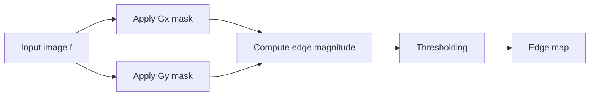
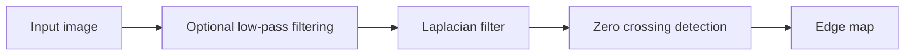
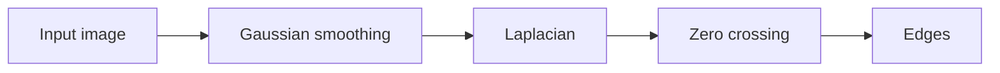

> [!info] 课件来源
> 原始课件：[[../附件/Part 3 - Edges, Interest points, and Morphology/3-1_Edges-I.pdf]]  
> 本节对应 **Part 3 的第 1 个 PPT：Edges-I**。主题是图像分割中的边缘检测，重点包括 **gradient 一阶导数边缘检测、Roberts/Prewitt/Sobel 模板、Laplacian 二阶导数、zero crossing、unsharp masking、LoG / Marr-Hildreth**。

---

## 0. 本节课的整体框架

这节课从 **image segmentation 图像分割** 引出 **edge detection 边缘检测**。

图像分割的目标是：

> **把图像中的像素划分成若干组，使每一组像素尽可能对应真实场景中的某个物体、区域或结构。**

边缘检测是分割中最常见的第一步，因为很多物体的轮廓、区域边界、深度突变或亮度突变都会在图像中表现为 **灰度值的突然变化**。

PPT 的主线可以整理为：

1. **Segmentation problem**：为什么要把图像分成区域；
2. **Edges**：边缘是什么，边缘为什么重要；
3. **Derivatives**：为什么一阶/二阶导数能检测灰度突变；
4. **Gradient method**：用一阶导数检测边缘强度和方向；
5. **Roberts / Prewitt / Sobel**：常见边缘检测模板；
6. **Laplacian method**：用二阶导数和 zero crossing 找边缘；
7. **Unsharp masking**：利用边缘增强实现图像锐化；
8. **LoG / Marr-Hildreth**：先平滑再求 Laplacian，降低噪声影响。

> [!tip] 一句话理解本节
> **边缘检测就是寻找图像中灰度变化剧烈的位置；一阶导数看变化率，二阶导数看变化率的变化，并常通过 zero crossing 定位边缘。**

---

## 1. Image segmentation：图像分割问题

### 1.1 什么是 segmentation

PPT 对 segmentation 的定义是：

> **Segmentation: divide the pixels of an image into groups that strongly correlate with the objects in an image.**

也就是：

- 输入：一张普通图像；
- 输出：若干个区域、物体或结构；
- 目标：让每个区域尽量和真实物体或语义结构对应。

例如一张细胞图像，分割之后可以把每个细胞单独标出；一张人像或建筑图像，分割之后可以把前景、背景、轮廓、纹理区域分开。

### 1.2 为什么 segmentation 重要

图像分割通常是自动计算机视觉任务的第一步。例如：

| 后续任务 | 为什么需要分割 |
|---|---|
| object recognition 物体识别 | 先知道物体大致在哪里，再识别它是什么 |
| shape analysis 形状分析 | 需要提取轮廓和边界 |
| medical image analysis 医学图像分析 | 需要分出病灶、器官、细胞等区域 |
| industrial inspection 工业检测 | 需要找裂纹、缺陷、边界或异常点 |

所以，本节课并不是单独讲“边缘好看不好看”，而是在为后续 **自动视觉理解** 做准备。

---

## 2. Discontinuities：点、线、边缘

PPT 把图像中的 discontinuities 分成：

- **points 点**；
- **lines 线**；
- **edges 边缘**。

它们的共同点是：局部灰度值和周围区域明显不同。

### 2.1 Point detection 点检测

点检测关注的是局部孤立异常点。例如 X-ray 图像中某个小缺陷、亮点或暗点。

点检测通常流程是：

1. 用某种模板增强孤立点；
2. 对响应结果做 thresholding；
3. 得到二值检测结果。

### 2.2 Line detection 线检测

线检测关注某个方向上的细长结构。PPT 中有 `-45° line detector` 的例子。

线检测的核心思想是：

> **如果一个模板的方向和图像中的线方向一致，卷积响应会比较强。**

这也是后面 Roberts、Prewitt、Sobel 这些模板方法的基础：模板本质上是在检测某种方向的变化模式。

### 2.3 Edge detection 边缘检测

边缘是最重要的一类 discontinuity。

PPT 中说 edges：

- define the **shape** of objects in a scene；
- correspond to **large variations** in pixel values。

也就是说，边缘往往对应物体轮廓或区域边界，并表现为像素值的剧烈变化。

---

## 3. Edges：边缘是什么

### 3.1 边缘的直观定义

在灰度图像中，如果某个位置左边比较暗、右边比较亮，中间发生明显过渡，那么这个位置附近就是一条边缘。

数学上可以理解为：

> **边缘是图像函数 $f(x,y)$ 在空间位置上发生显著变化的地方。**

如果把图像的一行像素看成一维函数 $f(x)$，边缘就表现为函数值的跳变或快速过渡。

### 3.2 边缘不一定等于物体边界

PPT 强调：强度变化可能由多种物理或非物理原因造成。

#### 几何原因 geometric events

| 原因 | 解释 |
|---|---|
| object boundary | 物体边界，常伴随深度、颜色或纹理不连续 |
| surface boundary | 表面方向、颜色或纹理发生不连续 |
| depth discontinuity | 深度发生突变，例如前景物体遮挡背景 |
| surface normal discontinuity | 表面法线方向突变，例如棱角 |

#### 非几何原因 non-geometric events

| 原因 | 解释 |
|---|---|
| specularity | 镜面高光，来自直接反射 |
| shadows | 阴影，可能来自其他物体或自身遮挡 |
| inter-reflections | 物体之间的互反射 |
| illumination discontinuity | 光照突然变化 |

> [!warning] 易错点
> 边缘检测算法只看图像中的灰度/颜色变化，它并不知道变化一定来自真实物体边界。阴影、高光、纹理也可能产生强边缘。

---

## 4. Edge detection：边缘检测的目标与要求

### 4.1 基本策略

PPT 给出的 strategy 是：

- finding points of **large variation** in an image；
- measure gray-level transitions in a meaningful way。

翻译成处理流程就是：

1. 计算每个位置的局部变化程度；
2. 找出变化大的位置；
3. 用阈值或后处理保留真正的边缘；
4. 得到边缘图像。

### 4.2 好的边缘检测器需要区分三类变化

PPT 特别强调，一个好的 edge detector 必须区分：

| 类型 | 是否应该保留 | 说明 |
|---|---|---|
| noise 引起的变化 | 通常不应该 | 噪声是随机扰动，会产生假边缘 |
| texture 引起的变化 | 视任务而定 | 纹理变化可能不是物体边界 |
| true object edges | 应该保留 | 真实物体轮廓或区域边界 |

这也是为什么边缘检测通常会有：

- smoothing 平滑；
- thresholding 阈值；
- non-maximum suppression 非极大值抑制；
- edge linking 边缘连接；
- post-processing 后处理。

本节 PPT 主要讲前半部分，即导数、梯度、Laplacian 和 LoG。

### 4.3 边缘检测结果的形式

边缘检测结果通常有两种显示方式：

1. **二值边缘图**：边缘像素为白，非边缘像素为黑；
2. **叠加显示**：把边缘用某种颜色叠加到原图上。

---

## 5. 边缘检测方法分类

PPT 把边缘检测方法分成三类：

| 类别 | 方法 | 核心思想 |
|---|---|---|
| Differential methods | Gradient, Laplacian | 用一阶或二阶导数检测灰度变化 |
| Template methods | Roberts, Prewitt, Sobel | 用固定卷积模板近似导数 |
| Optimisation methods | Marr, Canny | 建立边缘、噪声和检测质量模型，优化检测结果 |

本节重点是：

- **Gradient**：一阶导数；
- **Laplacian**：二阶导数；
- **Unsharp masking**：边缘增强/锐化；
- **LoG / Marr-Hildreth**：Gaussian smoothing + Laplacian + zero crossing。

Canny、thresholding、region-based segmentation 在后续 PPT 继续讲。

---

## 6. Edges and derivatives：边缘与导数

### 6.1 为什么导数能找边缘

边缘是灰度值快速变化的位置，而导数本质上衡量函数变化率。

对于一维灰度剖面 $f(x)$：

- 平坦区域：灰度几乎不变，导数接近 0；
- 边缘区域：灰度快速变化，一阶导数变大；
- 边缘中心附近：二阶导数可能发生符号变化，即 zero crossing。

### 6.2 一阶导数 first derivative

连续形式：

$$
f'(x)=\lim_{h\to 0}\frac{f(x+h)-f(x)}{h}
$$

当像素间隔取 $h=1$ 时，可以近似为：

$$
f'(x)\approx f(x+1)-f(x)
$$

对应的一维 mask 是：

$$
[-1,\;1]
$$

常见差分形式：

| 名称 | 公式 | 说明 |
|---|---|---|
| backward difference | $f'(x)\approx f(x)-f(x-1)$ | 用当前点和前一个点 |
| forward difference | $f'(x)\approx f(x+1)-f(x)$ | 用后一个点和当前点 |
| central difference | $f'(x)\approx f(x+1)-f(x-1)$ | 用左右两侧点，常见教材会再除以 2 |

PPT 中还用 mask：

$$
[-1,\;0,\;+1]
$$

来说明 step、ramp 和 impulse 的响应。

### 6.3 二阶导数 second derivative

二阶导数可以看成“一阶导数的变化率”。PPT 推导得到：

$$
f''(x)\approx f(x+1)-2f(x)+f(x-1)
$$

对应 mask：

$$
[1,\;-2,\;1]
$$

有些图中也会使用相反符号的 mask：

$$
[-1,\;2,\;-1]
$$

这两个只差一个负号，边缘位置不变，只是响应的正负相反。

### 6.4 Step edge、ramp edge、impulse 的响应

| 信号类型 | 一阶导数响应 | 二阶导数响应 |
|---|---|---|
| step edge 阶跃边缘 | 有明显响应，但位置可能不够精确 | 出现正负成对响应，可用 zero crossing 定位 |
| ramp edge 斜坡边缘 | 产生较宽、较弱的响应 | 边缘两侧出现较弱响应 |
| impulse 脉冲/亮线 | 一阶导数像 whip，一正一负 | 二阶导数像 double whip，且可能放大噪声 |

> [!note] ramp 与 slope
> 在这里 **ramp edge** 指灰度不是瞬间跳变，而是逐渐过渡；**slope** 是这个过渡的斜率。ramp 越宽，局部 slope 越小，边缘响应通常越弱、越宽。

### 6.5 导数方法为什么怕噪声

噪声通常包含高频变化，而导数运算本质上会增强高频成分。

所以：

> **Derivative based edge detectors are sensitive to noise.**

直观理解：

- 原图中一个小噪声点可能只是轻微起伏；
- 求导之后，起伏会被放大；
- 结果中可能出现大量假边缘。

因此很多边缘检测算法都会先进行 smoothing，例如 Gaussian smoothing。

---

## 7. Gradient：二维图像的一阶导数

### 7.1 图像梯度定义

对于二维图像函数 $f(x,y)$，梯度定义为：

$$
\nabla f(x,y)=
\begin{bmatrix}
G_x \\
G_y
\end{bmatrix}
=
\begin{bmatrix}
\frac{\partial f(x,y)}{\partial x} \\
\frac{\partial f(x,y)}{\partial y}
\end{bmatrix}
$$

梯度是一个向量，它指向图像灰度值增长最快的方向。

### 7.2 梯度幅值 magnitude

梯度幅值表示边缘强度：

$$
|\nabla f|=\sqrt{G_x^2+G_y^2}
$$

为了减少计算量，也常用近似：

$$
|\nabla f|\approx |G_x|+|G_y|
$$

PPT 的 flow diagram 中给了两种方案：

| 方案         | 公式                   | 特点             |     |     |     |                       |
| ---------- | -------------------- | -------------- | --- | --- | --- | --------------------- |
| Solution A | $\sqrt{G_x^2+G_y^2}$ | 更接近欧氏长度，但计算稍复杂 |     |     |     |                       |
| Solution B | $                    | G_x            | +   | G_y | $   | 更简单，PPT 中标为 preferred |

### 7.3 梯度方向 direction

梯度方向为：

$$
\theta=\arctan\left(\frac{G_y}{G_x}\right)
$$

实际编程中更推荐用：

$$
\theta=\operatorname{atan2}(G_y,G_x)
$$

因为 `atan2` 能正确处理象限和 $G_x=0$ 的情况。

> [!warning] 重要概念
> **梯度方向是灰度变化最快的方向，它与边缘方向垂直。**  
> 例如一条竖直边缘，灰度主要沿水平方向变化，所以梯度大致水平。

### 7.4 用有限差分估计梯度

PPT 中给出有限差分近似：

$$
\frac{\partial f}{\partial x}\approx f(x+1,y)-f(x,y)
$$

$$
\frac{\partial f}{\partial y}\approx f(x,y+1)-f(x,y)
$$

二维图像中通常通过卷积 mask 来计算 $G_x$ 和 $G_y$。

---

## 8. Roberts、Prewitt、Sobel 算子

这些算子都是用小尺寸模板近似图像梯度。

### 8.1 Roberts operator

Roberts 使用两个 $2\times2$ 对角方向模板：

$$
\begin{bmatrix}
-1 & 0\\
0 & 1
\end{bmatrix}
\qquad
\begin{bmatrix}
0 & -1\\
1 & 0
\end{bmatrix}
$$

特点：

- 计算快，模板小；
- 检测对角方向变化；
- 没有明确中心点，边缘定位可能不如 $3\times3$ 模板稳定；
- 对噪声比较敏感。

### 8.2 Prewitt operator

Prewitt 使用两个 $3\times3$ 模板：

$$
\begin{bmatrix}
-1 & -1 & -1\\
0 & 0 & 0\\
1 & 1 & 1
\end{bmatrix}
\qquad
\begin{bmatrix}
-1 & 0 & 1\\
-1 & 0 & 1\\
-1 & 0 & 1
\end{bmatrix}
$$

如果把 $3\times3$ 邻域写成：

$$
\begin{bmatrix}
z_1 & z_2 & z_3\\
z_4 & z_5 & z_6\\
z_7 & z_8 & z_9
\end{bmatrix}
$$

课件中的写法为：

$$
G_x=(z_7+z_8+z_9)-(z_1+z_2+z_3)
$$

$$
G_y=(z_3+z_6+z_9)-(z_1+z_4+z_7)
$$

> [!note] 符号提醒
> 不同教材可能会把 $G_x$、$G_y$ 的命名或 mask 方向交换。考试时按课件约定写；理解时只要记住：一个模板测水平/垂直方向变化，另一个测另一方向变化。

Prewitt 的优点是简单，缺点是平滑能力有限。

### 8.3 Sobel operator

Sobel 与 Prewitt 类似，但中间行/列权重为 2：

$$
\begin{bmatrix}
-1 & -2 & -1\\
0 & 0 & 0\\
1 & 2 & 1
\end{bmatrix}
\qquad
\begin{bmatrix}
-1 & 0 & 1\\
-2 & 0 & 2\\
-1 & 0 & 1
\end{bmatrix}
$$

课件中的写法为：

$$
G_x=(z_7+2z_8+z_9)-(z_1+2z_2+z_3)
$$

$$
G_y=(z_3+2z_6+z_9)-(z_1+2z_4+z_7)
$$

Sobel 的中心权重为 2，因此有轻微平滑效果，比 Prewitt 对噪声稍微更鲁棒。

### 8.4 三者对比

| 算子 | 模板大小 | 优点 | 缺点 |
|---|---:|---|---|
| Roberts | $2\times2$ | 快、简单 | 没有清晰中心，对噪声敏感，定位不够稳定 |
| Prewitt | $3\times3$ | 简单，能检测水平/垂直边缘 | 平滑能力一般 |
| Sobel | $3\times3$ | 带一点平滑，抗噪略好 | 仍然是局部模板，对强噪声仍敏感 |

---

## 9. Gradient method 的完整流程

PPT 中的 gradient method 可以总结为：

具体步骤：

1. 对图像卷积，得到 $G_x$；
2. 对图像卷积，得到 $G_y$；
3. 计算梯度幅值：
   $$
   |\nabla f|=\sqrt{G_x^2+G_y^2}
   $$
   或近似为：
   $$
   |\nabla f|\approx |G_x|+|G_y|
   $$
4. 设置阈值 $T$：
   $$
   |\nabla f|>T
   $$
   则认为该点可能是边缘点；
5. 进行后处理，例如去除噪声边缘、细化粗边缘、连接断裂边缘。

### 9.1 阈值 threshold 的作用

如果不设阈值，所有微小变化都会被当作边缘。设阈值可以减少噪声影响。

但阈值选择有 trade-off：

| 阈值 | 结果 |
|---|---|
| 太低 | 噪声和纹理也被保留，边缘图很乱 |
| 太高 | 弱边缘消失，轮廓断裂 |
| 合适 | 保留主要边缘，抑制噪声 |

### 9.2 local maximum detection

PPT 提到 local maximum detection。它的目的通常是：

> 沿梯度方向只保留局部最大的响应，使边缘变细。

这和后续 Canny 边缘检测中的 non-maximum suppression 思想相关。

---

## 10. Laplacian：二维二阶导数

### 10.1 连续 Laplacian 定义

二维连续图像的 Laplacian 是：

$$
\nabla^2 f(x,y)=\frac{\partial^2 f(x,y)}{\partial x^2}+\frac{\partial^2 f(x,y)}{\partial y^2}
$$

它是一个二阶导数算子，用来衡量图像局部变化率的变化。

### 10.2 离散 Laplacian

离散情况下：

$$
\frac{\partial^2 f(x,y)}{\partial x^2}
\approx f(x+1,y)+f(x-1,y)-2f(x,y)
$$

$$
\frac{\partial^2 f(x,y)}{\partial y^2}
\approx f(x,y+1)+f(x,y-1)-2f(x,y)
$$

合起来：

$$
\nabla^2 f(x,y)\approx f(x+1,y)+f(x-1,y)+f(x,y+1)+f(x,y-1)-4f(x,y)
$$

对应 $4$ 邻域 mask：

$$
\begin{bmatrix}
0 & 1 & 0\\
1 & -4 & 1\\
0 & 1 & 0
\end{bmatrix}
$$

也常见 $8$ 邻域 mask：

$$
\begin{bmatrix}
1 & 1 & 1\\
1 & -8 & 1\\
1 & 1 & 1
\end{bmatrix}
$$

同样，符号可以整体取反，边缘位置不变，只是响应正负相反。

### 10.3 Laplacian method 流程

Laplacian 边缘检测通常不是直接看响应大小，而是找 **zero crossing**。

流程：

PPT 特别强调：Laplacian 对噪声非常敏感，所以实际使用时最好先低通滤波。

---

## 11. Zero crossing：零交叉

### 11.1 什么是 zero crossing

Zero crossing 指滤波响应从正变负或从负变正的位置。

对于二阶导数来说，边缘附近常出现一正一负的响应，二者之间穿过 0 的地方就是边缘位置。

直观理解：

- 一阶导数：边缘处出现峰值；
- 二阶导数：边缘两侧出现正负响应，中间过零；
- 过零点可以用来定位边缘。

### 11.2 Laplacian 的性质

PPT 总结 Laplacian 的性质：

| 性质 | 含义 |
|---|---|
| isotropic | 各方向性质相同，不偏向某个方向 |
| cheaper to implement | 只需要一个 mask，比同时算 $G_x,G_y$ 便宜 |
| no edge direction | 只能告诉你哪里可能有边缘，不提供边缘方向 |
| sensitive to noise | 二阶导数会更强烈放大噪声 |

> [!warning] 易错点
> Gradient 可以给出 edge strength 和方向信息；Laplacian 通常只给出二阶响应和 zero crossing，不直接给出边缘方向。

---

## 12. Unsharp masking：非锐化掩蔽与图像锐化

### 12.1 为什么叫 unsharp masking

名字看起来像“让图像不锐”，但实际用途是 **sharpening 锐化**。

它的思想是：

1. 先把原图模糊，得到 blurred image；
2. 用原图减去模糊图，得到细节/边缘 mask；
3. 把这个 mask 加回原图，使边缘更明显。

公式：

$$
\text{mask}=f-f_{blur}
$$

$$
g=f+k(f-f_{blur})
$$

其中：

- $f$ 是原图；
- $f_{blur}$ 是模糊图；
- $f-f_{blur}$ 主要保留高频细节和边缘；
- $k$ 控制锐化强度。

当 $k$ 越大，边缘增强越强，但噪声也越容易被放大。

### 12.2 Mach banding 与视觉解释

PPT 用 Mach bands 解释 unsharp masking 的直觉。

Mach banding 是人类视觉系统的一种现象：

> 在亮度阶梯的边界附近，人眼会感到边界一侧更亮、另一侧更暗，好像边缘被额外增强了。

Unsharp masking 就是在图像处理中人为制造类似效果，让边缘附近形成更强的亮暗对比。

### 12.3 用 Laplacian 做锐化

Laplacian 会突出灰度二阶变化，因此也可以用于锐化。常见思想是：

$$
g = f - c\nabla^2 f
$$

或根据 mask 符号写成：

$$
g = f + c\nabla^2 f
$$

关键是：

> **根据 Laplacian mask 的中心符号决定加还是减，目标都是把边缘细节增强回原图。**

PPT 中还展示了不同 scaling factor 对锐化强度的影响：

| mask intensity | 效果 |
|---|---|
| low | 轻微增强，较自然 |
| medium | 边缘更清楚 |
| high | 边缘很强，但可能出现过冲、振铃或噪声放大 |

---

## 13. LoG：Laplacian of Gaussian

### 13.1 为什么需要 LoG

Laplacian 对噪声很敏感。解决方法是：

> **先用 Gaussian 低通滤波平滑图像，再应用 Laplacian。**

这就是 LoG，Laplacian of Gaussian。

### 13.2 Gaussian 函数

PPT 中的 Gaussian 写作：

$$
G(r)=e^{-\frac{r^2}{2\sigma^2}},\qquad r^2=x^2+y^2
$$

其中：

- $r$ 是到中心的距离；
- $\sigma$ 是标准差；
- $\sigma$ 越大，平滑尺度越大。

实际完整归一化形式常写作：

$$
G(x,y)=\frac{1}{2\pi\sigma^2}e^{-\frac{x^2+y^2}{2\sigma^2}}
$$

但边缘检测中常数因子不影响 zero crossing 的位置。

### 13.3 LoG 的数学形式

PPT 中给出：

$$
\nabla^2[f(x,y)*G(x,y)] = \nabla^2G(x,y)*f(x,y)
$$

这利用了卷积的结合性/可交换性：可以先把 Gaussian 和 Laplacian 合成一个滤波器，再和图像卷积。

PPT 中 LoG 公式为：

$$
\nabla^2G(r)=\left[\frac{r^2-\sigma^2}{\sigma^4}\right]e^{-\frac{r^2}{2\sigma^2}}
$$

> [!note] 公式版本提醒
> 不同教材对 Gaussian 是否归一化、Laplacian 符号方向、二维常数项的处理可能略有不同，所以 LoG 公式可能出现常数或整体符号差异。考试时优先按课件写法；理解时重点是“Gaussian smoothing + Laplacian + zero crossing”。

### 13.4 Mexican hat function

LoG 的形状像中间凸起、周围凹陷的帽子，所以也叫：

> **Mexican hat function 墨西哥帽函数**

它对边缘的响应通常表现为：

- 离边缘很远：响应接近 0；
- 边缘一侧：响应为正；
- 边缘另一侧：响应为负；
- 边缘位置附近：响应穿过 0。

因此可以通过 zero crossing 检测边缘。

---

## 14. Marr-Hildreth method

Marr-Hildreth 方法可以理解为 LoG 边缘检测框架。

基本流程：

由于：

$$
\nabla^2(G_\sigma*f)=(\nabla^2G_\sigma)*f
$$

所以可以预先计算不同尺度的 LoG filter bank：

$$
\nabla^2G_{\sigma_1},\;\nabla^2G_{\sigma_2},\;\ldots,\;\nabla^2G_{\sigma_n}
$$

然后分别对图像滤波，得到不同尺度下的边缘。

### 14.1 scale 的影响

PPT 展示了 low scale 和 high scale 的 zero crossing 结果。

| scale / $\sigma$ | 效果 |
|---|---|
| 小尺度 | 保留更多细节，也更容易受噪声和纹理影响 |
| 大尺度 | 平滑更强，边缘更稳定，但细小结构可能消失 |

所以选择 $\sigma$ 是一个重要 trade-off。

---

## 15. LoG 的近似：DoG 与 DoB

LoG 计算相对较复杂，可以用近似方法加速。

### 15.1 DoG：Difference of Gaussians

PPT 提到：

> LoG filter can be approximated by the difference of two differently sized Gaussians.

即：

$$
DoG = G_{\sigma_1}-G_{\sigma_2}
$$

其中 $\sigma_1$ 和 $\sigma_2$ 不同。

DoG 的直觉是：

- 小尺度 Gaussian 保留较多细节；
- 大尺度 Gaussian 更模糊；
- 两者相减后保留“某个尺度附近的变化”。

### 15.2 DoB：Difference of Boxes

更粗糙但更快的近似是：

> **DoB = Difference of Boxes**

也就是用两个不同大小的 mean filter / box filter 相减。

它计算更快，但近似更粗。

---

## 16. 本节核心对比表

| 方法 | 导数阶数 | 主要输出 | 优点 | 缺点 |
|---|---|---|---|---|
| Gradient | 一阶导数 | 边缘强度 + 方向 | 直观，可用 Roberts/Prewitt/Sobel 实现 | 对噪声敏感，边缘可能较粗 |
| Roberts | 一阶导数模板 | 对角梯度 | 快 | $2\times2$ 无明确中心，抗噪差 |
| Prewitt | 一阶导数模板 | 水平/垂直梯度 | 简单 | 平滑弱 |
| Sobel | 一阶导数模板 | 水平/垂直梯度 | 中心权重 2，抗噪略好 | 仍可能受噪声影响 |
| Laplacian | 二阶导数 | zero crossing | isotropic，只需一个 mask | 无方向信息，噪声敏感 |
| Unsharp masking | 高频增强 | 锐化图像 | 增强边缘和细节 | 会放大噪声，过强会不自然 |
| LoG | Gaussian + 二阶导数 | zero crossing | 先平滑再检测，抗噪更好 | $\sigma$ 选择影响结果，计算较复杂 |
| DoG / DoB | LoG 近似 | 多尺度边缘/细节 | 更快 | 只是近似 |

---

## 17. 考试与作业重点

### 17.1 必须会写的公式

一阶导数：

$$
f'(x)\approx f(x+1)-f(x)
$$

二阶导数：

$$
f''(x)\approx f(x+1)-2f(x)+f(x-1)
$$

梯度：

$$
\nabla f=\begin{bmatrix}G_x\\G_y\end{bmatrix}
$$

梯度幅值：

$$
|\nabla f|=\sqrt{G_x^2+G_y^2}\approx |G_x|+|G_y|
$$

梯度方向：

$$
\theta=\arctan\left(\frac{G_y}{G_x}\right)
$$

Laplacian：

$$
\nabla^2 f=\frac{\partial^2 f}{\partial x^2}+\frac{\partial^2 f}{\partial y^2}
$$

离散 Laplacian：

$$
\nabla^2 f(x,y)\approx f(x+1,y)+f(x-1,y)+f(x,y+1)+f(x,y-1)-4f(x,y)
$$

Unsharp masking：

$$
g=f+k(f-f_{blur})
$$

LoG：

$$
\nabla^2[f*G]=f*(\nabla^2G)
$$

### 17.2 必须会认的 mask

Roberts：

$$
\begin{bmatrix}-1&0\\0&1\end{bmatrix},\quad
\begin{bmatrix}0&-1\\1&0\end{bmatrix}
$$

Prewitt：

$$
\begin{bmatrix}-1&-1&-1\\0&0&0\\1&1&1\end{bmatrix},\quad
\begin{bmatrix}-1&0&1\\-1&0&1\\-1&0&1\end{bmatrix}
$$

Sobel：

$$
\begin{bmatrix}-1&-2&-1\\0&0&0\\1&2&1\end{bmatrix},\quad
\begin{bmatrix}-1&0&1\\-2&0&2\\-1&0&1\end{bmatrix}
$$

Laplacian：

$$
\begin{bmatrix}0&1&0\\1&-4&1\\0&1&0\end{bmatrix},\quad
\begin{bmatrix}1&1&1\\1&-8&1\\1&1&1\end{bmatrix}
$$

---

## 18. 易混点整理

| 易混点 | 正确理解 |
|---|---|
| edge direction vs gradient direction | 梯度方向垂直于边缘方向 |
| Gradient vs Laplacian | Gradient 是一阶导数，有方向；Laplacian 是二阶导数，常用 zero crossing，无方向 |
| Sobel vs Prewitt | Sobel 中心权重为 2，有轻微平滑，抗噪略好 |
| Laplacian 直接检测边缘 | 更常见是看 zero crossing，而不是只看响应大小 |
| LoG 为什么先平滑 | 因为二阶导数极其敏感噪声 |
| unsharp masking | 名字有 unsharp，但实际用于 sharpening |
| true edge vs texture/noise | 边缘检测算法可能把纹理或噪声误认为边缘 |

---

## 19. 自测题

1. 为什么边缘检测可以看作图像分割的第一步？
2. 一阶导数和二阶导数在 step edge 上的响应有什么区别？
3. 为什么导数型边缘检测器对噪声敏感？
4. 写出 Sobel 的两个 $3\times3$ mask。
5. 为什么 Sobel 通常比 Prewitt 抗噪声稍好？
6. 梯度方向和边缘方向是什么关系？
7. Laplacian 为什么不能直接提供边缘方向？
8. 什么是 zero crossing？它为什么能用于 Laplacian 边缘检测？
9. Unsharp masking 的三个步骤是什么？
10. LoG 为什么等价于先 Gaussian smoothing 再 Laplacian？
11. $\sigma$ 变大时，LoG 检测结果会发生什么变化？
12. DoG 和 DoB 分别是什么？它们为什么可以近似 LoG？

---

## 20. 本节总结

本节课的重点是：

- **边缘是图像灰度或颜色发生显著变化的位置**；
- 边缘检测常用于图像分割、形状分析和识别；
- 一阶导数形成 **gradient method**，可以得到边缘强度和方向；
- Roberts、Prewitt、Sobel 是常见的一阶导数模板；
- 二阶导数形成 **Laplacian method**，常通过 zero crossing 定位边缘；
- Laplacian 对噪声敏感，所以通常要先 smoothing；
- Unsharp masking 用“原图 - 模糊图”的高频细节增强边缘，实现锐化；
- LoG 把 Gaussian smoothing 和 Laplacian 结合起来，是 Marr-Hildreth 边缘检测的核心；
- DoG 和 DoB 是 LoG 的快速近似。

> [!summary] 最重要的一句话
> **Gradient 找“哪里变化大”，Laplacian 找“变化从正到负/从负到正的过零点”；实际边缘检测必须同时考虑噪声、阈值、尺度和后处理。**

