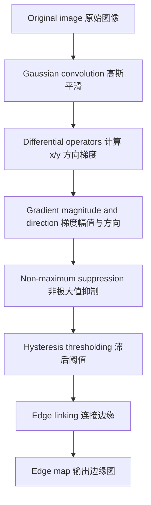
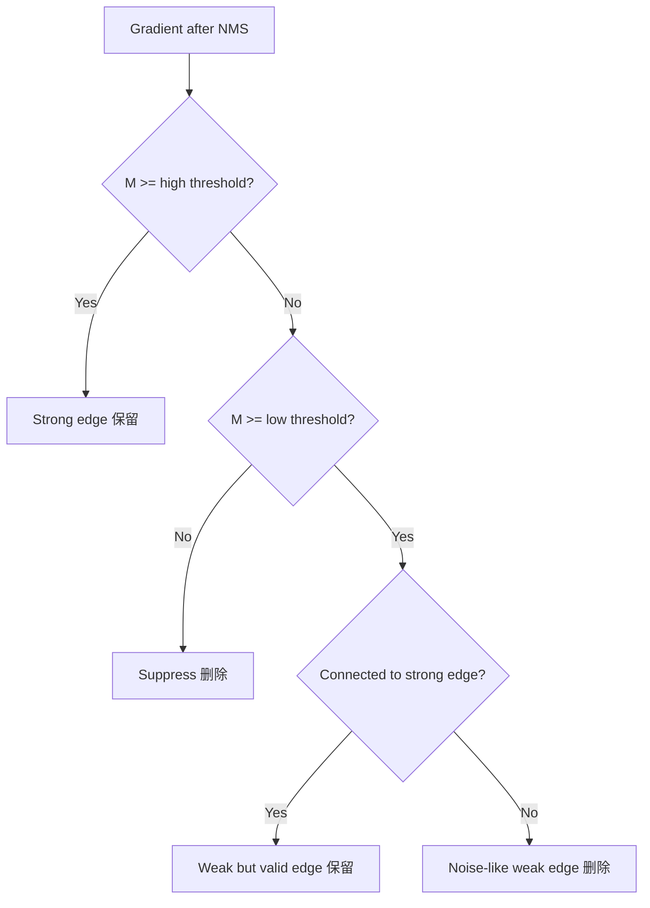
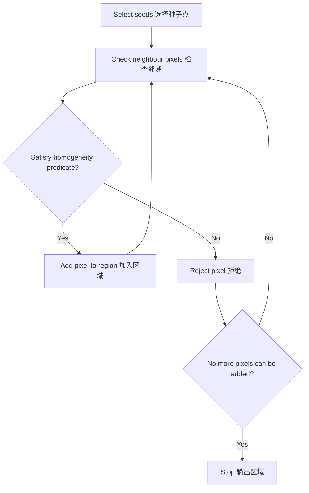
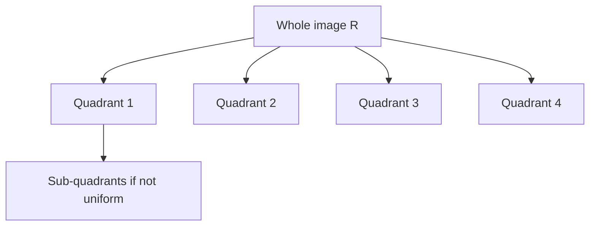

> [!info] 课件来源
> 原始课件：[[../附件/Part 3 - Edges, Interest points, and Morphology/3-2_Edges-II.pdf]]  
> 本节对应 **Part 3 的第 2 个 PPT：Edges-II**。它承接 [[Part 3 - PPT 1：Edges-I]]，从基础导数型边缘检测推进到 **Canny edge detector**，然后引出两类非边缘主导的分割方法：**thresholding 阈值分割** 与 **region-based segmentation 区域分割**。

---

## 0. 本节课的整体主线

这节课可以分成三条主线：

1. **什么样的边缘检测结果才算好**：低错误率、定位准确、单一响应；
2. **Canny 边缘检测器如何实现这些目标**：Gaussian smoothing、梯度计算、非极大值抑制、双阈值滞后连接；
3. **边缘检测之外的分割方法**：阈值分割与区域分割。

上一节 Edges-I 主要解释了为什么可以用 gradient、Laplacian、LoG 等导数方法检测灰度突变；这一节 Edges-II 的重点则是：

> [!summary] 一句话理解本节课
> **Canny 是把“导数找边缘”的思想做成一套更完整的流程：先平滑抗噪，再找梯度峰值，再用双阈值把强边缘和弱边缘连接起来；而当边缘不够可靠时，可以改用阈值或区域一致性做图像分割。**

---

## 1. Optimal Edge Detection：什么是“好的”边缘检测？

课件先给出评价 edge detector 的三个标准。

### 1.1 Low error rate：低错误率

边缘检测的错误主要有两类：

| 错误类型 | 含义 | 后果 |
|---|---|---|
| false positive 假阳性 | 把不是边缘的位置误检为边缘 | 边缘图很乱，噪声、纹理也被当成边缘 |
| false negative 假阴性 | 漏掉真实边缘 | 物体轮廓断裂，后续分割/识别困难 |

好的算法应该同时减少这两类错误，并且结果尽量接近人眼感知到的轮廓。

### 1.2 Good localization：定位准确

检测到的边缘位置应尽量接近真实边缘位置。

例如真实边缘在第 100 列，而算法输出在第 104 列，虽然看起来也像边缘，但对精确测量、轮廓提取、目标定位来说就是误差。

### 1.3 Single response：单一响应

对于一条真实边缘，算法最好只输出一条细边缘，而不是在边缘附近输出多条平行线。

这也是后面 **non-maximum suppression 非极大值抑制** 的意义：把宽边缘变成细边缘，只保留局部最强响应。

---

## 2. Canny Edge Detector 的核心思想

Canny 边缘检测器试图同时满足上面的三个标准。

它面对一个典型 trade-off：

| 操作 | 好处 | 坏处 |
|---|---|---|
| 更强的 smoothing 平滑 | 抑制噪声，减少假边缘 | 会模糊边缘，使定位变差 |
| 更弱的 smoothing 平滑 | 保留细节，定位更精确 | 更容易把噪声当成边缘 |

Canny 的理论结果说明：**Gaussian 的一阶导数** 可以较好地平衡信噪比与定位精度。因此 Canny 并不是简单“套一个 Sobel 后阈值化”，而是一套完整流程。

### 2.1 Canny 总流程

每一步的作用：

| 步骤 | 作用 | 解决的问题 |
|---|---|---|
| Gaussian smoothing | 先模糊图像 | 降低噪声对导数的影响 |
| Gradient calculation | 计算边缘强度与方向 | 找出灰度变化大的位置 |
| Non-maximum suppression | 沿梯度方向只保留局部最大值 | 把粗边缘细化成单像素级边缘 |
| Hysteresis thresholding | 使用高低两个阈值 | 保留真实弱边缘，去掉孤立噪声边缘 |
| Edge linking | 连接断裂轮廓 | 提升边缘连续性 |

---

## 3. Canny 第一步：Gaussian smoothing

导数型边缘检测对噪声很敏感。因为噪声通常表现为局部高频变化，而导数会放大高频变化。

因此 Canny 先用 Gaussian filter 平滑图像：

$$
G_\sigma(x,y)=\frac{1}{2\pi\sigma^2}e^{-\frac{x^2+y^2}{2\sigma^2}}
$$

其中 $\sigma$ 控制平滑尺度。

| $\sigma$ | 效果 | 边缘结果 |
|---|---|---|
| 小 $\sigma$ | 平滑弱 | 保留细节，但噪声和细纹理也多 |
| 大 $\sigma$ | 平滑强 | 边缘更稳定，但小结构会被抹掉 |

> [!warning] 易错点
> $\sigma$ 不是越大越好。大 $\sigma$ 会减少噪声边缘，但也会让细小结构消失，并使边缘定位更粗略。

---

## 4. Canny 第二步：梯度幅值与方向

平滑之后，对图像计算 $x$ 与 $y$ 方向的导数：

$$
G_x = \frac{\partial f}{\partial x}, \qquad
G_y = \frac{\partial f}{\partial y}
$$

梯度向量：

$$
\nabla f =
\begin{bmatrix}
G_x \\
G_y
\end{bmatrix}
$$

梯度幅值表示边缘强度：

$$
|\nabla f| = \sqrt{G_x^2+G_y^2}
$$

梯度方向表示灰度变化最快的方向：

$$
\theta = \operatorname{atan2}(G_y,G_x)
$$

> [!important] 梯度方向与边缘方向
> 梯度方向指向灰度增长最快的方向，通常 **垂直于边缘方向**。例如一条竖直边缘，灰度主要沿水平方向变化，所以梯度方向大致水平。

---

## 5. Non-maximum Suppression：非极大值抑制

### 5.1 为什么需要 NMS

只看梯度幅值会得到比较粗的边缘带。因为真实边缘附近多个像素的梯度都可能比较大。

NMS 的目标是：

> **沿梯度方向，只保留局部最大梯度点，其他位置置零。**

这样可以让边缘从“粗带状响应”变成“细线状响应”。

### 5.2 NMS 的基本算法

对每个像素 $(i,j)$：

1. 取当前梯度幅值 $M(i,j)$；
2. 沿梯度方向找到当前像素两侧的比较点；
3. 如果 $M(i,j)$ 小于任意一侧的幅值，则说明它不是局部峰值，置为 0；
4. 否则保留它。

可写为：

$$
I_N(i,j)=
\begin{cases}
0, & M(i,j)<M(i_1,j_1) \text{ or } M(i,j)<M(i_2,j_2)\\
M(i,j), & \text{otherwise}
\end{cases}
$$

其中 $(i_1,j_1)$ 与 $(i_2,j_2)$ 是沿梯度方向两侧的点。

### 5.3 为什么需要插值

梯度方向通常不是刚好水平、垂直或 45°，两侧比较点可能落在像素网格之间。因此课件提醒：NMS 常常需要检查插值点 $p$ 和 $r$。

直观理解：

- 如果梯度方向刚好水平，就比较左右两个像素；
- 如果梯度方向是斜的，就要比较斜方向上的两个位置；
- 如果方向落在像素之间，就用插值估计该位置的梯度幅值。

> [!tip] NMS 的关键作用
> Canny 的“边缘细”主要来自 NMS；没有 NMS，阈值化后的梯度图通常会比较厚、比较模糊。

---

## 6. Hysteresis Thresholding：滞后阈值与边缘连接

### 6.1 单阈值的问题

如果只用一个 threshold：

| 阈值选择 | 结果 |
|---|---|
| 阈值太低 | 噪声边缘也被保留，边缘图很乱 |
| 阈值太高 | 真实弱边缘被删除，轮廓断裂 |

真实边缘的强度会波动：同一条轮廓有些地方很强，有些地方较弱。如果只保留强响应，轮廓容易断开。

### 6.2 双阈值思想

Canny 使用两个阈值：

- 高阈值 $t_h$；
- 低阈值 $t_l$；
- 通常 $t_h > t_l$，课件中提到常见设置是 $t_h \approx 2t_l$。

像素可以分成三类：

| 梯度幅值 | 类型 | 处理 |
|---|---|---|
| $M \ge t_h$ | strong edge 强边缘 | 一定保留 |
| $t_l \le M < t_h$ | weak / maybe edge 弱边缘 | 若连接到强边缘则保留 |
| $M < t_l$ | non-edge | 删除 |

### 6.3 Edge linking：如何连接边缘

课件给出的算法可以理解为：

1. 用低阈值 $t_l$ 和高阈值 $t_h$ 生成两张边缘图：
   - $I_1(i,j)$：低阈值图，边缘多，但假边缘也多；
   - $I_2(i,j)$：高阈值图，假边缘少，但可能有断裂。
2. 以 $I_2$ 中的强边缘为起点；
3. 当轮廓出现 gap 时，到 $I_1$ 中查找是否有弱边缘可以补上；
4. 检查 8-neighbourhood，把连接到强边缘的弱边缘并入轮廓；
5. 删除无法连接到强边缘的孤立弱边缘。

> [!summary] 滞后阈值的意义
> 高阈值负责“可靠性”，低阈值负责“连续性”。最终只保留那些与强边缘连通的弱边缘。

---

## 7. Canny 中的尺度问题：Multi-scale Processing

课件强调图像结构存在不同尺度：

- 小尺度结构：纹理、细线、小物体边缘；
- 大尺度结构：物体轮廓、区域边界、主要结构。

Gaussian 的 $\sigma$ 决定 Canny 的观察尺度。

| 设置 | 适合检测 | 代价 |
|---|---|---|
| 小 $\sigma$ + 较低阈值 | 细节、纹理、小边缘 | 噪声多，边缘碎 |
| 小 $\sigma$ + 较高阈值 | 强细节边缘 | 弱细节丢失 |
| 大 $\sigma$ + 较高阈值 | 大轮廓、稳定结构 | 小结构消失 |
| 大 $\sigma$ + 较低阈值 | 平滑后的弱轮廓 | 可能出现较粗或不精确的边缘 |

### 7.1 Interesting scales

课件中的 multi-scale processing 强调：一个结构如果在多个尺度下都能稳定出现，通常更可能是重要结构。

例如：人物轮廓可能在 $\sigma=1$ 到 $\sigma=4$ 的范围内都能被检测到；而噪声点可能只在很小尺度出现。

### 7.2 人眼分割与梯度边缘并不等价

课件中用 Berkeley segmentation database 的例子说明：

- 人眼看到的是语义上有意义的对象边界；
- 梯度幅值看到的是局部灰度/颜色变化；
- 纹理、阴影、噪声也可能产生强梯度；
- 真实物体边界有时反而梯度较弱。

所以 edge detection 是分割的重要工具，但不是完整的图像理解。

---

## 8. 现代边缘检测算法的方向

课件简单展示了几类更现代的方法：

| 方法方向 | 代表思想 | 和传统方法的区别 |
|---|---|---|
| Crisp boundary detection | 利用统计关系判断边界是否真实 | 不只看局部梯度大小 |
| Structured forests | 用监督学习从训练数据学习边缘模式 | 依赖标注数据 |
| Holistically-nested edge detection | 深度网络多层特征联合预测边缘 | 可以结合低层细节与高层语义 |

这说明边缘检测从早期的“滤波器 + 阈值”逐渐发展到“数据驱动 + 语义上下文”。

---

## 9. Thresholding：阈值分割

Canny 之后，课件转向其他 segmentation 方法。第一类是 thresholding。

### 9.1 阈值分割的基本假设

阈值分割假设：

> **目标物体与背景在灰度或颜色取值范围上有明显差异。**

如果这个假设成立，就可以通过一个或多个阈值把图像分成不同区域。

课件中的二值阈值形式为：

$$
g(x,y)=
\begin{cases}
1, & f(x,y)>T \quad (background)\\
0, & f(x,y)\le T \quad (object)
\end{cases}
$$

> [!note] 标签 0/1 可以反过来
> 课件中把 $1$ 标为 background、$0$ 标为 object。但实际应用中也常把 object 设为 1、background 设为 0。关键不是 0/1 的命名，而是阈值如何把类别分开。

### 9.2 Threshold 可以依赖什么？

更一般地，阈值可写为：

$$
T = T(x,y,p(x,y),f(x,y))
$$

其中：

- $(x,y)$：像素位置；
- $p(x,y)$：邻域信息；
- $f(x,y)$：像素强度或特征。

不同阈值方法的区别就在于 $T$ 是否随位置和邻域变化。

---

## 10. 阈值分割的类型

### 10.1 Global thresholding：全局阈值

全局阈值只使用一个阈值：

$$
T = T(f(x,y))
$$

特点：

- 简单、快速；
- 适合目标与背景灰度分布明显分离的图像；
- 对光照不均、阴影、渐变背景比较敏感。

### 10.2 Local / regional thresholding：局部阈值

局部阈值根据邻域信息确定：

$$
T = T(p(x,y), f(x,y))
$$

它适合图像不同区域亮度分布不同的情况。

例如一张图左上角较暗、右下角较亮，用同一个全局阈值可能会失败；把图像分成小块后，每个小块使用自己的阈值，效果会更好。

### 10.3 Adaptive / dynamic thresholding：自适应阈值

自适应阈值进一步允许阈值随位置变化：

$$
T = T(x,y,p(x,y),f(x,y))
$$

它常用于光照不均、背景缓慢变化的图像。

课件中的 adaptive thresholding 示例说明：当一个区域的直方图仍然无法分开目标与背景时，可以继续 subdivision，把图像分得更小，使局部直方图更容易分离。

### 10.4 Multiple thresholding：多阈值分割

如果图像中有多个类别，可以使用多个阈值：

$$
g(x,y)=
\begin{cases}
0, & f(x,y)<T_1 \quad (background)\\
1, & T_1 < f(x,y) \le T_2 \quad (object\ 1)\\
2, & T_2 < f(x,y) \le T_3 \quad (object\ 2)\\
\vdots
\end{cases}
$$

它把灰度轴分成多个区间，每个区间对应一个类别。

### 10.5 基于多变量的阈值

对于 colour image，阈值不一定只对灰度值做，也可以在多维特征空间中做，例如：

- RGB；
- HSV；
- Lab；
- 纹理特征；
- 位置 + 颜色联合特征。

本质上是把“单一灰度轴上的切分”扩展为“多维特征空间中的分类边界”。

---

## 11. Thresholding 的优缺点

| 优点 | 解释 |
|---|---|
| 计算便宜 | 不需要复杂模型，速度快 |
| 实现简单 | 一个条件判断即可完成基本二值化 |
| 适合简单场景 | 目标与背景灰度差异明显时效果很好 |

| 缺点 | 解释 |
|---|---|
| 对光照敏感 | 背景亮度变化会破坏固定阈值 |
| 不理解连通性 | 只按像素值判断，可能产生碎片 |
| 难处理纹理复杂图像 | 目标和背景灰度重叠时效果差 |
| 阈值选择困难 | 阈值过高/过低都会导致错分 |

> [!tip] 和边缘检测的关系
> Edge detection 找的是“变化大的位置”；thresholding 找的是“像素值属于哪个范围”。两者关注点不同，适合的问题也不同。

---

## 12. Region-Based Segmentation：区域分割

当边缘或阈值效果不好时，可以考虑 region-based segmentation。

### 12.1 基本思想

区域分割不只看单个像素值，也看像素之间的连通性与区域一致性。

核心原则：

1. 每个 region 内部应该 uniform；
2. region 内的像素应该 connected；
3. 相邻 region 如果合并后仍然 uniform，就不应该被分开。

### 12.2 形式化定义

令 $R$ 表示整幅图像区域，分割就是把 $R$ 划分成若干子区域：

$$
R_1,R_2,\ldots,R_n
$$

需要满足：

1. 覆盖完整图像：

$$
\bigcup_{i=1}^{n}R_i = R
$$

2. 每个区域连通：

$$
R_i \text{ is a connected region}, \quad i=1,2,\ldots,n
$$

3. 区域之间互不重叠：

$$
R_i \cap R_j = \varnothing, \quad i\ne j
$$

4. 每个区域满足一致性谓词：

$$
P(R_i)=TRUE
$$

例如 $P(R_i)$ 可以定义为：区域内所有像素灰度差异小于某个阈值。

5. 任意相邻区域合并后不再满足谓词：

$$
P(R_i\cup R_j)=FALSE
$$

这表示分割已经尽可能合并了相似区域，不会把本该属于同一类的相邻区域强行分开。

---

## 13. Region Growing：区域生长

### 13.1 基本流程

Region growing 从若干 seed pixels 种子点开始，不断把相似的邻域像素加入区域。

### 13.2 种子点如何选择

如果有先验知识，可以直接选种子。例如医学图像中已知病灶大概位置。

如果没有先验知识，可以计算每个像素的特征，如灰度、颜色、纹理、空间位置等；如果这些特征形成明显 cluster，就选择靠近 cluster centroid 的像素作为种子。

### 13.3 生长规则需要什么？

Region growing 至少需要两类规则：

| 规则 | 作用 |
|---|---|
| growth mechanism | 决定从哪些邻居继续扩展，例如 4 邻域或 8 邻域 |
| homogeneity criterion | 判断候选像素是否与当前区域足够相似 |

常见描述符包括：

- gray level；
- colour；
- texture；
- spatial moments；
- 与区域均值/方差的距离。

停止条件：

> 当没有更多邻域像素满足加入标准时，区域生长停止。

### 13.4 优缺点

| 优点 | 缺点 |
|---|---|
| 能利用连通性，结果通常比较连续 | 对 seed selection 敏感 |
| 适合目标内部相对均匀的图像 | 区域可能泄漏到相似背景 |
| 容易加入领域知识 | 噪声会影响一致性判断 |

---

## 14. Region Splitting：区域分裂

Region splitting 是 region growing 的反方向。

### 14.1 基本思想

不是从小区域长大，而是从大区域开始：

1. 把整幅图像看成一个大区域；
2. 检查该区域是否 uniform；
3. 如果不 uniform，就把它分裂成更小区域；
4. 对每个子区域重复检查；
5. 直到所有区域都满足谓词 $P(R_i)$。

### 14.2 Quadtree 四叉树

课件提到可以用 quadtree structure 做分裂。

四叉树中，每个节点可以分成四个子节点，对应图像区域被分成四个象限。

Region splitting 的难点是：在哪里分裂、何时停止、如何避免过度分裂。

---

## 15. Region Splitting and Merging：分裂与合并

单纯 splitting 可能把图像切得太碎，所以常加入 merging。

课件中的 split-and-merge procedure：

1. 对任何不满足一致性谓词的区域 $R_i$：

$$
P(R_i)=FALSE
$$

就把它分成四个互不相交的象限。

2. 对任意相邻区域 $R_j$ 和 $R_k$：如果合并后满足谓词：

$$
P(R_j\cup R_k)=TRUE
$$

则把它们合并。

3. 当不能继续分裂或合并时停止。

> [!note] 为什么需要 merge
> splitting 只会让区域越来越小，容易产生碎片；merging 可以把分裂后仍然相似的相邻区域重新合起来，使结果更自然。

---

## 16. 应用：3D Image Segmentation

课件提到 3D imaging 中也需要 segmentation。

在 3D 图像中，基本单位不再是 2D pixel，而是 3D voxel。分割的目标是把 voxel 分到不同对象或组织中。

典型应用：

- MRI 医学图像分割；
- 器官、病灶、组织结构提取；
- 3D rendering；
- 体积、密度、形状等定量分析。

这说明 segmentation 不只是图像显示效果，而是很多医学/工程测量任务的基础步骤。

---

## 17. Lenna、Semantic Segmentation 与 Generative AI 示例

课件后半部分展示了 Lenna 图像、semantic segmentation、semantic communications，以及 ChatGPT/Grok/HuggingFace Spaces 等生成式 AI 示例。

### 17.1 Lenna 图像的作用

Lenna 是图像处理领域常见标准测试图，历史上经常用于压缩、滤波、分割等算法展示。

在课程语境中，它主要用于说明：

- 标准图像便于不同算法对比；
- 但测试图只是 benchmark，不等于真实应用场景；
- 分割算法最终仍要回到具体任务评价。

### 17.2 Semantic segmentation

Semantic segmentation 不只是把图像切成区域，而是给每个像素分配语义类别，例如：人、道路、天空、树、车辆。

它比传统 thresholding 或 region growing 更进一步，因为它需要理解“区域是什么”。

### 17.3 Generative AI 的图像分割能力

课件展示了用生成式 AI 对图像进行分割的示例。可以把它理解为：

- 用户用自然语言描述目标；
- 模型尝试定位并分割目标区域；
- 输出可能是 mask、裁剪图或高亮图。

但需要注意：

> [!warning] 生成式 AI 不是传统算法的替代品
> 生成式 AI 的输出可能受提示词影响，结果不一定可重复，也不一定满足精确测量要求。工程或医学任务中仍需要可验证的算法、标注数据和评价指标。

---

## 18. Canny、Thresholding、Region-based Segmentation 对比

| 方法 | 依据 | 适合场景 | 主要优点 | 主要缺点 |
|---|---|---|---|---|
| Canny edge detector | 灰度变化 + 梯度峰值 + 双阈值连通 | 物体边界明显、需要轮廓 | 边缘细、连续性较好、抗噪比简单梯度法好 | 参数依赖 $\sigma,t_l,t_h$，不直接给区域 |
| Global thresholding | 全局灰度/颜色范围 | 目标与背景强度分布明显分离 | 快速、简单 | 光照不均时失败 |
| Adaptive thresholding | 局部邻域与位置 | 背景变化、光照不均 | 比全局阈值灵活 | 参数与窗口大小敏感，可能产生块效应 |
| Region growing | 种子点 + 区域一致性 + 连通性 | 目标内部均匀，种子可靠 | 区域连贯 | 对种子和噪声敏感 |
| Region splitting | 区域一致性谓词 | 从整体逐步细分 | 不需要初始种子 | 可能过度分裂 |
| Split and merge | 分裂 + 相邻合并 | 区域既需细分又需合并 | 比单纯分裂更自然 | 谓词设计仍然关键 |

---

## 19. 考试/复习重点

### 19.1 必须能解释的概念

- optimal edge detection 的三个标准：low error rate、good localization、single response；
- Canny 的完整流程；
- non-maximum suppression 的目的和做法；
- hysteresis thresholding 为什么要用两个阈值；
- $\sigma$ 对 Canny 结果的影响；
- thresholding 的全局、局部、自适应、多阈值版本；
- region-based segmentation 的连通性与一致性；
- region growing、region splitting、split-and-merge 的差异。

### 19.2 必须能写出的公式

Canny 梯度幅值：

$$
|\nabla f|=\sqrt{G_x^2+G_y^2}
$$

梯度方向：

$$
\theta=\operatorname{atan2}(G_y,G_x)
$$

二值阈值：

$$
g(x,y)=
\begin{cases}
1, & f(x,y)>T\\
0, & f(x,y)\le T
\end{cases}
$$

自适应阈值的一般形式：

$$
T=T(x,y,p(x,y),f(x,y))
$$

区域分割覆盖条件：

$$
\bigcup_{i=1}^{n}R_i=R
$$

区域互不重叠：

$$
R_i\cap R_j=\varnothing,\quad i\ne j
$$

区域一致性：

$$
P(R_i)=TRUE
$$

相邻区域不可再合并：

$$
P(R_i\cup R_j)=FALSE
$$

### 19.3 易混点

| 易混点 | 正确理解 |
|---|---|
| Canny 不是单纯 Sobel + threshold | 它还包括 Gaussian smoothing、NMS、hysteresis 和 edge linking |
| NMS 与 thresholding 的作用不同 | NMS 让边缘变细；thresholding 判断是否保留 |
| 高阈值不是越高越好 | 太高会漏掉真实弱边缘 |
| 大 $\sigma$ 不是永远更好 | 大 $\sigma$ 抗噪好，但会丢细节、降低定位精度 |
| thresholding 不等于 segmentation 的全部 | 它只适合特征分布可分的场景 |
| region growing 不只是按灰度相等扩张 | 它还依赖种子、邻接关系、区域一致性谓词和停止规则 |
| split-and-merge 不一定保持 quadtree | 合并相邻区域后，原来的四叉树结构可能被破坏 |

---

## 20. 自测题

1. Canny 边缘检测器为什么要先做 Gaussian smoothing？
2. Optimal edge detection 的三个评价标准分别是什么？
3. 为什么 smoothing 会改善 detection，却损害 localization？
4. Non-maximum suppression 为什么要沿梯度方向比较？
5. NMS 中为什么可能需要插值？
6. 单阈值边缘检测有什么问题？
7. Hysteresis thresholding 中，高阈值和低阈值分别承担什么作用？
8. $\sigma$ 增大时，Canny 检测出的边缘会发生什么变化？
9. 全局阈值和自适应阈值的区别是什么？
10. 多阈值分割适合什么情况？
11. Region-based segmentation 为什么强调 connectivity？
12. Region growing 的 seed selection 为什么重要？
13. Region splitting 中 quadtree 的作用是什么？
14. Split-and-merge 为什么通常比单纯 split 更合理？
15. 为什么人类感知的边界和 gradient magnitude 不一定一致？

---

## 21. 本节总结

本节课从 Canny edge detector 出发，讲清了经典边缘检测如何从“局部导数响应”升级为“完整边缘提取流程”。Canny 的强大之处在于它同时处理了噪声、边缘粗细、阈值选择与轮廓连续性问题：

- Gaussian smoothing 解决噪声敏感问题；
- gradient magnitude 和 direction 找出候选边缘；
- non-maximum suppression 使边缘变细；
- hysteresis thresholding 用强边缘引导弱边缘，兼顾可靠性与连续性；
- multi-scale processing 说明边缘与结构依赖尺度。

随后，课件说明 edge detection 并不是 segmentation 的唯一方法。Thresholding 直接基于灰度/颜色范围分割，简单快速；region-based segmentation 则基于像素连通性和区域一致性，更适合需要完整区域的任务。

> [!summary] 最重要的一句话
> **Canny 适合提取“边界在哪里”，thresholding 适合回答“像素属于哪个强度范围”，region-based segmentation 适合回答“哪些相邻像素应该属于同一个区域”。**
