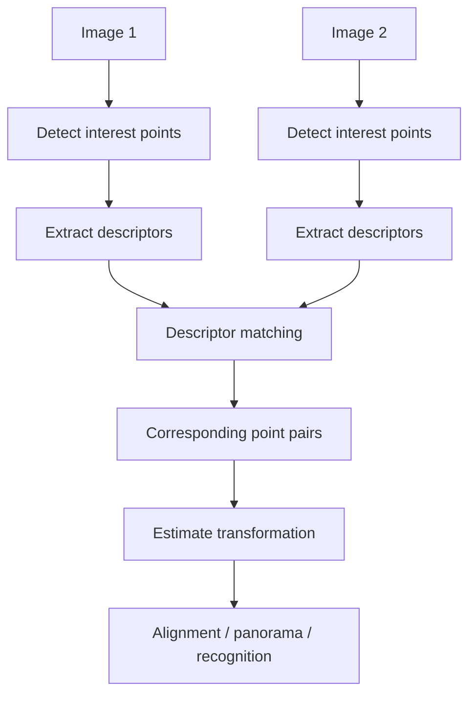
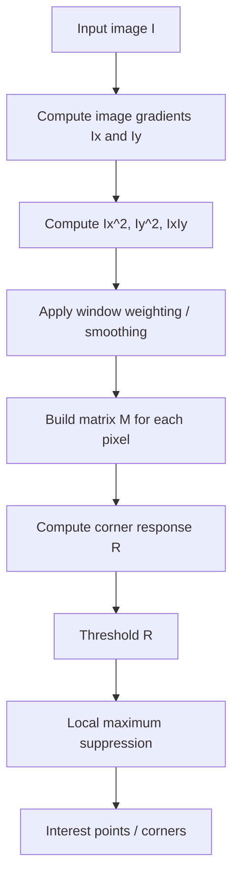
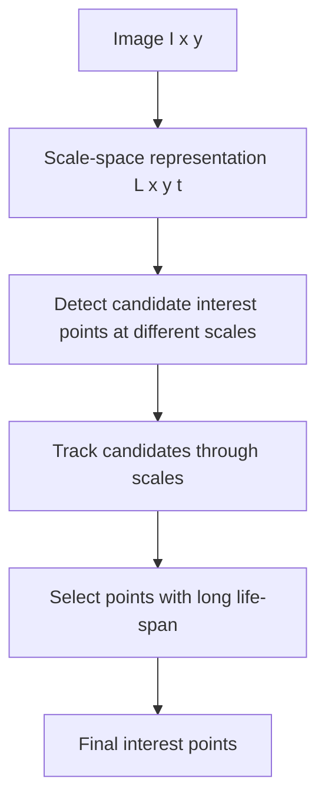

> [!info] 课件来源
> 原始课件：[[../附件/Part 3 - Edges, Interest points, and Morphology/3-3_Interest points.pdf]]  
> 本节对应 **Part 3 的第 3 个 PPT：Interest points**。它承接 [[Part 3 - PPT 2：Edges-II]] 中的边缘检测与分割内容，进一步讨论计算机视觉中用于匹配、识别、拼接和重建的 **interest points / corners / feature points**。

---

## 0. 本节课的整体主线

这节课的核心问题是：

> **在一张图像里，哪些点值得被保存下来，用来和另一张图像进行匹配？**

上一节课主要关注“哪里是边缘”。但很多视觉任务不只需要边缘，还需要一些稳定、可重复、定位准确的局部点。例如：

- 两张图片拼接 panorama；
- 识别同一个物体；
- 估计相机运动；
- 做 3D reconstruction；
- 增强现实中跟踪平面或物体；
- 机器人导航。

这些任务通常需要先找到 **interest points**，再围绕这些点提取 **feature descriptors**，最后通过 descriptor matching 找到不同图像之间的对应点。

> [!summary] 一句话理解本节课
> **Interest point 是图像中局部结构丰富、位置明确、在变换后仍能重复检测到的点；Moravec 用窗口位移后的变化量找角点，Harris 用局部梯度矩阵和特征值更系统地判断 flat / edge / corner。**

---

## 1. 什么是 Interest Point？

课件对 interest point 的要求可以总结为五点。

### 1.1 清晰、最好有数学基础的定义

一个好的 interest point detector 不能只凭直觉说“这里看起来有特点”，而应该有明确的计算方式。

例如：

- Moravec：窗口在多个方向移动后，灰度变化都很大；
- Harris：局部自相关矩阵的两个特征值都大；
- scale-space 方法：在尺度变化中稳定存在。

### 1.2 在图像空间中有明确位置

interest point 应该是一个可以定位的点，而不是一大片模糊区域。

这对匹配非常重要。若同一真实点在两张图中的定位误差过大，后续估计 homography、fundamental matrix 或相机位姿都会受到影响。

### 1.3 局部信息丰富

点周围的局部 patch 应该有足够丰富的结构，方便描述和匹配。

例如：

| 区域类型 | 是否适合作 interest point | 原因 |
|---|---|---|
| 均匀区域 | 不适合 | 周围像素都差不多，难以唯一匹配 |
| 单条边缘 | 不太适合 | 沿边缘方向移动时外观变化小，匹配位置不唯一 |
| 角点/纹理丰富区域 | 适合 | 多方向都有变化，更容易稳定定位与匹配 |

### 1.4 对扰动稳定

好的 interest point 应该能在以下变化下仍被检测出来：

- illumination / brightness variation 光照变化；
- small viewpoint change 视角变化；
- image noise 噪声；
- blur 模糊；
- compression 压缩；
- geometric transformation 几何变换。

这就是后面 repeatability 评价指标的来源。

### 1.5 最好支持尺度属性

现实图像中，同一个物体可能离相机远近不同，导致同一个结构在图像中的大小不同。

因此更好的 detector 不只输出位置 $(x,y)$，还可以输出 scale，例如：

$$
(x,y,\sigma)
$$

这样才能在 scale changes 下更稳定。

---

## 2. Interest Points 与 Corresponding Points

### 2.1 为什么需要对应点？

很多视觉任务都依赖图像之间的点对应关系。

例如 panorama：

1. 在两张重叠图像中检测 interest points；
2. 为每个 interest point 周围的 patch 提取 descriptor；
3. 比较 descriptor，找到对应点；
4. 根据对应点估计两张图之间的几何变换；
5. 对齐并拼接图像。

### 2.2 Descriptor 的作用

interest point 只告诉我们“点在哪里”；descriptor 告诉我们“这个点周围长什么样”。

因此匹配通常不是直接比较点坐标，而是比较点周围 patch 的 descriptor。

常见思路：

- 在 interest point 周围取局部窗口；
- 提取灰度、梯度方向、纹理等特征；
- 把这些特征编码成向量；
- 在另一张图中寻找 descriptor 最相似的点。

> [!note] Detector 与 Descriptor 的区别
> **Detector** 负责找点；**descriptor** 负责描述点周围的外观；**matching** 负责把不同图像中的点对应起来。

---

## 3. 好特征应具备的性质

课件列出 good features 的五个性质。

| 性质 | 含义 | 为什么重要 |
|---|---|---|
| Local | 特征局部化 | 对遮挡和杂乱背景更鲁棒 |
| Accurate | 定位准确 | 几何估计需要精确点位置 |
| Covariant / Repeatable | 变换后仍能在对应位置被检测 | 保证两张图能找到同一真实点 |
| Robust | 对噪声、模糊、压缩等稳定 | 实际图像质量不完美 |
| Efficient | 计算高效 | 许多应用需要接近实时 |

### 3.1 Covariant：检测位置随变换而对应变化

Detector 的 covariance 指：如果图像发生几何或光度变化，特征点应该出现在变换后的对应位置。

例如图像旋转后，原来的角点也应该在旋转后的对应位置被检测到。

用概念式表示：

$$
\text{detect}(T(I)) \approx T(\text{detect}(I))
$$

也就是：先变换图像再检测，和先检测再变换点，结果应该一致或接近。

### 3.2 Invariant：描述子在变换下保持相似

Descriptor 的 invariance 指：同一个真实点在不同图像中的 descriptor 应该相似，即使图像经历了几何或光度变换。

例如：

- detector 要把对应点找出来；
- descriptor 要让这些对应点的描述向量仍然接近。

> [!warning] 易混点
> **Covariance 多用于 detector 的位置输出；invariance 多用于 descriptor 的数值表达。** 位置需要随图像变换而变换，描述子则希望在变换后仍可比较、仍相似。

---

## 4. Corners：为什么角点重要？

课件把 corners、point features、interest points、feature points 放在一起讨论。

### 4.1 角点的直观定义

角点是两条边缘汇合的地方，也可以理解为局部图像在两个方向上都有明显变化的位置。

课件说：

> A corner is where the image gradient has significant components in the x and y direction.

也就是：

- 不是只有 $x$ 方向变化；
- 也不是只有 $y$ 方向变化；
- 而是多个方向都有明显变化。

### 4.2 为什么单边缘不是好角点？

对于一条边缘，如果沿着边缘方向移动窗口，窗口内容变化很小；垂直边缘方向移动时变化很大。

因此单边缘点定位存在歧义：沿边缘方向无法精确确定位置。

而角点不同：无论朝哪个方向移动窗口，局部内容都会明显变化，所以更适合匹配。

### 4.3 角点的应用

课件给出多个动机：

| 应用 | 为什么需要角点/interest points |
|---|---|
| recognition | 用稳定局部点识别物体 |
| augmented reality | 跟踪场景中的稳定点来叠加虚拟内容 |
| robotics | 机器人导航、定位与地图构建需要可重复点 |
| panorama | 找对应点以对齐多张图像 |
| image alignment | 用对应点估计 homography 或 fundamental matrix |
| 3D reconstruction | 用多视图对应点恢复三维结构 |
| database retrieval | 用局部特征检索相似图像 |

---

## 5. Corner Feature 的核心判断

课件给出 corner feature 的关键描述：

> 对于一个角点，以它为中心的窗口向任何方向移动，窗口内平均强度都应该发生很大变化。

这句话非常重要，因为 Moravec 和 Harris 都围绕它构建。

可以把局部窗口移动后的变化写成：

$$
E(u,v)=\sum_{x,y}w(x,y)\left[I(x+u,y+v)-I(x,y)\right]^2
$$

其中：

- $(u,v)$ 是窗口移动方向和距离；
- $w(x,y)$ 是窗口函数，可以是矩形窗口或 Gaussian window；
- $E(u,v)$ 衡量窗口移动后图像内容变化多大。

不同区域的表现：

| 区域 | $E(u,v)$ 的特点 | 判断 |
|---|---|---|
| flat region | 所有方向变化都小 | 不是特征点 |
| edge | 垂直边缘方向变化大，沿边缘方向变化小 | 不稳定，位置有歧义 |
| corner | 所有方向变化都大 | 好的 interest point |

---

## 6. Moravec Operator

Moravec 是早期经典 interest operator。它的核心是直接比较窗口在不同方向平移后的差异。

### 6.1 基本思想

对于每个像素：

1. 以该像素为中心取一个小窗口，例如 $3\times3$；
2. 将窗口向多个方向移动 1 个像素；
3. 计算原窗口与移动窗口之间的差异；
4. 如果所有方向上的变化都大，则该点可能是角点；
5. 如果某个方向变化很小，则不是稳定角点。

### 6.2 课件中的 Moravec 流程

课件 detail 页给出的流程：

1. 给定灰度图像 $I(x,y)$；
2. 在每个像素上放置一个 $3\times3$ window；
3. 定义另一个相对原窗口移动 1 像素的 window；
4. 计算两个 window 中对应像素的差；
5. 对 9 个差异值求和；
6. 对多个方向重复，例如上、下、左、右、左上、左下、右上、右下；
7. 取这些方向响应中的最小值作为 Moravec response：

$$
M(i,j)=\min_{(u,v)\in D} E_{u,v}(i,j)
$$

8. 对 $M(i,j)$ 做 threshold，得到 corners。

其中 $D$ 是若干离散移动方向集合。

> [!note] SSD 与 absolute difference
> 课件前面用 “sums of squared differences (SSD)” 描述 Moravec，后面 detail 页写的是 absolute differences。两者核心思想一致：比较窗口平移前后的差异。常见教材中 Moravec 多写作 SSD：
> $$
> E_{u,v}(x,y)=\sum_{(a,b)\in W}\left[I(x+a+u,y+b+v)-I(x+a,y+b)\right]^2
> $$

### 6.3 为什么取最小值？

这是 Moravec 的关键。

如果一个点是角点，窗口朝任何方向移动都会产生大变化，所以所有方向响应都大，最小值也大。

如果一个点在边缘上，窗口沿边缘方向移动时变化小，所以多个方向响应中至少有一个很小，最小值小。

如果一个点在平坦区域，所有方向响应都小，最小值当然也小。

| 位置类型 | 多方向响应 | 最小响应 | 是否角点 |
|---|---|---|---|
| flat | 都小 | 小 | 否 |
| edge | 有些大，有些小 | 小 | 否 |
| corner | 都大 | 大 | 是 |

### 6.4 阈值对结果的影响

Moravec 最后需要对 $M(i,j)$ 设阈值。

| 阈值  | 结果              |
| --- | --------------- |
| 太低  | 检出很多点，包括噪声和弱结构  |
| 太高  | 只保留最强角点，可能漏掉有用点 |
| 合适  | 保留稳定且信息丰富的角点    |
|     |                 |

课件示例中低阈值会得到更多 interest points，高阈值会得到更少但更强的点。

### 6.5 Moravec 的优缺点

| 优点 | 说明 |
|---|---|
| 简单 | 实现容易，直观 |
| 计算较快 | 适合早期实时应用 |
| 能找到高对比度角点 | 对明显角点有效 |

| 缺点 | 说明 |
|---|---|
| 只检查离散方向 | 方向分辨率粗，不能连续刻画方向变化 |
| 使用矩形窗口 | 不够平滑，方向上有偏好 |
| 使用 min 函数过于简单 | 响应不够稳定 |
| 对 diagonal edges 可能误检 | 对角边缘可能被错误当成角点 |
| 不如 Harris 系统 | 理论与实际效果都有限 |

---

## 7. 从 Moravec 到 Harris

课件指出 Moravec 的两个主要问题：

1. 使用 discrete rectangular window，希望改成 smooth circular / elliptical window；
2. 使用 simple min function，希望更系统地刻画不同方向的变化。

Harris & Stephens 的方法就是改进这些问题：

- 不直接比较少数离散平移 patch；
- 而是用局部梯度构造一个矩阵 $M$；
- 用 $M$ 的特征值描述局部在所有方向上的变化。

---

## 8. Harris Corner Detector：基本思想

Harris detector 基于 auto-correlation。

核心判断仍然是：

> 如果一个小窗口向任何方向移动，窗口强度都发生明显变化，则该点是 corner。

### 8.1 flat / edge / corner 的三种情况

| 类型 | 窗口移动后的变化 | 解释 |
|---|---|---|
| flat region | 所有方向都几乎无变化 | 没有可匹配结构 |
| edge | 沿边缘方向变化小，垂直边缘方向变化大 | 只有一个方向约束强 |
| corner | 所有方向变化都大 | 两个方向都有强约束 |

---

## 9. Harris 数学推导

### 9.1 窗口移动后的强度变化

Harris 从以下函数出发：

$$
E(u,v)=\sum_{x,y}w(x,y)\left[I(x+u,y+v)-I(x,y)\right]^2
$$

其中：

- $E(u,v)$：窗口移动 $(u,v)$ 后的强度变化；
- $w(x,y)$：窗口函数；
- $I(x,y)$：图像强度；
- $I(x+u,y+v)$：平移后的图像强度。

如果 $E(u,v)$ 在所有方向都大，则说明局部像 corner。

### 9.2 小位移近似

对小位移 $(u,v)$，使用一阶 Taylor expansion：

$$
I(x+u,y+v)\approx I(x,y)+uI_x+vI_y
$$

代入 $E(u,v)$：

$$
E(u,v)\approx \sum_{x,y}w(x,y)(uI_x+vI_y)^2
$$

展开可得二次型：

$$
E(u,v)\approx
\begin{bmatrix}u & v\end{bmatrix}
M
\begin{bmatrix}u\\v\end{bmatrix}
$$

其中 $M$ 是局部结构矩阵，也常称 second moment matrix / structure tensor：

$$
M=\sum_{x,y}w(x,y)
\begin{bmatrix}
I_x^2 & I_xI_y\\
I_xI_y & I_y^2
\end{bmatrix}
$$

### 9.3 矩阵 $M$ 的意义

$M$ 汇总了窗口内的梯度信息：

- $I_x^2$：水平方向变化强度；
- $I_y^2$：垂直方向变化强度；
- $I_xI_y$：两个方向变化的相关性。

因此 $M$ 描述的是：这个局部窗口在不同方向上“容易变化”还是“不容易变化”。

---

## 10. 用特征值解释 flat / edge / corner

设 $M$ 的两个特征值为 $\lambda_1,\lambda_2$。

特征值表示局部变化在两个主方向上的强弱。

### 10.1 三类点的特征值模式

| 类型 | 特征值关系 | 直观解释 |
|---|---|---|
| flat region | $\lambda_1,\lambda_2$ 都小 | 各方向都没变化 |
| edge | 一个大，一个小 | 一个方向变化强，另一个方向变化弱 |
| corner | $\lambda_1,\lambda_2$ 都大 | 两个主方向都变化强 |

更具体地：

- $\lambda_1\gg\lambda_2$：edge；
- $\lambda_2\gg\lambda_1$：edge；
- $\lambda_1\approx\lambda_2$ 且都大：corner；
- $\lambda_1\approx\lambda_2\approx0$：flat。

### 10.2 椭圆解释

课件用椭圆解释 $M$。

对于固定常数 $c$：

$$
\begin{bmatrix}u & v\end{bmatrix}
M
\begin{bmatrix}u\\v\end{bmatrix}=c
$$

这是一个椭圆。

- 椭圆轴的方向由 $M$ 的特征向量决定；
- 椭圆轴长与特征值相关，约为 $\lambda^{-1/2}$；
- 特征值越大，说明该方向变化越快，对应椭圆轴越短；
- 特征值越小，说明该方向变化越慢，对应椭圆轴越长。

这与 edge/corner 判断一致：

- edge：一个方向变化快，一个方向变化慢，椭圆很长很窄；
- corner：两个方向都变化快，椭圆比较小；
- flat：两个方向都变化慢，椭圆很大。

---

## 11. Harris Corner Response

直接计算特征值也可以判断角点，但 Harris 使用一个不需要显式求特征值的 corner response：

$$
R=\det(M)-k(\operatorname{trace}(M))^2
$$

其中：

$$
\det(M)=\lambda_1\lambda_2
$$

$$
\operatorname{trace}(M)=\lambda_1+\lambda_2
$$

$k$ 是经验常数，课件给出：

$$
k=0.04\sim0.06
$$

### 11.1 为什么这个公式能区分 corner / edge / flat？

- corner：$\lambda_1$ 和 $\lambda_2$ 都大，乘积 $\lambda_1\lambda_2$ 大，所以 $R$ 大且正；
- edge：一个特征值很大，另一个很小，乘积不大，但 trace 很大，所以 $R$ 往往为负；
- flat：两个特征值都小，det 和 trace 都小，所以 $|R|$ 小。

| $R$ 的情况 | 判断 |
|---|---|
| $R$ large positive | corner |
| $R$ negative with large magnitude | edge |
| $|R|$ small | flat region |

> [!tip] Harris 的核心记忆法
> **两个方向都强 → corner → $R>0$；只有一个方向强 → edge → $R<0$；两个方向都弱 → flat → $|R|$ 小。**
> 判断角点时看的是 **$R$ 本身是否足够大且为正**，不是看 $|R|$。  
> 因此 **$R$ 越大，角点响应越强**；很大的负数通常表示 edge，而不是 corner。

---

## 12. Harris Detector Workflow

课件中的 Harris workflow 可以整理为以下步骤。

### 12.1 具体步骤

1. 计算图像梯度 $I_x, I_y$；
2. 计算三个局部量：

$$
I_x^2, \quad I_y^2, \quad I_xI_y
$$

3. 在窗口中对这些量加权求和，形成 $M$；
4. 计算：

$$
R=\det(M)-k(\operatorname{trace}(M))^2
$$

5. 找出 $R$ 大于阈值的位置；
6. 只保留 $R$ 的局部极大值。

### 12.2 为什么要取 local maxima？

如果只做 threshold，角点附近可能出现一小片高响应区域。

local maxima suppression 的作用是：

- 每个角点附近只保留响应最强的点；
- 减少重复检测；
- 提高定位稳定性。

这和 Canny 中的 non-maximum suppression 思想类似：只保留局部最有代表性的响应。

---

## 13. Moravec 与 Harris 对比

| 项目 | Moravec | Harris |
|---|---|---|
| 基本思想 | 比较窗口在离散方向移动后的差异 | 用梯度矩阵描述所有方向的变化 |
| 方向处理 | 只检查有限几个方向 | 通过矩阵/特征值连续刻画方向 |
| 窗口 | 离散矩形窗口 | 可用 Gaussian 等平滑窗口 |
| 响应函数 | 取多个方向响应的最小值 | $R=\det(M)-k(\operatorname{trace}M)^2$ |
| 理论性 | 简单直观 | 更系统，数学基础更强 |
| 缺点 | 对 diagonal edge 可能误检，方向粗糙 | 计算量比 Moravec 大，仍不天然 scale invariant |
| 适合记忆 | “所有方向移动都变化大” | “两个特征值都大” |

---

## 14. Interest Point Evaluation：如何评价检测器？

课件强调两个最重要的评价指标：

1. Repeatability；
2. Accuracy。

### 14.1 Repeatability：重复性

Repeatability 衡量的是：当视角变化或几何变换发生时，同一个真实 interest point 是否还能被再次检测到。

课件给出的定义：

$$
\text{Repeatability}=\frac{\#\text{ of interest points repeated}}{\text{total }\#\text{ of interest points}}
$$

直观例子：

- 对同一物体旋转多个角度；
- 每个角度都检测 interest points；
- 如果算法稳定，同一批真实角点应该反复出现；
- 若每次检测出的点差别很大，则 repeatability 低。

### 14.2 Accuracy：定位精度

Accuracy 衡量检测点位置与真实点位置的距离。

课件使用 RMSE：

$$
RMSE=\sqrt{\frac{1}{N}\sum_{n=1}^{N}\left[(x_{n0}-x_n)^2+(y_{n0}-y_n)^2\right]}
$$

其中：

- $(x_{n0},y_{n0})$：真实 interest point 位置；
- $(x_n,y_n)$：算法检测到的位置；
- $N$：点数量。

RMSE 越小，定位越准确。

### 14.3 Repeatability 与 Accuracy 的区别

| 指标 | 关注问题 | 好结果 |
|---|---|---|
| Repeatability | 同一个点能不能反复被检测到 | 比例高 |
| Accuracy | 检测点位置和真实点差多远 | RMSE 低 |

一个算法可能 repeatability 高但 accuracy 不够好，也可能定位很准但只在少数情况下检测到点。因此两个指标需要一起看。

---

## 15. Scale-space 改进

### 15.1 为什么需要 scale-space？

Moravec 和基本 Harris 通常在固定窗口/固定尺度下检测角点。

但现实图像中，同一结构可能因为距离或缩放而大小不同。如果只用固定尺度，就可能出现：

- 小尺度下检测到大量噪声点；
- 大尺度下丢失小结构；
- 同一真实点在不同尺度下不稳定。

### 15.2 Scale-space 的基本思想

构建一组逐渐平滑的图像：

$$
L(x,y,t)=G(x,y,t)*I(x,y)
$$

其中：

$$
t=\sigma^2
$$

$t$ 或 $\sigma$ 越大，Gaussian smoothing 越强，图像越平滑。

课件流程可以整理为：

### 15.3 life-span of a track

scale-space 中，一个候选 interest point 可以随着尺度变化形成一条 track。

课件提出选择标准：

> life-span of a track

即：

- 噪声点的 life-span 通常很短；
- 真正稳定的 interest point 会在多个尺度上持续存在。

因此可以优先保留跨尺度稳定的点。

---

## 16. 本节核心公式整理

### 16.1 窗口位移变化量

$$
E(u,v)=\sum_{x,y}w(x,y)\left[I(x+u,y+v)-I(x,y)\right]^2
$$

### 16.2 Harris 二次型近似

$$
E(u,v)\approx
\begin{bmatrix}u & v\end{bmatrix}
M
\begin{bmatrix}u\\v\end{bmatrix}
$$

### 16.3 Harris 矩阵 $M$

$$
M=\sum_{x,y}w(x,y)
\begin{bmatrix}
I_x^2 & I_xI_y\\
I_xI_y & I_y^2
\end{bmatrix}
$$

### 16.4 Harris response

$$
R=\det(M)-k(\operatorname{trace}(M))^2
$$

$$
\det(M)=\lambda_1\lambda_2
$$

$$
\operatorname{trace}(M)=\lambda_1+\lambda_2
$$

### 16.5 Repeatability

$$
\text{Repeatability}=\frac{\#\text{ repeated interest points}}{\text{total }\#\text{ interest points}}
$$

### 16.6 Accuracy / RMSE

$$
RMSE=\sqrt{\frac{1}{N}\sum_{n=1}^{N}\left[(x_{n0}-x_n)^2+(y_{n0}-y_n)^2\right]}
$$

---

## 17. 易混点整理

| 易混点 | 正确理解 |
|---|---|
| interest point = edge point？ | 不等于。edge 只有一个方向变化强，corner/interest point 通常要求多个方向变化强。 |
| corner 必须是两条直线交点？ | 不一定。只要局部结构像角点、多个方向变化明显，就可以是 interest point。 |
| detector 和 descriptor | detector 找位置；descriptor 描述局部外观；matching 比较 descriptor。 |
| covariance 和 invariance | detector 位置通常要求 covariant；descriptor 表达通常希望 invariant。 |
| Moravec 为什么取最小值？ | 因为角点要求所有方向变化都大；只要某方向变化小，就不像角点。 |
| Harris 中 $M$ 是什么？ | 局部梯度二阶统计矩阵，描述窗口在不同方向上的强度变化。 |
| Harris 中两个特征值都大意味着什么？ | 所有主方向变化都大，因此是 corner。 |
| $R>0$ 一定是完美角点？ | 通常表示 corner response 强，但还要 threshold 和 local maxima。 |
| repeatability 和 accuracy | repeatability 看是否重复出现；accuracy 看定位误差。 |
| scale-space 的目的 | 处理不同尺度下的稳定兴趣点，减少噪声点影响。 |

---

## 18. 考试/复习重点

### 18.1 必须会解释

1. interest point 的定义与性质；
2. 为什么角点比单边缘更适合匹配；
3. descriptor matching 的基本流程；
4. good features 的五个性质；
5. detector covariance 与 descriptor invariance 的区别；
6. Moravec operator 的步骤和取最小值的原因；
7. Moravec 的缺点；
8. Harris detector 的基本思想；
9. Harris 矩阵 $M$ 的构造；
10. 用 $\lambda_1,\lambda_2$ 区分 flat / edge / corner；
11. Harris response $R$ 的含义；
12. repeatability 与 accuracy 的评价方法；
13. scale-space 为什么能改进稳定性。

### 18.2 必须会写

Harris 的三个关键式子：

$$
E(u,v)=\sum_{x,y}w(x,y)[I(x+u,y+v)-I(x,y)]^2
$$

$$
M=\sum_{x,y}w(x,y)
\begin{bmatrix}
I_x^2 & I_xI_y\\
I_xI_y & I_y^2
\end{bmatrix}
$$

$$
R=\det(M)-k(\operatorname{trace}(M))^2
$$

以及特征值判断：

| $\lambda_1$ | $\lambda_2$ | 类型 |
|---|---|---|
| small | small | flat |
| large | small | edge |
| small | large | edge |
| large | large | corner |

---

## 19. 自测题

1. Interest point 与 edge point 的区别是什么？
2. 为什么角点适合图像匹配？
3. 在 panorama 中，interest points 和 descriptors 分别起什么作用？
4. 什么是 feature detector 的 covariance？
5. 什么是 feature descriptor 的 invariance？
6. Moravec operator 为什么要比较窗口平移后的差异？
7. Moravec 为什么取多个方向响应的最小值？
8. Moravec 容易误检 diagonal edges 的原因是什么？
9. Harris detector 中 $E(u,v)$ 表示什么？
10. Harris 矩阵 $M$ 由哪些量组成？
11. $\lambda_1,\lambda_2$ 都大说明什么？
12. $R=\det(M)-k(\operatorname{trace}M)^2$ 中 det 和 trace 分别与特征值有什么关系？
13. 为什么 $R<0$ 常表示 edge？
14. Harris workflow 为什么最后要取 local maxima？
15. Repeatability 与 accuracy 分别如何衡量？
16. Scale-space 中 track 的 life-span 为什么能帮助筛选稳定点？

---

## 20. 本节总结

本节课把图像处理从“检测边缘”推进到“检测可匹配的局部特征点”。Interest points 是许多计算机视觉任务的基础，因为它们能在不同图像之间建立对应关系。

Moravec operator 用窗口在多个方向上的位移差异来判断角点：如果窗口朝所有方向移动都会产生大变化，则该点可能是角点。它简单高效，但方向离散、窗口粗糙，容易产生误检。

Harris corner detector 则用局部梯度矩阵 $M$ 系统描述窗口在不同方向上的变化。通过 $M$ 的特征值或 response function $R$，可以区分 flat、edge 和 corner。Harris 的关键结论是：

- 两个方向都弱：flat；
- 一个方向强、一个方向弱：edge；
- 两个方向都强：corner。

最后，课件介绍了评价 interest point detector 的两个指标：repeatability 和 accuracy，并指出 scale-space 方法可以通过多尺度稳定性改进兴趣点检测。

> [!summary] 最重要的一句话
> **好的 interest point 必须“信息丰富、定位准确、可重复检测”；Moravec 用多方向窗口位移找角点，Harris 用局部梯度矩阵的两个特征值判断这个点到底是 flat、edge 还是 corner。**
