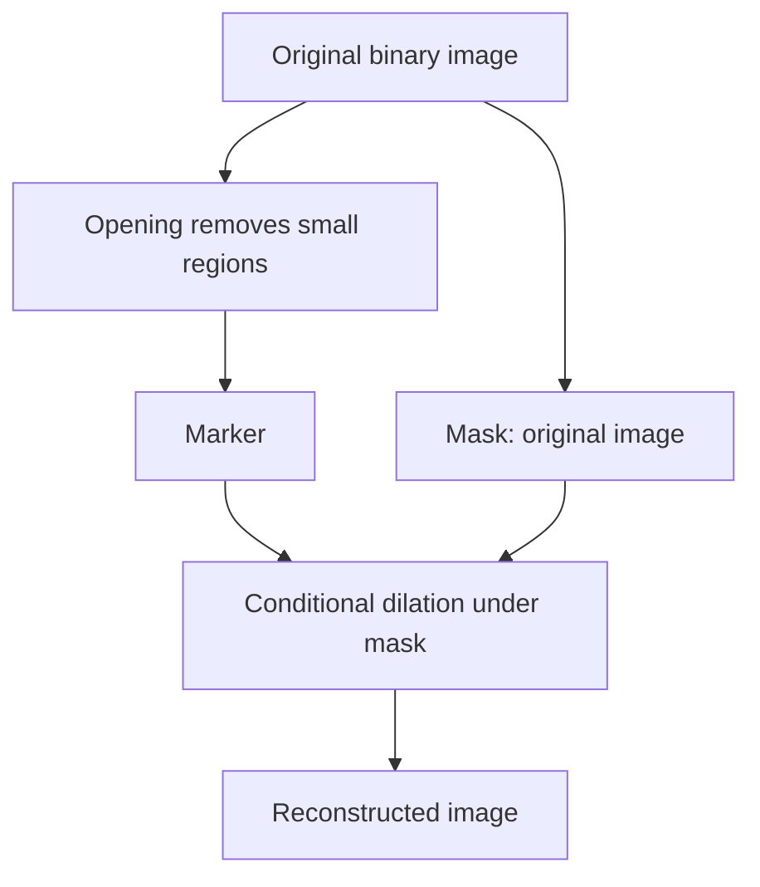

> [!info] 课件来源
> 原始课件：[[../附件/Part 3 - Edges, Interest points, and Morphology/3-4_Morphology.pdf]]  
> 本节对应 **Part 3 的第 4 个 PPT：Morphological Image Processing**。它承接 [[Part 3 - PPT 2：Edges-II]] 的图像分割内容，重点讲二值图像中的 **structuring element、erosion、dilation、opening、closing**，以及由这些基本操作组合出的边界提取、区域填充、连通分量提取和二值重建。

---

## 0. 本节课的整体主线

本节课的核心问题是：

> **图像分割之后，得到的二值区域往往有噪声、断裂、孔洞、粘连、毛刺；如何用形状规则把这些区域修正得更干净？**

Morphological image processing，中文通常叫 **形态学图像处理**，是一类直接处理图像中 **shape / morphology** 的方法。

它特别适合处理二值图像，例如：

- 去掉分割后的小噪声点；
- 填补物体内部小孔；
- 分离轻微粘连的目标；
- 连接断裂的线条或边界；
- 提取物体边界；
- 填充封闭区域；
- 提取连通分量；
- skeletonization 骨架化。

> [!summary] 一句话理解本节课
> **形态学处理就是拿一个小模板 structuring element 在二值图像上移动，根据它是否“完全放得下”或“碰得到”前景，来缩小、扩大、清理、连接或重建图像中的形状。**

---

## 1. What is Morphology？什么是形态学图像处理

课件对 morphology 的定义是：

> Morphological image processing describes a range of image processing techniques that deal with the shape of features in an image.

也就是：形态学关注的不是像素灰度本身，而是图像中特征的 **形状、连通性、边界、孔洞、大小和结构**。

### 1.1 形态学常用于哪里？

课件强调，morphological operations 通常用于：

- remove imperfections introduced during segmentation；
- operate on bi-level images；
- 也可以扩展到 greyscale images。

换句话说，形态学最常见的场景是：

1. 先通过 thresholding / segmentation 得到二值图；
2. 再用 morphology 清理结果。

例如课件中的指纹例子：分割后的纹线可能有断裂、小毛刺或噪声；形态学处理后，纹线结构更连续、更干净。

### 1.2 形态学的用途

| 用途 | 说明 |
|---|---|
| image enhancement | 改善二值结构质量 |
| shape analysis | 分析物体形状、边界和结构 |
| image segmentation | 辅助分割结果清理 |
| image restoration | 修补断裂、孔洞或缺损 |
| component analysis | 分析连通区域 |
| edge detection | 通过膨胀/腐蚀提取边界 |
| curve filling | 填充线条或封闭区域 |
| texture analysis | 分析局部结构形态 |
| thinning / thickening | 细化或加粗结构 |
| particle analysis | 分析颗粒数量、大小和形状 |
| feature detection | 检测特定形状结构 |
| skeletonization | 提取骨架 |
| noise reduction | 去除 salt / pepper 噪声 |

---

## 2. Binary Image、Foreground 与 Support

形态学通常从二值图像开始。

### 2.1 Binary image

二值图像中，每个像素只有两个状态：

- foreground 前景；
- background 背景。

通常写成：

$$
I(x,y)\in\{0,1\}
$$

但课件特别提醒：

> whether 0 and 1 refer to white or black is a little interchangeable.

也就是说，不同例子里 1 可能表示白色，也可能表示黑色；关键是你要清楚当前操作的 foreground 是哪一类像素。

> [!warning] 易错点
> 不要死记“1 一定是白”或“1 一定是黑”。形态学操作永远是相对于 foreground/support 来定义的。考试或做题时先确认哪一类是前景。

### 2.2 Support of an image

二值图像的 support 指的是所有前景像素位置的集合。

如果二值图像为 $A$，则：

$$
A=\{(x,y)\mid I(x,y)=1\}
$$

$A^c$ 是它的 complement，即背景像素位置集合。

---

## 3. Structuring Element：结构元素

### 3.1 什么是 structuring element？

Structuring element，简称 **SE**，是形态学中的核心工具。

课件定义：

> A structuring element is a small image used as a moving window whose support delineates pixel neighborhoods in the image plane.

直观理解：SE 是一个小模板，它在图像上滑动，用来“探测”图像局部是否有某种形状。

### 3.2 SE 可以是什么形状？

SE 可以有不同：

- size；
- shape；
- connectivity；
- origin；
- holes；
- disconnected pieces。

常见 SE：

| SE | 适合场景 |
|---|---|
| $3\times3$ square | 均匀处理四周与对角邻域 |
| plus / cross | 4-connected 邻域处理 |
| disk | 圆滑边界、自然形状处理 |
| line | 检测或连接某方向线条 |

### 3.3 SE 的 origin

SE 有一个 origin。形态学操作时，SE 的 origin 被放到当前处理像素 $(x,y)$ 上，然后检查 SE 与图像前景之间的关系。

origin 不一定在 SE 的几何中心，但通常放在中心更直观。

### 3.4 Zero-valued pixels ignored

课件说明：SE 中值为 0 的像素被 ignored。也就是说，SE 中只有 support，也就是值为 1 的位置，参与 fit / hit 判断。

---

## 4. Reflected Structuring Element：反射结构元素

给定 structuring element $s$，它的 reflected structuring element 记作 $\tilde{s}$：

$$
\tilde{s}(x,y)=s(-x,-y)
$$

直观上：

> $\tilde{s}$ 是把 $s$ 绕 origin 旋转 180°。

这个概念在腐蚀和膨胀的对偶关系中很重要。

---

## 5. Fitting 与 Hitting

形态学的两个基本判断是 **fit** 和 **hit**。

### 5.1 Fit：完全放得下

SE is said to fit the image if：

> 对 SE 中每个值为 1 的像素，对应的图像像素也都是 1。

集合语言：

$$
B_z\subseteq A
$$

即把 SE $B$ 平移到位置 $z$ 后，整个 SE support 都落在图像前景 $A$ 内。

### 5.2 Hit：碰得到

SE is said to hit / intersect the image if：

> SE 中至少一个值为 1 的像素，对应图像像素也是 1。

集合语言：

$$
B_z\cap A\ne\varnothing
$$

### 5.3 Fit 和 Hit 的直觉区别

| 判断 | 条件 | 直觉 |
|---|---|---|
| fit | SE 完全包含在前景中 | 放得下 |
| hit | SE 至少碰到一个前景像素 | 碰得到 |

腐蚀用 fit，膨胀用 hit。

---

## 6. Fundamental Operations：腐蚀与膨胀

形态学最基本的两个操作是：

1. erosion 腐蚀；
2. dilation 膨胀。

它们都类似 spatial filtering：把 SE 放在图像每个像素位置，按规则决定输出像素值。

---

## 7. Erosion：腐蚀

### 7.1 定义

课件中腐蚀写作 image $f$ by structuring element $s$：

$$
f\ominus s
$$

其规则为：

$$
g(x,y)=
\begin{cases}
1, & \text{if } s \text{ fits } f\\
0, & \text{otherwise}
\end{cases}
$$

也就是说：把 SE 的 origin 放在 $(x,y)$，如果 SE 的所有前景位置都落在图像前景中，则输出 1；否则输出 0。

集合形式常写为：

$$
A\ominus B=\{z\mid B_z\subseteq A\}
$$

### 7.2 腐蚀的直观效果

腐蚀会让前景对象变小。

具体表现：

- 物体边界向内收缩；
- 窄连接会断开；
- 小的前景噪声会消失；
- 细小突起会被削掉。

### 7.3 腐蚀用于什么？

课件给出的用途包括：

| 用途 | 解释 |
|---|---|
| split apart joined objects | 分开轻微粘连的目标 |
| strip away extrusions | 去掉物体边缘的小突起 |
| remove small bright spots | 去除小的前景噪声，例如 salt noise |

### 7.4 腐蚀的 SE 大小影响

SE 越大，腐蚀越强。

例如：

- $3\times3$ square 会轻微收缩；
- $5\times5$ square 会更强地收缩；
- 大半径 disk 会明显缩小对象，甚至让小对象完全消失。

> [!warning] 腐蚀的副作用
> 腐蚀能去掉噪声和细连接，但也会缩小真实物体。若 SE 太大，真实结构也会被破坏。

---

## 8. Dilation：膨胀

### 8.1 定义

课件中膨胀写作：

$$
f\oplus s
$$

其规则为：

$$
g(x,y)=
\begin{cases}
1, & \text{if } s \text{ hits } f\\
0, & \text{otherwise}
\end{cases}
$$

也就是说：把 SE 的 origin 放在 $(x,y)$，只要 SE 有至少一个前景位置碰到图像前景，就输出 1。

集合形式常写为：

$$
A\oplus B=\{z\mid \hat{B}_z\cap A\ne\varnothing\}
$$

其中 $\hat{B}$ 是反射后的 SE。很多教材对是否显式写反射有不同约定，理解时抓住 “hit” 的概念即可。

### 8.2 膨胀的直观效果

膨胀会让前景对象变大。

具体表现：

- 边界向外扩张；
- 小孔洞被填补；
- 小断裂被连接；
- 细小凹陷被修复；
- 相近目标可能粘连。

### 8.3 膨胀用于什么？

课件给出的用途包括：

| 用途 | 解释 |
|---|---|
| repair breaks | 连接断裂线条或断裂区域 |
| repair intrusions | 填平物体边缘的小凹陷 |
| fill small holes | 填补 pepper noise 或小背景洞 |
| edge detection | 用 dilation 后图像减去原图得到外边界 |

> [!warning] 膨胀的副作用
> 膨胀能填孔和连接断裂，但也会扩大对象。若 SE 太大，相邻对象可能被错误合并。

---

## 9. 腐蚀与膨胀的对偶关系

课件强调：dilation and erosion are duals of each other with respect to complementation。

常见形式为：

$$
A\oplus B = \left(A^c\ominus \tilde{B}\right)^c
$$

以及：

$$
A\ominus B = \left(A^c\oplus \tilde{B}\right)^c
$$

其中：

- $A^c$ 是图像前景集合的补集；
- $\tilde{B}$ 是反射 structuring element。

直观理解：

> 对前景做膨胀，等价于对背景做腐蚀后再取补集；对前景做腐蚀，等价于对背景做膨胀后再取补集。

这个对偶性说明：理论上只要直接实现 erosion 或 dilation 中的一个，另一个可以通过补集和反射得到。

---

## 10. Compound Operations：复合形态学操作

单独使用 erosion 或 dilation 会改变对象大小。为了更有针对性地清理形状，常把它们组合起来。

课件重点讲两个最常用的 compound operations：

1. opening 开运算；
2. closing 闭运算。

此外，二值图像还可以做集合运算：

- complement：$A^c$；
- intersection：$A\cap B$；
- union：$A\cup B$；
- difference：$A-B$。

---

## 11. Opening：开运算

### 11.1 定义

Opening 是先腐蚀再膨胀。

课件记作：

$$
f\circ s
$$

公式为：

$$
f\circ s=(f\ominus s)\oplus s
$$

### 11.2 开运算的直观效果

先腐蚀会：

- 去掉小的前景噪声；
- 削掉细小突起；
- 断开狭窄连接；
- 缩小对象。

再膨胀会：

- 尽量把剩余对象恢复到原来大小；
- 但已经被腐蚀掉的小噪声、小突起、细连接不会恢复。

所以 opening 常用于：

| 用途 | 解释 |
|---|---|
| remove small foreground objects | 去掉小前景点 |
| smooth object contour | 平滑轮廓 |
| break narrow bridges | 断开细连接 |
| remove protrusions | 去掉小突起 |

### 11.3 开运算的记忆法

> [!tip] Opening 记忆法
> **Opening = erosion then dilation：先“瘦身”去小东西，再“长回去”。小前景噪声和细突起回不来了。**

---

## 12. Closing：闭运算

### 12.1 定义

Closing 是先膨胀再腐蚀。

课件记作：

$$
f\bullet s
$$

公式为：

$$
f\bullet s=(f\oplus s)\ominus s
$$

### 12.2 闭运算的直观效果

先膨胀会：

- 填小孔；
- 修小裂缝；
- 连接小断裂；
- 扩大对象。

再腐蚀会：

- 尽量把对象恢复到原来大小；
- 但已被填补的小洞、小裂缝仍然保持填补状态。

所以 closing 常用于：

| 用途 | 解释 |
|---|---|
| fill small holes | 填小孔 |
| bridge small gaps | 连接小断裂 |
| smooth contour | 平滑轮廓 |
| repair intrusions | 修补边界凹陷 |

### 12.3 闭运算的记忆法

> [!tip] Closing 记忆法
> **Closing = dilation then erosion：先“长大”把缺口堵上，再“缩回来”。小孔和小断裂被修复。**

---

## 13. Opening 与 Closing 对比

| 操作 | 公式 | 主要作用 | 副作用 |
|---|---|---|---|
| erosion | $A\ominus B$ | 缩小对象、去小前景点、断开细连接 | 真实对象变小 |
| dilation | $A\oplus B$ | 扩大对象、填小洞、连小断裂 | 对象变大、可能粘连 |
| opening | $(A\ominus B)\oplus B$ | 去小前景噪声、去突起、断开细连接 | 小结构可能消失 |
| closing | $(A\oplus B)\ominus B$ | 填小孔、连小断裂、修凹陷 | 可能合并近邻对象 |

### 13.1 用 salt / pepper noise 理解

- salt noise：小的前景亮点；常用 erosion 或 opening 去掉；
- pepper noise：前景中的小背景黑洞；常用 dilation 或 closing 填补。

---

## 14. Morphological Algorithms

课件后半部分展示了由基本操作组合得到的更复杂算法：

- boundary extraction；
- region filling；
- extraction of connected components；
- thinning / thickening；
- skeletonisation；
- conditional dilation；
- binary reconstruction。

这些算法的共同思路是：

> 通过反复使用 erosion、dilation、intersection、union、complement 和 mask constraint，让图像形状按规则生长、收缩或保留。

---

## 15. Boundary Extraction：边界提取

### 15.1 定义

课件给出边界提取公式：

$$
\beta(A)=A-(A\ominus B)
$$

其中：

- $A$ 是原始前景区域；
- $B$ 是 structuring element；
- $A\ominus B$ 是腐蚀后的内部区域；
- 原区域减去内部区域，就剩边界。

### 15.2 直观理解

腐蚀会把对象边界向内收缩一圈。

因此：

1. 原对象 $A$ 包含边界和内部；
2. 腐蚀后 $A\ominus B$ 主要保留内部；
3. $A-(A\ominus B)$ 就是被腐蚀掉的那一圈，即边界。

### 15.3 SE 对边界连接性的影响

课件展示了：

- square SE 会对应 8-connected 邻域；
- plus / cross SE 会对应 4-connected 邻域。

不同 SE 会影响提取边界的连接方式和厚度。

---

## 16. Region Filling：区域填充

### 16.1 问题定义

给定一个封闭边界和边界内部的一个 seed pixel，region filling 想要把整个封闭区域填成前景。

例如：给一个圆环边界内部的点，算法应把圆内部填满。

### 16.2 关键公式

课件给出的迭代式为：

$$
X_k=(X_{k-1}\oplus B)\cap A^c,\quad k=1,2,3,\ldots
$$

其中：

- $X_0$：边界内部的起始点；
- $B$：简单 structuring element；
- $A$：边界集合；
- $A^c$：边界的补集，即允许填充的区域；
- $X_k$：第 $k$ 次迭代后已填充的区域。

迭代直到：

$$
X_k=X_{k-1}
$$

最后结果与原始边界 union：

$$
X_k\cup A
$$

### 16.3 为什么要与 $A^c$ 相交？

膨胀本身会让区域无限扩张，可能越过边界。

与 $A^c$ 相交的作用是：

> 只允许填充区域在非边界区域中生长，不能穿过边界像素。

这就是一种 masked growth。

---

## 17. Conditional Dilation：条件膨胀

Conditional dilation 可以理解为：

> 每次膨胀后，用 mask 限制膨胀结果，只保留 mask 允许的部分。

典型形式：

$$
X_k=(X_{k-1}\oplus B)\cap M
$$

其中 $M$ 是 mask。

它的作用是让区域在指定范围内生长，而不是任意扩张。

### 17.1 条件膨胀与 region filling 的关系

Region filling 本质上就是条件膨胀的一种：

- marker：内部 seed $X_0$；
- mask：边界补集 $A^c$；
- operation：反复 dilation；
- stop：结果不再变化。

---

## 18. Connected Component Extraction：连通分量提取

连通分量提取的目标是：

> 从一个给定 seed/tag 出发，找出所有与它连通的前景像素。

基本思路：

1. 选择一个属于目标连通区域的 seed；
2. 对 seed 进行 dilation；
3. 用原图作为 mask，只保留原图前景中的像素；
4. 重复 dilation + mask；
5. 直到不再变化，得到与 seed 连通的完整 component。

可写成：

$$
X_k=(X_{k-1}\oplus B)\cap A
$$

其中 $A$ 是原始二值图的前景区域。

### 18.1 和 region filling 的区别

| 算法 | mask | 目标 |
|---|---|---|
| region filling | 边界补集 $A^c$ | 填满封闭边界内部 |
| connected component extraction | 原始前景 $A$ | 找到与 seed 连通的前景分量 |

---

## 19. Binary Reconstruction：二值重建

课件说明：binary reconstruction 常在 opening 后使用，用来 grow back pieces of the original image that are connected to the opening。

### 19.1 为什么需要 reconstruction？

普通 opening 可以去掉小噪声，但也可能改变大对象的细节。

Binary reconstruction 的目标是：

- 去掉与大对象不连通的小区域；
- 保留与大对象连通的原始形状细节；
- 比普通 opening 更少扭曲大对象。

### 19.2 直观流程

1. 对原图做 opening，得到 marker；
2. 用原图作为 mask；
3. 从 marker 开始做 conditional dilation；
4. 只允许在原图前景范围内长回去；
5. 最终保留与 marker 连通的原图部分。

### 19.3 Reconstruction 的优势

普通 opening 可能把大对象的小细节也磨掉；reconstruction 会把与 marker 连通的原图结构长回来，所以能更好地保持大对象形状。

> [!tip] Binary reconstruction 记忆法
> **先用 opening 找“可靠主体”，再用原图当 mask 把主体中仍连通的细节长回来；孤立小噪声因为不连通，不会恢复。**

---

## 20. Thinning、Thickening 与 Skeletonisation

课件只在 agenda 中列出这些算法，没有展开推导，但它们也是形态学的重要应用。

### 20.1 Thinning

Thinning 将前景结构逐步变细，常用于把线条或区域变成单像素宽的骨架。

用途：

- 字符识别；
- 指纹纹线分析；
- 道路/血管中心线提取。

### 20.2 Thickening

Thickening 与 thinning 相反，会让结构变粗，常用于增强细线或补足弱结构。

### 20.3 Skeletonisation

Skeletonisation 提取物体的中心骨架，同时尽量保持拓扑结构。

它可以看作形态学版的“形状中轴线提取”。

---

## 21. SE 选择为什么重要？

Structuring element 决定了形态学操作观察图像的方式。

| SE 参数 | 影响 |
|---|---|
| size | 决定操作尺度，大 SE 去掉/填补更大的结构 |
| shape | 决定保留或删除哪类形状，如 disk 更适合圆形平滑 |
| connectivity | 决定 4-connected 或 8-connected 的邻接关系 |
| origin | 决定输出像素相对于模板的位置 |

### 21.1 选 SE 的原则

- 要去掉比某个尺寸小的噪声：SE 应略大于噪声；
- 要保留细结构：SE 不能太大；
- 要连接断裂线条：SE 形状应匹配线条方向；
- 要平滑自然边界：disk SE 往往比 square SE 更自然。

---

## 22. 本节核心公式整理

### 22.1 腐蚀

$$
A\ominus B=\{z\mid B_z\subseteq A\}
$$

规则：

$$
g(x,y)=
\begin{cases}
1, & B \text{ fits } A\\
0, & \text{otherwise}
\end{cases}
$$

### 22.2 膨胀

$$
A\oplus B=\{z\mid \tilde{B}_z\cap A\ne\varnothing\}
$$

规则：

$$
g(x,y)=
\begin{cases}
1, & B \text{ hits } A\\
0, & \text{otherwise}
\end{cases}
$$

### 22.3 反射 SE

$$
\tilde{B}(x,y)=B(-x,-y)
$$

### 22.4 对偶关系

$$
A\oplus B=\left(A^c\ominus \tilde{B}\right)^c
$$

$$
A\ominus B=\left(A^c\oplus \tilde{B}\right)^c
$$

### 22.5 开运算

$$
A\circ B=(A\ominus B)\oplus B
$$

### 22.6 闭运算

$$
A\bullet B=(A\oplus B)\ominus B
$$

### 22.7 边界提取

$$
\beta(A)=A-(A\ominus B)
$$

### 22.8 区域填充

$$
X_k=(X_{k-1}\oplus B)\cap A^c,
\quad k=1,2,3,\ldots
$$

停止条件：

$$
X_k=X_{k-1}
$$

最终：

$$
X_k\cup A
$$

### 22.9 条件膨胀 / 连通分量生长

$$
X_k=(X_{k-1}\oplus B)\cap M
$$

其中 $M$ 是 mask。

---

## 23. 易混点整理

| 易混点 | 正确理解 |
|---|---|
| 0 和 1 哪个是前景？ | 不同例子可能不同，先确认 foreground/support。 |
| Erosion 和 Dilation | 腐蚀要求 SE fits；膨胀只要求 SE hits。 |
| 腐蚀一定是“变黑”吗？ | 不一定，取决于前景是黑还是白；本质是 foreground shrink。 |
| 膨胀一定是“变白”吗？ | 不一定；本质是 foreground grow。 |
| Opening 和 Closing 顺序 | Opening = 先腐蚀后膨胀；Closing = 先膨胀后腐蚀。 |
| Opening 是否恢复原图？ | 只恢复剩余对象的大致尺寸，小噪声和细突起不会回来。 |
| Closing 是否恢复原图？ | 只恢复大致尺寸，小孔和小裂缝通常被填掉。 |
| Boundary extraction 为什么用原图减腐蚀图？ | 腐蚀后留下内部，差集就是边界。 |
| Region filling 为什么要与 $A^c$ 相交？ | 为了不穿过边界，只在允许区域内生长。 |
| Reconstruction 和普通 opening | Reconstruction 更能保留与主体连通的细节。 |

---

## 24. 考试/复习重点

### 24.1 必须会解释

1. Morphology 为什么常用于 segmentation 后处理；
2. binary image、foreground、background、support、complement；
3. structuring element 的含义、origin 和反射；
4. fit 与 hit 的区别；
5. erosion 的规则、效果和用途；
6. dilation 的规则、效果和用途；
7. erosion 和 dilation 的对偶关系；
8. opening / closing 的顺序、公式和用途；
9. boundary extraction 的公式和直觉；
10. region filling 的迭代公式；
11. conditional dilation 如何用 mask 限制生长；
12. connected component extraction 与 region filling 的区别；
13. binary reconstruction 为什么比普通 opening 更能保留细节。

### 24.2 必须会写

Opening：

$$
A\circ B=(A\ominus B)\oplus B
$$

Closing：

$$
A\bullet B=(A\oplus B)\ominus B
$$

Boundary extraction：

$$
\beta(A)=A-(A\ominus B)
$$

Region filling：

$$
X_k=(X_{k-1}\oplus B)\cap A^c
$$

---

## 25. 自测题

1. 什么是 binary image 的 support？
2. Structuring element 的 origin 有什么作用？
3. fit 和 hit 分别是什么意思？
4. 为什么 erosion 会缩小 foreground？
5. 为什么 dilation 会扩大 foreground？
6. 腐蚀可以用来解决哪些 segmentation 后处理问题？
7. 膨胀可以用来解决哪些 segmentation 后处理问题？
8. 写出 opening 和 closing 的公式，并说明二者顺序区别。
9. Opening 为什么能去除小前景噪声？
10. Closing 为什么能填补小孔洞？
11. 用一句话解释 erosion / dilation 的对偶关系。
12. 为什么 boundary extraction 可以写成 $A-(A\ominus B)$？
13. Region filling 的 seed point 必须在哪里？
14. Region filling 公式中为什么要用 $A^c$？
15. Conditional dilation 与普通 dilation 有什么区别？
16. Connected component extraction 的 mask 通常是什么？
17. Binary reconstruction 为什么能保留大对象细节？
18. 如何根据任务选择 SE 的大小和形状？

---

## 26. 本节总结

本节课系统介绍了二值图像的形态学处理。形态学不是直接分析灰度梯度或语义类别，而是用 structuring element 对图像形状进行局部探测和修改。

最基础的两个操作是：

- **erosion**：SE 必须完全 fit 前景，结果使对象缩小；
- **dilation**：SE 只需 hit 前景，结果使对象扩大。

在此基础上可以构造：

- **opening**：先腐蚀再膨胀，去小前景噪声、小突起和细连接；
- **closing**：先膨胀再腐蚀，填小孔、小断裂和凹陷；
- **boundary extraction**：原图减去腐蚀后的内部；
- **region filling**：从内部种子点出发，在边界约束下迭代膨胀；
- **connected component extraction**：从 seed 出发，在原图 mask 中找连通分量；
- **binary reconstruction**：用 mask 约束地长回与 marker 连通的原图结构。

> [!summary] 最重要的一句话
> **形态学处理的关键是 structuring element：腐蚀看它能否完全放进前景，膨胀看它是否碰到前景；开闭运算和各种形态学算法都是这两个基本判断的组合。**
