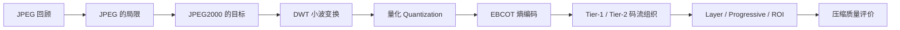
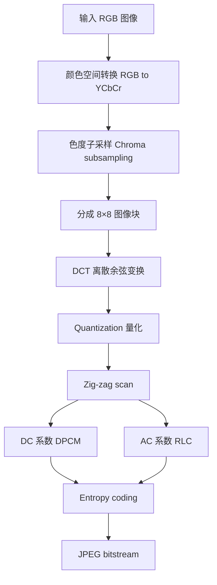
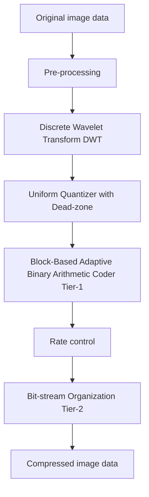
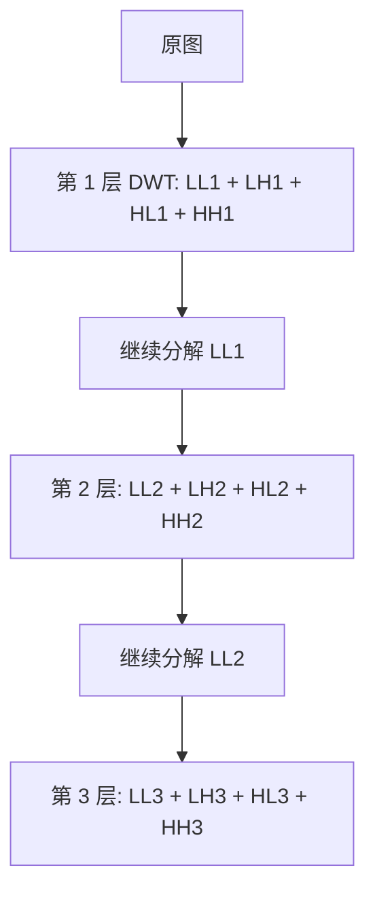

> [!info] 课件来源
> 原始课件：[[课程笔记/图像与视频处理/附件/Part 4 - Image Compression (JPEG2000), Image Sequences, MPEG7/4-1_Image Compression_updated.pdf]]  
> 本笔记对应 **图像与视频处理 Part 4 的第 1 个 PPT：Image Compression**。本节从传统 JPEG 的基本流程出发，重点解释 **JPEG2000** 为什么要用小波变换、EBCOT 分层编码、progressive coding、ROI coding，以及如何用 PSNR、MSE、MAE、SSIM 评价压缩图像质量。

---

# Part 4 - PPT 1：Image Compression

## 0. 本节课的整体主线

这节课可以按一条非常清晰的路线理解：



一句话概括：

> [!summary] 核心理解
> **JPEG** 主要靠 8×8 DCT、量化、zig-zag、RLC 和熵编码压缩图像；  
> **JPEG2000** 则把图像变成多分辨率的小波子带，再用 bit-plane 与 EBCOT 组织出可以按质量、分辨率、空间位置、ROI 渐进解码的码流。

本节的学习目标是：

1. 理解图像压缩为什么重要，以及有损 / 无损压缩的基本取舍；
2. 比较 JPEG 与 JPEG2000 在效率、质量、应用场景上的差异；
3. 理解 JPEG2000 的核心技术：DWT、dead-zone quantization、EBCOT、Layer、ROI；
4. 能用 MSE、MAE、PSNR、SSIM 评价压缩图像的失真程度。

---

## 1. 图像压缩的基本动机

数字图像通常数据量很大。以一张 RGB 彩色图像为例，每个像素通常需要 24 bit：

- R：8 bit
- G：8 bit
- B：8 bit

如果图像尺寸是 $M \times N$，未压缩数据量约为：

$$
24MN \text{ bits}
$$

压缩的目标是在尽量少牺牲视觉质量的情况下，减少存储与传输成本。

### 1.1 bpp 与压缩比

课件中多次用 **bpp** 衡量压缩程度：

$$
\text{bpp} = \frac{\text{compressed bits}}{\text{number of pixels}}
$$

也就是平均每个像素在压缩后占多少 bit。

压缩比一般写作：

$$
\text{compression ratio} =
\frac{\text{original bits}}{\text{compressed bits}}
$$

例如：

- 若原图是 24 bpp 彩色图，压缩到 0.125 bpp，则压缩比是 $24 / 0.125 = 192:1$；
- 若原图是 8 bpp 灰度图，压缩到 1 bpp，则压缩比是 $8:1$。

> [!note] 注意
> 同一个 bpp 对应的压缩比取决于原图本身的 bit depth。课件里的不同示例可能对应彩色图或灰度图，所以理解公式比死记数字更重要。

---

## 2. JPEG：传统图像压缩流程回顾

### 2.1 JPEG 是什么

JPEG 全称是 **Joint Photographic Experts Group**，1992 年成为国际标准。它的特点包括：

- 支持彩色图像与灰度图像；
- 支持最高 24-bit 彩色图像；
- 主要面向自然照片类图像；
- 在摄影、网络图片、医学、遥感等场景都有大量应用；
- 是一种典型的 **有损压缩** 方法。

JPEG 的核心心理视觉依据是：

1. 人眼对高频信息不如低频信息敏感；
2. 人眼对颜色变化不如亮度变化敏感。

这两个观察决定了 JPEG 的两个关键策略：

- 把图像变换到频率域；
- 对高频和颜色相关成分压缩得更狠。

---

### 2.2 JPEG 编码器的整体流程

课件中的 baseline JPEG encoder 可以整理成下面的流程：



每一步的作用如下：

| 步骤 | 作用 | 为什么能压缩 |
|---|---|---|
| RGB $\to$ YCbCr | 分离亮度 Y 与色度 Cb/Cr | 人眼更敏感于亮度，色度可以更粗略 |
| Chroma subsampling | 降低色度分量采样率 | 减少颜色数据量 |
| 8×8 blocks | 把图像切成小块 | 局部区域内像素相关性较强，便于变换 |
| DCT | 把空间像素变成频率系数 | 能量通常集中在低频 |
| Quantization | 对 DCT 系数除以量化步长并取整 | 高频小系数容易变成 0，是主要有损步骤 |
| Zig-zag scan | 从低频到高频重排系数 | 把大量 0 集中到序列后部 |
| DPCM for DC | 相邻块 DC 系数作差 | 相邻块平均亮度通常相近 |
| RLC for AC | 对连续 0 做游程编码 | 高频量化后会出现长串 0 |
| Entropy coding | Huffman / arithmetic 等无损编码 | 利用符号概率差异继续压缩 |

---

### 2.3 DCT：把像素块变成频率系数

对每个 8×8 block，JPEG 使用二维 DCT：

$$
f(x,y) \rightarrow F(u,v)
$$

其中：

- $f(x,y)$ 是空间域像素值；
- $F(u,v)$ 是频率域系数；
- $F(0,0)$ 是 **DC coefficient**，表示该块的平均亮度；
- 其他系数是 **AC coefficients**，表示不同方向、不同频率的纹理变化。

直观理解：

- 左上角低频系数决定图像的大轮廓；
- 右下角高频系数决定细节、纹理、噪声；
- 自然图像的大部分能量集中在低频，所以高频可以被更强量化。

---

### 2.4 JPEG 的典型问题

JPEG 很成功，但它有明显局限：

1. **8×8 block 导致 blocking artifacts**  
   压缩率很高时，块边界会变得明显。

2. **不天然支持高质量渐进式多分辨率解码**  
   虽然 JPEG 有 progressive JPEG，但灵活性不如 JPEG2000。

3. **有损与无损不是同一套优雅框架**  
   传统 JPEG 的无损模式不如 JPEG2000 的可逆小波路径统一。

4. **对合成图像、文字、图形边缘不够友好**  
   JPEG 面向自然照片，高压缩下文字、线条和图表容易产生振铃、模糊、块效应。

这些问题正是 JPEG2000 要解决的重点。

---

## 3. JPEG2000：为什么要提出新标准

### 3.1 JPEG2000 的基本定位

JPEG2000 是 JPEG 委员会在 2000 年左右推出的新图像编码系统。课件中强调：

- 常见扩展名：`.jp2`
- MIME type：`image/jp2`
- 核心技术基于 **wavelet technology 小波技术**
- 面向从数码相机到医学图像的广泛应用

JPEG2000 的核心不是把 JPEG 小修小补，而是换了一套更适合多分辨率、渐进传输和高压缩质量的编码架构。

---

### 3.2 为什么需要 JPEG2000

课件列出了 JPEG2000 的几个重要动机：

| 动机 | 解释 |
|---|---|
| 更高压缩比 | 可以支持很低 bpp，例如低于 0.25 bpp 的高压缩场景 |
| 有损与无损统一 | 同一个框架内可支持 lossy 与 lossless |
| 更适合合成图像 | 对文字、图形、复合文档等比传统 JPEG 更友好 |
| 错误鲁棒性 | 适合无线、移动等可能出现码流错误的环境 |
| 可伸缩编码 | 可以按质量、分辨率、空间区域逐步解码 |
| ROI 支持 | 允许重要区域高质量，背景低质量 |

> [!tip] 理解 JPEG2000 的关键词
> 如果只记一个核心区别：  
> **JPEG 是 block-DCT transform coding；JPEG2000 是 wavelet + EBCOT scalable coding。**

---

### 3.3 JPEG2000 的应用场景

课件给出的应用包括：

- Internet 图像传输；
- Mobile 移动设备；
- Printing 打印；
- Scanning 扫描；
- Digital photos 数码照片；
- Aerial imaging 航拍 / 遥感；
- Fax；
- Medical imaging 医学图像；
- E-commerce。

这些应用共同需要：

- 高压缩；
- 可按网络情况逐步传输；
- 局部区域可能比整体更重要；
- 有时需要无损保存。

---

### 3.4 JPEG2000 标准的组成

课件列出 JPEG2000 标准的多个部分，考试或复习时不需要逐字背全部编号，但要知道它不是单一文件格式，而是一套标准族：

| Part | 内容 |
|---|---|
| Part 1 | Core coding system，核心编码系统 |
| Part 2 | Extensions，扩展功能 |
| Part 3 | Motion JPEG 2000 |
| Part 4 | Conformance，一致性测试 |
| Part 5 | Reference software，Java/C 参考实现 |
| Part 6 | Compound image file format，复合图像文件 |
| Part 8 | JPSEC，安全相关 |
| Part 9 | JPIP，交互式协议与 API |
| Part 10 | JP3D，3D / 体数据 |
| Part 11 | JPWL，无线应用 |
| Part 12 | ISO Base Media File Format，与 MPEG-4 共用的媒体框架 |

---

## 4. JPEG vs JPEG2000：核心差异

课件用不同 bpp 下的图像对比说明：在很低码率时，JPEG2000 通常比 JPEG 更能保留整体结构，并减少 8×8 块效应。

| 维度 | JPEG | JPEG2000 |
|---|---|---|
| 主要变换 | 8×8 DCT | Discrete Wavelet Transform |
| 图像划分 | 固定 8×8 block | 可 tiling，但核心变换是多分辨率子带 |
| 压缩风格 | 量化 DCT 系数后 RLC + entropy coding | 小波系数量化后 EBCOT bit-plane coding |
| 高压缩伪影 | blocking artifacts 明显 | 更少块效应，可能出现模糊 / ringing |
| 有损 / 无损 | 传统框架不统一 | 可逆 / 不可逆路径统一 |
| 渐进解码 | 有 progressive JPEG，但灵活度有限 | 天然支持质量、分辨率、空间、ROI 渐进 |
| ROI | 不属于核心优势 | 重要特性 |
| 适合场景 | 普通照片、广泛兼容 | 医学、遥感、档案、交互传输、高质量压缩 |

> [!warning] 不要误解
> JPEG2000 技术上更强，不代表所有场景都替代 JPEG。JPEG 的生态、浏览器支持、硬件支持、简单性和兼容性非常强，所以现实中 JPEG 仍然极常见。

---

## 5. JPEG2000 的编码框架

课件中的 JPEG2000 overview 可以整理为：



这个流程对应四个核心问题：

1. **Pre-processing**：输入图像怎样准备？
2. **DWT**：怎样把图像变成多分辨率频率子带？
3. **Quantization**：怎样丢弃不重要的小波系数？
4. **Tier-1 / Tier-2**：怎样把量化后的系数组织成可渐进解码的码流？

---

## 6. Pre-processing：JPEG2000 的预处理

### 6.1 Tiling

**Tiling** 是把图像分成若干不重叠的矩形 tile：

- tile 通常大小相等；
- 图像边界处的 tile 可能尺寸不同；
- 每个 tile 可以独立压缩；
- 每个 tile 可以有自己的压缩参数。

好处：

- 降低内存需求；
- 支持局部随机访问；
- 适合大图像，如遥感、医学图像。

潜在问题：

- tile 太小可能出现 tile 边界伪影；
- 每个 tile 独立编码可能降低全局统计利用效率。

---

### 6.2 Level offset

**Level offset** 的作用是把像素值中心移动到 0 附近。

例如 8-bit 灰度像素原本在：

$$
[0,255]
$$

经过 level offset 后可以近似变为：

$$
[-128,127]
$$

这样做的原因是：

- 小波变换和后续量化更适合处理零均值附近的数据；
- 能更充分利用正负动态范围；
- 低频 / 高频系数的统计分布更集中。

---

### 6.3 Colour component transformation

JPEG2000 支持把 RGB 转换到更适合压缩的颜色空间，例如：

- $YC_bC_r$
- YUV 类空间

课件区分了两类变换：

| 类型 | 英文 | 特点 | 适合 |
|---|---|---|---|
| ICT | Irreversible Colour Transform | 浮点或定点计算，会引入舍入误差 | 有损压缩 |
| RCT | Reversible Colour Transform | 不引入量化误差，可完全反变换 | 无损压缩 |

核心思想仍然是：亮度和色度分离后，可以更有效压缩色度信息。

---

## 7. Discrete Wavelet Transform：JPEG2000 的关键变换

### 7.1 为什么从 DCT 换成 DWT

JPEG 用 DCT 处理 8×8 小块。JPEG2000 改用 **Discrete Wavelet Transform 离散小波变换**，原因是 DWT 同时具有：

1. **空间定位能力**：知道某个特征大致出现在图像哪里；
2. **频率分析能力**：知道它属于低频轮廓还是高频细节；
3. **多分辨率能力**：可以先得到低分辨率图像，再逐步加入细节；
4. **可逆 / 不可逆选择**：适配无损或有损压缩。

---

### 7.2 1-D Two-Band DWT

课件先用一维信号解释 two-band DWT：

```mermaid
graph LR
    X[x[n] 输入信号] --> LP[低通滤波 h0]
    X --> HP[高通滤波 h1]
    LP --> DS1[下采样 by 2]
    HP --> DS2[下采样 by 2]
    DS1 --> L[低频输出]
    DS2 --> H[高频输出]
```

含义：

- **低通滤波器 $h_0$**：提取平滑、低频成分；
- **高通滤波器 $h_1$**：提取变化、边缘、纹理等高频细节；
- **下采样 by 2**：滤波后数据量减半。

所以一维 DWT 把原始信号分成：

$$
\text{signal} \rightarrow \text{low-frequency part} + \text{high-frequency detail}
$$

---

### 7.3 把 1-D DWT 应用到二维图像

二维图像的 DWT 通常先沿一个方向做一维 DWT，再沿另一个方向做一维 DWT。

结果会产生四个子带：

| 子带 | 含义 | 直观解释 |
|---|---|---|
| LL | Low-Low | 水平和垂直方向都低频，近似图像 |
| LH | Low-High | 一个方向低频、另一个方向高频，方向性细节 |
| HL | High-Low | 另一类方向性细节 |
| HH | High-High | 对角线、高频纹理、细碎变化 |

> [!note] 方向命名
> 不同教材可能对 LH / HL 的方向解释略有不同。记住本质即可：**LL 是低分辨率近似图，LH/HL/HH 是三个方向的细节子带。**

---

### 7.4 多层小波分解：multiresolution

JPEG2000 不只做一次 DWT，而是会继续对 LL 子带做分解：



课件中给出的理解方式是：

| 解码层级 | 使用的子带 | 效果 |
|---|---|---|
| Resolution 0 | 只有 LL3 | 最低分辨率 / 最粗略图像 |
| Resolution 1 | LL3 + LH3 + HL3 + HH3 | 加入第 3 层细节 |
| Resolution 2 | 再加入 LH2 + HL2 + HH2 | 更高分辨率 / 更高质量 |
| Resolution 3 | 再加入 LH1 + HL1 + HH1 | 接近完整质量 |

这就是 JPEG2000 能够 **先传低分辨率预览，再逐步增强细节** 的根本原因。

---

## 8. Quantization：JPEG2000 的量化

### 8.1 量化的作用

DWT 后得到大量小波系数。量化的目的仍然是：

- 保留重要系数；
- 把不重要的小系数变成 0；
- 降低后续熵编码的数据量。

JPEG2000 使用的是：

> **uniform scalar quantizer with dead-zone**

即带死区的均匀标量量化器。

---

### 8.2 Dead-zone quantizer

课件中的量化规则为：

$$
q_j(m,n)
=
\operatorname{sign}(y_j(m,n))
\left\lfloor
\frac{|W_j(m,n)|}{\Delta_j}
\right\rfloor
$$

其中：

| 符号 | 含义 |
|---|---|
| $W_j(m,n)$ | 第 $j$ 个 sub-band 中位置 $(m,n)$ 的 DWT 系数 |
| $\Delta_j$ | 第 $j$ 个 sub-band 的量化步长 |
| $q_j(m,n)$ | 量化后的 index |
| $\operatorname{sign}(\cdot)$ | 正负号 |

dead-zone 的意思是：0 附近有一个更宽的区间会被量化为 0。课件图中 0 附近的区间宽度是 $2\Delta_j$，比其他区间更宽。

这样做的好处：

- 小幅度高频系数大量变成 0；
- 0 的数量增加后，后续 bit-plane coding 和 entropy coding 更容易压缩；
- 视觉上不重要的细小变化被优先丢弃。

---

### 8.3 量化步长的选择

每个 sub-band 可以选择不同的 $\Delta_j$。

一般来说：

- 对人眼敏感的低频 / 重要子带：量化步长小，保留更多信息；
- 对人眼不敏感的高频 / 细节子带：量化步长大，压缩更强。

这体现了 **visual model** 的思想：不是所有误差都会被人眼同等感知。

---

### 8.4 课件例子

课件给出：

- Encoder input value：$-21.82$
- Quantizer step size：$\Delta = 10$

则：

$$
\left\lfloor \frac{|-21.82|}{10} \right\rfloor
=
\lfloor 2.182 \rfloor
=
2
$$

因为输入为负，所以量化 index 为：

$$
q = -2
$$

> [!tip] 做题方法
> 先取绝对值，除以步长，向下取整，再加回符号。

---

## 9. JPEG2000 熵编码：EBCOT

JPEG2000 的熵编码核心是：

> **EBCOT = Embedded Block Coding with Optimized Truncation**

它被分成两层：

- **Tier-1 coding**：对 code-block 内的小波系数进行 bit-plane arithmetic coding；
- **Tier-2 coding**：组织 Tier-1 产生的码流，形成可伸缩、可渐进的最终 bitstream。

---

### 9.1 Code-block

每个 tile component 经过 DWT 后产生多个 sub-band。每个 sub-band 会进一步被划分成许多 **code-block**。

特点：

- 每个 code-block 独立熵编码；
- 这样便于局部访问和并行处理；
- 也便于在码流中按重要性截断或重排。

---

### 9.2 Bit-plane conversion

量化后的小波系数是整数。对这些整数，可以按二进制位从最高有效位到最低有效位逐层编码：

```text
MSB  ->  高重要性 bit-plane
...
LSB  ->  低重要性 bit-plane
```

一个 bit-plane 是所有系数在同一 bit 位上的集合。

直观理解：

- 高位 bit 决定系数的大致大小，是粗略但重要的信息；
- 低位 bit 只是细化精度；
- 先编码高位，后编码低位，就天然支持渐进式质量提升。

---

### 9.3 Significant 与 insignificant

在 bit-plane coding 中，一个系数一开始是 **insignificant**，直到从某个 bit-plane 开始第一次出现 1。

第一次出现 1 时：

- 该系数变成 **significant**；
- 需要编码它的 sign；
- 之后的低位 bit 用于 refinement。

这与课件图中的 “First 1 appear” 对应。

---

### 9.4 三个 coding passes

课件说明每个 bit-plane 通常被分成三个 sub bit-plane passes：

| Pass | 中文理解 | 作用 |
|---|---|---|
| Significance propagation pass | 显著性传播 | 优先编码邻域中可能变显著的系数 |
| Magnitude refinement pass | 幅值细化 | 对已经 significant 的系数补充更低位精度 |
| Clean up pass | 清理 | 编码剩下未被前两类处理的样本 |

这种拆分带来一个关键优势：

> bitstream 可以在每个 pass 结束处截断。

也就是说，编码器可以根据目标码率决定保留多少 pass，从而实现更精细的 rate control。

---

### 9.5 Arithmetic coding

课件中提到，pass 中产生的二进制符号会经过 **adaptive binary arithmetic coder** 编码。

核心思想：

- 不同 bit 的概率不同；
- 不同上下文中的 bit 概率也不同；
- 算术编码可以比固定长度编码更接近理论熵极限。

JPEG2000 中 Tier-1 的目标就是把 code-block 的 bit-plane 信息压成高效、可截断、可组织的嵌入式码流。

---

## 10. Tier-1 与 Tier-2 的分工

### 10.1 Tier-1：生成独立 code-block bitstreams

Tier-1 接收量化后的小波系数，并对每个 code-block 独立编码。

它输出的是：

- 每个 code-block 一个 embedded bitstream；
- bitstream 可在多个 truncation points 截断；
- 每个截断点对应不同的码率和失真。

---

### 10.2 Tier-2：组织最终 codestream

Tier-2 的作用不是重新压缩每个系数，而是：

1. multiplex 多个 code-block 的 bitstreams；
2. 记录 coding pass 的顺序；
3. 把数据组织成 packets；
4. 支持多种 progression order；
5. 让解码器可以按需要解析部分码流。

课件强调 Tier-2 使以下伸缩性成为可能：

- SNR scalability：按质量逐步提高；
- Resolution scalability：按分辨率逐步提高；
- Spatial scalability：按空间区域访问；
- ROI scalability：重要区域优先；
- Arbitrary progression scalability：任意进度组织。

---

## 11. Progressive Coding：为什么 JPEG2000 可以渐进解码

### 11.1 什么是 progressive coding

Progressive coding 指的是：

> 不必等完整文件全部下载 / 解码，先用一部分码流得到粗略图像，再逐步加入更多信息提升质量或分辨率。

JPEG2000 的 progressive coding 来自两个结构：

1. DWT 的多分辨率子带；
2. EBCOT 的 bit-plane / layer 组织。

---

### 11.2 按分辨率渐进

只解码低层 LL 子带，可以得到低分辨率预览图；继续加入更高层细节子带，就能得到更高分辨率。

例如：

```text
LL3
-> LL3 + level-3 details
-> + level-2 details
-> + level-1 details
-> full resolution
```

适合场景：

- 网络图片预览；
- 大图像远程浏览；
- 医学图像先快速看全局，再放大局部；
- 遥感图像按区域逐步加载。

---

### 11.3 按质量 / SNR 渐进

按质量渐进时，分辨率可能保持不变，但先解码高重要性的 bit-plane，再逐步加入低位精度。

直观过程：

1. 先看轮廓；
2. 再看到主要纹理；
3. 再减少量化噪声；
4. 最后接近完整质量。

这与 JPEG2000 的 **Layer** 概念直接相关。

---

## 12. Layers：按质量组织码流

课件定义：

> A layer is a collection of some consecutive bit-plane coding passes from all code-blocks in all sub-bands and components.

中文理解：

> **Layer 是从所有 code-block、所有 sub-band、所有 component 中收集若干连续 bit-plane coding passes 形成的一层质量增量。**

关键点：

- 每个 layer 都会提高图像质量；
- layer 经常与 SNR 或视觉质量级别相关；
- 每个 code-block 可以向一个 layer 贡献任意数量的 passes；
- layer 的组织由 encoder 决定；
- layer 数量可以从 1 到 65535；
- 实际中通常大约 20 层；
- 交互式应用中可以根据用户反馈动态生成更多 layer。

> [!example] 直观例子
> 第 1 个 layer 可能只提供粗略图像；  
> 第 2 个 layer 加入更多重要 bit-plane；  
> 第 3 个 layer 再加入细节；  
> 直到最后一层接近最高质量。

---

## 13. ROI：Region of Interest coding

### 13.1 ROI 的基本思想

**ROI = Region of Interest**，即感兴趣区域。

ROI coding 允许：

- ROI 区域用更高质量编码；
- 背景区域用更低质量编码；
- 在相同码率下优先保证关键区域；
- 或者在相同 ROI 质量下提高整体压缩比。

课件中的核心句子是：

> The ROI is coded with a higher quality than the background.

---

### 13.2 为什么 ROI 有用

图像中并不是所有区域都同样重要。

例如：

| 场景 | ROI 可能是什么 |
|---|---|
| 医学图像 | 病灶、器官边界、医生关注区域 |
| 遥感图像 | 城市、道路、目标区域 |
| 视频会议 | 人脸区域 |
| 电商图 | 商品主体 |
| 移动端浏览 | 用户当前放大的区域 |

ROI coding 的思想是：把码率预算优先花在最有价值的区域。

---

### 13.3 Static ROI 与 Dynamic ROI

课件区分了两类 ROI：

| 类型 | 定义时间 | 特点 | 适合场景 |
|---|---|---|---|
| Static ROI | 编码时定义 | ROI mask 固定 | 存储、固定传输、遥感 |
| Dynamic ROI | 用户交互时定义 | 客户端 / 服务器根据请求动态生成 layers | 远程医疗、PDA、移动通信 |

Dynamic ROI 特别适合交互式传输：

1. 用户先看到低分辨率全图；
2. 用户点击或放大某个区域；
3. 服务器优先发送该区域的高质量数据。

---

## 14. 压缩图像质量评价

图像压缩总是在码率和质量之间做权衡。课件最后介绍了两类评价方式：

1. **Fidelity metrics**：逐像素计算误差；
2. **Perceptual quality metrics**：考虑人眼视觉感知。

---

### 14.1 MAE：Mean Absolute Error

MAE 是平均绝对误差：

$$
MAE =
\frac{1}{n}
\sum_{i=1}^{n}
|y_i - x_i|
=
\frac{1}{n}
\sum_{i=1}^{n}
|e_i|
$$

含义：

- 每个像素误差取绝对值；
- 再求平均；
- 数值越小，和参考图越接近。

优点：

- 容易理解；
- 对异常值没有 MSE 那么敏感。

缺点：

- 不区分误差出现在重要区域还是不重要区域；
- 不反映人眼感知。

---

### 14.2 MSE：Mean Square Error

MSE 是平均平方误差：

$$
MSE =
\frac{1}{mn}
\sum_{i=0}^{m-1}
\sum_{j=0}^{n-1}
[I(i,j)-K(i,j)]^2
$$

其中：

- $I(i,j)$ 是参考图像；
- $K(i,j)$ 是压缩 / 失真图像；
- $m \times n$ 是图像尺寸。

特点：

- 数值越小越好；
- 大误差会被平方放大；
- 是 PSNR 的基础。

---

### 14.3 PSNR：Peak Signal-to-Noise Ratio

PSNR 定义为：

$$
PSNR =
10 \log_{10}
\left(
\frac{MAX_I^2}{MSE}
\right)
$$

也可写成：

$$
PSNR =
20 \log_{10}(MAX_I)
-
10 \log_{10}(MSE)
$$

对于 8-bit 图像：

$$
MAX_I = 255
$$

理解：

- MSE 越小，PSNR 越大；
- PSNR 越大，通常表示失真越小；
- 如果 MSE = 0，PSNR 理论上是无穷大。

> [!warning] PSNR 的局限
> PSNR 是逐像素误差指标，简单、可计算、物理意义清楚，但不一定符合人眼视觉质量。例如两张图 MSE 一样，人的主观感受可能完全不同。

---

### 14.4 课件 PSNR 例题

参考帧 Frame A：

| 255 | 255 | 255 |
|---:|---:|---:|
| 0 | 255 | 0 |
| 0 | 255 | 0 |

Frame B：

| 128 | 128 | 128 |
|---:|---:|---:|
| 0 | 128 | 0 |
| 0 | 128 | 0 |

Frame C：

| 64 | 64 | 64 |
|---:|---:|---:|
| 4 | 64 | 4 |
| 4 | 64 | 4 |

以 Frame A 为参考，计算结果：

| 对比 | SSE | MSE | MAE | PSNR |
|---|---:|---:|---:|---:|
| A vs B | 80645 | 8960.56 | 70.56 | 8.61 dB |
| A vs C | 182469 | 20274.33 | 107.89 | 5.06 dB |

结论：

> Frame B 的 MSE 更小、PSNR 更高，所以 Frame B 比 Frame C 更接近参考帧 Frame A。

---

### 14.5 SSIM：Structural Similarity

课件最后介绍 **SSIM = Structural Similarity**，它是 2004 年提出的感知质量指标，试图更接近人类视觉系统。

公式为：

$$
SSIM(x,y)
=
\frac{
(2\mu_x\mu_y+c_1)(2\sigma_{xy}+c_2)
}{
(\mu_x^2+\mu_y^2+c_1)(\sigma_x^2+\sigma_y^2+c_2)
}
$$

其中：

| 符号 | 含义 |
|---|---|
| $\mu_x,\mu_y$ | 两幅图像局部均值，反映亮度 |
| $\sigma_x^2,\sigma_y^2$ | 方差，反映对比度 |
| $\sigma_{xy}$ | 协方差，反映结构相似性 |
| $c_1,c_2$ | 稳定常数，避免分母接近 0 |

SSIM 关注三类信息：

1. luminance 亮度；
2. contrast 对比度；
3. structure 结构。

所以它比 MSE / PSNR 更接近人眼感知。

---

### 14.6 SSIM vs MSE

课件中用一组图说明：多种失真图像可以有相同 MSE，但主观质量明显不同。

原因是：

- MSE 只看像素差；
- SSIM 看结构是否保留；
- 人眼对结构破坏非常敏感；
- 同样大小的像素误差，如果分布方式不同，主观感受也不同。

例如：

| 失真类型 | MSE 可能相同吗 | 主观质量可能不同吗 |
|---|---|---|
| 加性噪声 | 是 | 是 |
| 模糊 | 是 | 是 |
| JPEG blocking | 是 | 是 |
| 对比度变化 | 是 | 是 |
| 结构扭曲 | 是 | 是 |

> [!summary] 指标选择
> 工程上常用 PSNR，因为简单、可复现、方便比较；  
> 但如果关心人的主观视觉质量，SSIM 通常更有解释力。

---

## 15. 本节关键术语速查

| 术语 | 中文 | 重点 |
|---|---|---|
| JPEG | 联合图像专家组标准 | 8×8 DCT，有损压缩，广泛兼容 |
| JPEG2000 | 新一代 JPEG 标准 | DWT + EBCOT，支持伸缩与 ROI |
| DCT | 离散余弦变换 | JPEG 的核心变换 |
| DWT | 离散小波变换 | JPEG2000 的核心变换 |
| Tiling | 分块 / 瓦片 | 大图独立压缩，支持局部访问 |
| Level offset | 电平偏移 | 把像素中心移到 0 附近 |
| ICT | 不可逆颜色变换 | 适合有损 |
| RCT | 可逆颜色变换 | 适合无损 |
| Sub-band | 子带 | LL/LH/HL/HH |
| Quantization | 量化 | 主要有损步骤 |
| Dead-zone | 死区 | 让小系数更容易变成 0 |
| Code-block | 码块 | EBCOT 的独立编码单位 |
| Bit-plane | 位平面 | 从 MSB 到 LSB 逐层编码 |
| EBCOT | 嵌入式块编码优化截断 | JPEG2000 熵编码核心 |
| Tier-1 | 第一层编码 | code-block 内 bit-plane arithmetic coding |
| Tier-2 | 第二层组织 | packets、layers、progression order |
| Layer | 质量层 | 每层提升质量 / SNR |
| ROI | 感兴趣区域 | 重要区域优先高质量 |
| MSE | 均方误差 | 像素级误差平方平均 |
| MAE | 平均绝对误差 | 像素级绝对误差平均 |
| PSNR | 峰值信噪比 | 越高通常越好 |
| SSIM | 结构相似性 | 更接近视觉感知 |

---

## 16. 最容易考 / 最容易混的点

### 16.1 JPEG 与 JPEG2000 的一行对比

> JPEG：8×8 DCT + quantization + zig-zag + RLC/DPCM + entropy coding  
> JPEG2000：DWT + dead-zone quantization + EBCOT + Tier-2 scalable bitstream

---

### 16.2 为什么 JPEG2000 没有 JPEG 那么明显的块效应

JPEG 对每个 8×8 block 独立做 DCT，高压缩时块之间边界不连续，所以会出现 blocking artifacts。

JPEG2000 使用小波多分辨率分解，不以 8×8 block 作为核心变换单位，因此高压缩时通常不会出现传统 JPEG 那种规则的 8×8 方块伪影。

---

### 16.3 DWT 四个子带怎么理解

最重要的是：

- LL：低分辨率近似图；
- LH/HL/HH：不同方向的细节；
- 对 LL 递归分解可以得到多分辨率金字塔。

---

### 16.4 Layer 与 resolution 的区别

| 概念 | 改变什么 | 例子 |
|---|---|---|
| Resolution progressive | 图像尺寸 / 分辨率逐步提升 | 先小图预览，再高清 |
| Layer / SNR progressive | 同一分辨率下质量逐步提升 | 先粗糙，再清晰 |

---

### 16.5 PSNR 高一定代表视觉质量好吗

不一定。

PSNR 只由 MSE 决定，无法判断误差是否破坏结构。SSIM 更关注结构、亮度、对比度，所以更接近主观质量。

---

## 17. 复习问题

1. JPEG 编码流程中，哪一步是主要有损步骤？为什么？
2. 为什么 JPEG 要用 zig-zag scan？
3. JPEG 的 DC 系数和 AC 系数分别表示什么？
4. JPEG2000 为什么使用 DWT 而不是 8×8 DCT？
5. LL、LH、HL、HH 四个子带分别表示什么？
6. dead-zone quantizer 为什么能提高压缩率？
7. EBCOT 中 bit-plane coding 为什么支持渐进式解码？
8. Tier-1 和 Tier-2 的分工是什么？
9. Layer 和 ROI 的作用分别是什么？
10. MSE、PSNR、SSIM 的区别是什么？

---

## 18. 本节总结

本节课从 JPEG 入手，说明传统图像压缩如何利用人眼对高频和色度不敏感的特点，通过 DCT、量化和熵编码降低数据量。随后引出 JPEG2000：它用 DWT 代替 8×8 DCT，获得多分辨率表示；用 dead-zone quantization 强化小系数归零；用 EBCOT 对 code-block 逐 bit-plane 编码；再由 Tier-2 把码流组织成支持 layer、resolution、ROI 等多种渐进方式的结构。

最后，压缩质量不能只凭肉眼或文件大小判断。MSE、MAE、PSNR 提供了简单的像素级误差度量；SSIM 则进一步考虑亮度、对比度和结构，更接近人类视觉感知。

> [!success] 记忆锚点
> **JPEG2000 = 小波多分辨率 + 可截断 bit-plane 码流 + 可伸缩组织。**
