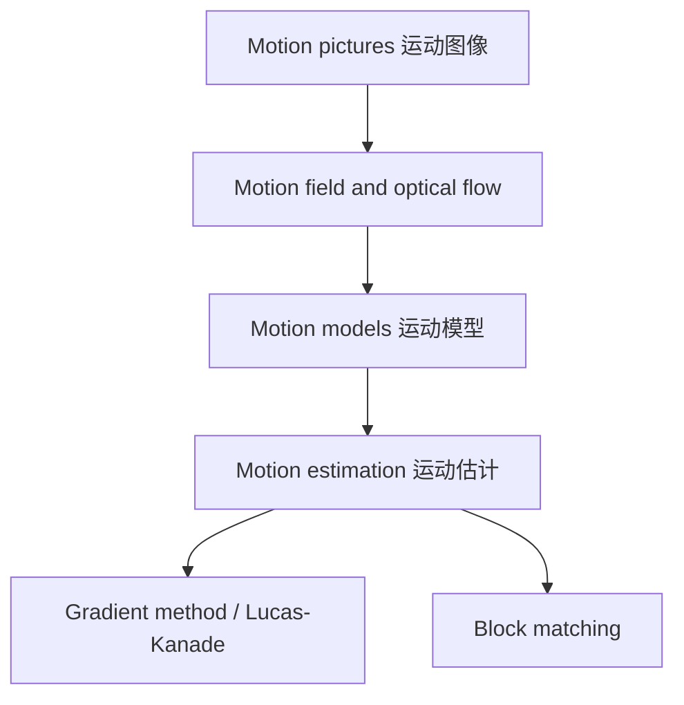
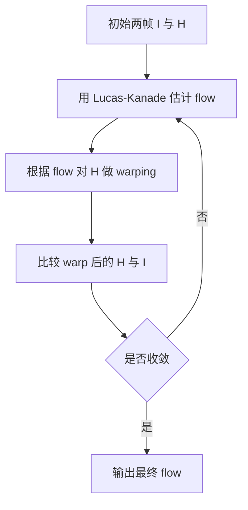

> [!info] 课件来源
> 原始课件：[[课程笔记/图像与视频处理/附件/Part 4 - Image Compression (JPEG2000), Image Sequences, MPEG7/4-2_Sequences_updated.pdf]]  
> 本笔记对应 **图像与视频处理 Part 4 的第 2 个 PPT：Image Sequences**。它承接 [[课程笔记/图像与视频处理/Part 4/Part 4 - PPT 1：Image Compression|Part 4 - PPT 1：Image Compression]] 中的图像压缩思想，进一步讨论视频序列中的运动、光流、运动模型和运动估计。

---

# Part 4 - PPT 2：Image Sequences

## 0. 本节课的整体主线

这节课研究的是 **image sequence 图像序列**，也就是视频的基本形式：一帧一帧图像按照时间顺序排列。核心问题是：

> 给定相邻两帧或多帧图像，怎样估计场景中物体或相机的运动？

课程内容可以分成四条主线：

一句话理解：

> [!summary] 本节核心
> 视频压缩和视频分析都依赖“运动”。运动估计要从相邻帧中找出像素、块或物体如何移动；常见方法包括基于图像梯度的 **optical flow / Lucas-Kanade**，以及视频编码中常用的 **block matching**。

---

## 1. Motion pictures：为什么连续图片会形成运动感

视频本质上不是连续时间信号，而是一系列静态图片。

课件指出：

- 图像序列中的运动是一种视觉错觉；
- 只要以足够高的频率显示静态图片，人眼就会感知到连续运动；
- 常见帧率包括：
  - 25 frames/sec；
  - 30 frames/sec；
  - 48 frames/sec。

帧率的选择与两个因素有关：

| 因素 | 影响 |
|---|---|
| 图像空间分辨率 | 分辨率越高，细节越多，对运动连续性的要求可能越高 |
| 运动幅度 | 运动越快、位移越大，通常需要更高帧率避免跳动感 |

> [!note] 帧率与运动估计
> 帧率越高，相邻帧之间的运动通常越小，运动估计更容易；帧率越低，相邻帧差异更大，光流中的 small motion 假设更容易失效。

---

## 2. Motion estimation 与 motion compensation

### 2.1 Motion estimation：运动估计

课件定义：

> Motion estimation 是一组方法，用来确定场景中物体的运动，并描述从一幅 2D 图像到另一幅 2D 图像的变换；通常用于视频序列中的相邻帧。

换句话说，运动估计回答：

> 当前帧中的这个像素、块或物体，是从上一帧的哪里移动过来的？

输出通常是：

- 每个像素的运动向量；
- 每个块的运动向量；
- 每个物体或区域的运动参数；
- 或某种更复杂的运动场。

---

### 2.2 Motion compensation：运动补偿

Motion compensation 利用运动信息来预测图像帧。

它回答：

> 如果知道物体如何运动，能不能用上一帧或未来帧预测当前帧？

在视频编码中，运动补偿非常重要：

1. 从参考帧中取出相似区域；
2. 根据运动向量移动到当前帧位置；
3. 得到预测帧；
4. 只编码预测误差。

这样能大量减少时间冗余。

---

### 2.3 二者区别

| 概念 | 目的 | 输出 / 使用方式 |
|---|---|---|
| Motion estimation | 找运动 | 输出 motion vectors 或运动参数 |
| Motion compensation | 用运动做预测 | 用运动向量从参考帧预测当前帧 |

> [!tip] 视频编码里的关系
> **先 motion estimation 找出运动向量，再 motion compensation 根据运动向量预测当前帧。**

---

## 3. 运动信息的应用

课件强调：运动是理解世界的丰富信息来源。

### 3.1 图像 / 视频分析应用

| 应用 | 运动信息的作用 |
|---|---|
| Segmentation | 利用运动一致性把前景 / 背景或不同物体分开 |
| Surface structure from parallax | 利用视差和运动推断表面结构或深度 |
| Self-motion | 推断相机或观察者自身运动 |
| Recognition | 动作识别、物体识别 |
| Understanding behavior | 理解人的行为或物体行为 |
| Understanding scene dynamics | 理解场景中动态变化 |

---

### 3.2 对应 / 配准问题

运动估计本质上也是一种 correspondence / registration problem，即找到不同图像之间的对应关系。

课件列出的相关问题包括：

- stereo disparity：立体视觉中的视差估计；
- computer-assisted surgery：计算机辅助手术中的图像配准；
- multiview alignment：多视角图像对齐；
- mosaicing：图像拼接；
- stop-frame animation：逐帧动画中的对齐。

这些问题共同的核心是：

> 在不同图像、不同时间或不同视角之间，找出哪些位置对应同一个真实点或同一个真实区域。

---

## 4. Video coding basics：视频编码为什么需要运动

视频压缩同时利用两种冗余：

| 冗余类型 | 含义 | 处理方式 |
|---|---|---|
| Spatial redundancy | 单帧内部相邻像素相似 | 使用类似 still image coding 的方法，如 DCT / DWT / transform coding |
| Temporal redundancy | 相邻帧之间内容相似 | 使用 inter-frame compression 和 motion vectors |

在 [[课程笔记/图像与视频处理/Part 4/Part 4 - PPT 1：Image Compression|上一节图像压缩]] 中，我们主要处理的是 **空间冗余**。本节的 image sequences 则强调 **时间冗余**。

例如，一个视频中背景可能连续几十帧几乎不变，人物只是稍微移动。如果每帧都独立压缩，会浪费大量数据；如果只记录“人物块从上一帧移动了多少”，就能节省码率。

---

## 5. Displacement 与 motion

### 5.1 Displacement：位移

**Displacement** 是物体从一个位置移动到另一个位置。

在二维图像中，常写成：

$$
\mathbf{d} = (d_x, d_y)
$$

其中：

- $d_x$：水平方向位移；
- $d_y$：垂直方向位移。

如果某点在上一帧位置是 $(x,y)$，当前帧位置是 $(x+d_x, y+d_y)$，则 $\mathbf{d}$ 就是它的位移向量。

---

### 5.2 Motion：运动

**Motion** 是位置随时间的变化，通常可理解为速度：

$$
\mathbf{v} = \frac{\mathbf{d}}{\Delta t}
$$

其中：

- $\mathbf{d}$ 是位移；
- $\Delta t$ 是两帧之间的时间间隔；
- $\mathbf{v}$ 是运动速度向量。

如果默认相邻帧时间间隔固定，有时会直接把 displacement 当作 motion vector 使用。

---

## 6. Motion field 与 optical flow

这两个概念很容易混淆，必须区分清楚。

### 6.1 Motion field：真实三维运动的二维投影

课件定义：

> Motion field 是场景中物体的 3D motion 投影到 2D image plane 后得到的 2D motion。

也就是说：

motion field 更接近“物理真实运动”的投影。

---

### 6.2 Optical flow：图像亮度模式的表观运动

课件定义：

> Optical flow 是由于物体或相机运动，在图像中观察到的 apparent motion。

也就是说，optical flow 是从图像亮度变化中估计出来的表观运动。

它可能与真实 motion field 不完全相同，因为：

- 光照变化会让亮度模式改变；
- 阴影变化会造成虚假运动；
- 反光表面会让图像模式移动但物体不一定同样移动；
- 遮挡会让点消失或出现。

> [!warning] 关键区别
> **Motion field 是真实运动投影；optical flow 是图像亮度模式的表观运动。**  
> 两者在理想情况下接近，但在光照变化、遮挡、反射等情况下可能不同。

---

## 7. Brightness constancy：光流的基本假设

### 7.1 基本思想

课件给出 brightness constancy：

> 同一个物理点在运动前后亮度保持不变。

若一个点从 $(x,y)$ 移动到 $(x+\Delta x, y+\Delta y)$，时间从 $t$ 到 $t+\Delta t$，则：

$$
I(x,y,t)
=
I(x+\Delta x, y+\Delta y, t+\Delta t)
$$

或课件中用 $H$ 与 $I$ 表示两帧：

$$
H(x,y,t)
=
I(x+\Delta x, y+\Delta y, t+\Delta t)
$$

---

### 7.2 这个假设什么时候会失败

brightness constancy 是光流方法的基础，但它并不总成立。

常见失败情况：

| 情况 | 为什么失败 |
|---|---|
| 光照变化 | 同一点亮度随时间改变 |
| 阴影移动 | 图像亮度变化不是物体真实运动 |
| 镜面反射 | 高光随视角变化移动 |
| 遮挡 | 原来的点在下一帧不可见 |
| 非 Lambertian 表面 | 亮度随观察角改变 |

这也是后面 Lucas-Kanade 可能出错的重要原因。

---

## 8. Motion models：运动模型

运动估计必须先决定“用什么模型描述运动”。

### 8.1 三种粒度

课件给出三种不同层级的运动表示：

| 粒度 | 描述 | 优点 | 缺点 |
|---|---|---|---|
| 每个像素一个 motion vector | 最理想、最密集 | 表达能力最强 | 计算复杂，数据量大 |
| 每个物体一个 motion vector | 语义合理 | 与真实物体运动接近 | 需要先分割物体，较难 |
| 每个 block 一个 motion vector | 实际常用 | 简单、易编码、易计算 | 块内运动不一定完全一致 |

视频编码中最常见的是 block-based motion model：

- block size 常见为 8×8 或 16×16 pixels；
- 每个 block 只估计一个 motion vector；
- 适合硬件实现和标准化编码。

---

### 8.2 Translational motion model

最简单的模型是假设一个区域只发生平移：

$$
\mathbf{d} = (d_x, d_y)
$$

也就是：

$$
x' = x + d_x
$$

$$
y' = y + d_y
$$

它只有两个参数：

- horizontal translation $d_x$；
- vertical translation $d_y$。

优点：

- 简单；
- 计算快；
- 适合 block matching；
- 视频编码中常用。

缺点：

- 不能很好描述旋转、缩放、透视变化或非刚体变形。

---

### 8.3 Affine motion model

Affine motion 比纯平移更复杂，可以描述：

- translation 平移；
- rotation 旋转；
- zoom in/out 缩放；
- shear 剪切；
- 局部线性形变。

二维 affine model 常用 6 个参数表示：

$$
\begin{bmatrix}
u \\
v
\end{bmatrix}
=
\begin{bmatrix}
d_x \\
d_y
\end{bmatrix}
+
\begin{bmatrix}
d_{xx} & d_{xy} \\
d_{yx} & d_{yy}
\end{bmatrix}
\begin{bmatrix}
u' \\
v'
\end{bmatrix}
$$

其中：

- $(u,v)$ 是图像中某点的运动向量；
- $(d_x,d_y)$ 是平移项；
- $d_{xx}, d_{xy}, d_{yx}, d_{yy}$ 描述随空间位置变化的线性运动；
- 需要估计这些参数，使模型尽量拟合图像中的真实运动。

> [!note] 复杂度取舍
> Affine model 表达能力强，但参数多、估计复杂；translation model 简单，但表达能力有限。实际系统通常在精度和复杂度之间折中。

---

## 9. Motion estimation：基本假设与方法

### 9.1 常见假设

课件列出的 motion estimation 假设包括：

1. **No occlusions**：没有遮挡；
2. **Rigid objects**：物体是刚体；
3. **No illumination changes**：光照不变；
4. **Local continuity of motion**：局部运动连续；
5. **Locally translational motion**：局部可近似为平移。

这些假设让问题变得可解，但也会带来误差。

---

### 9.2 主要方法

课件列出四类方法：

| 方法 | 思想 |
|---|---|
| Gradient method | 利用亮度梯度和时间变化估计光流 |
| Block matching | 把图像分块，在参考帧中搜索最相似块 |
| Pel-recursive | 逐像素递归更新运动估计 |
| Phase correlation | 利用频域相位关系估计平移 |

本 PPT 重点讲：

1. Gradient method，尤其是 Lucas-Kanade；
2. Block matching technique。

---

## 10. Gradient method：从亮度一致性推导光流约束

### 10.1 Brightness consistency constraint

假设两帧中同一个点亮度不变：

$$
H(x,y,t)
=
I(x+\Delta x, y+\Delta y, t+\Delta t)
$$

对于 small motion，即 $\Delta x$ 和 $\Delta y$ 都很小，通常在 1 pixel 内，可以对 $I$ 做一阶 Taylor expansion：

$$
I(x+\Delta x, y+\Delta y, t+\Delta t)
\approx
I(x,y,t)
+
\frac{\partial I}{\partial x}\Delta x
+
\frac{\partial I}{\partial y}\Delta y
+
\frac{\partial I}{\partial t}\Delta t
$$

忽略 higher order terms 后，结合 brightness constancy，可以得到：

$$
\frac{\partial I}{\partial x}\Delta x
+
\frac{\partial I}{\partial y}\Delta y
+
\frac{\partial I}{\partial t}\Delta t
=
0
$$

两边除以 $\Delta t$：

$$
I_x V_x + I_y V_y + I_t = 0
$$

其中：

- $I_x = \frac{\partial I}{\partial x}$：水平方向图像梯度；
- $I_y = \frac{\partial I}{\partial y}$：垂直方向图像梯度；
- $I_t = \frac{\partial I}{\partial t}$：时间方向亮度变化；
- $V_x = \frac{\Delta x}{\Delta t}$；
- $V_y = \frac{\Delta y}{\Delta t}$。

这就是经典的 **optical flow constraint equation**。

---

### 10.2 一个约束，两个未知数

光流约束方程：

$$
I_x V_x + I_y V_y + I_t = 0
$$

只有一个方程，但未知数有两个：

$$
(V_x, V_y)
$$

所以单个像素处无法唯一确定二维运动向量。

这就是后面 **aperture problem 孔径问题** 的数学原因。

---

## 11. Aperture problem：孔径问题

### 11.1 问题来源

课件说明：

> aperture problem 源自用一个方程求两个未知数，即 optical flow 的两个分量。

直观理解：

- 如果只看一条边缘上的局部小窗口；
- 图像梯度只告诉你沿梯度方向的运动；
- 沿边缘方向的运动不改变局部亮度模式；
- 因而无法确定完整二维运动。

例如一条斜线经过小窗口时，你可能只能看到它垂直于边缘方向移动，无法判断它是否沿边缘方向滑动。

---

### 11.2 Barberpole illusion

课件用 barberpole illusion 说明 aperture problem：局部窗口看到的运动方向与整体物体真实运动方向可能不同。

这说明：

> 局部信息不足时，光流估计可能被边缘方向误导。

---

### 11.3 如何解决 aperture problem

课件给出的解决思路是：引入额外约束。

最常见约束：

> 在一个小邻域内，optical flow field 平滑变化，甚至近似相同。

这样一个窗口内有多个像素，每个像素都提供一个光流约束方程，就能得到更多方程来求同一个运动向量。

这就是 **Lucas-Kanade method** 的核心。

---

## 12. Lucas-Kanade 方法

### 12.1 基本假设

Lucas-Kanade 方法假设：

> 两个相邻时刻之间，窗口内图像内容的位移很小，并且窗口内所有像素共享同一个运动向量。

设窗口内有 $n$ 个像素点：

$$
q_1, q_2, \ldots, q_n
$$

每个像素提供一个方程：

$$
I_x(q_i)V_x + I_y(q_i)V_y = -I_t(q_i)
$$

于是得到方程组：

$$
I_x(q_1)V_x + I_y(q_1)V_y = -I_t(q_1)
$$

$$
I_x(q_2)V_x + I_y(q_2)V_y = -I_t(q_2)
$$

$$
\ldots
$$

$$
I_x(q_n)V_x + I_y(q_n)V_y = -I_t(q_n)
$$

---

### 12.2 矩阵形式

写成矩阵形式：

$$
A\mathbf{v} = \mathbf{b}
$$

其中：

$$
A =
\begin{bmatrix}
I_x(q_1) & I_y(q_1) \\
I_x(q_2) & I_y(q_2) \\
\cdots & \cdots \\
I_x(q_n) & I_y(q_n)
\end{bmatrix}
$$

$$
\mathbf{v}
=
\begin{bmatrix}
V_x \\
V_y
\end{bmatrix}
$$

$$
\mathbf{b}
=
\begin{bmatrix}
-I_t(q_1) \\
-I_t(q_2) \\
\cdots \\
-I_t(q_n)
\end{bmatrix}
$$

窗口内通常有很多像素，所以方程数量大于未知数数量，这是一个 over-determined system。

---

### 12.3 最小二乘解

由于噪声、假设误差和局部运动不完全一致，方程组通常不可能完全满足。因此 Lucas-Kanade 选择最小化：

$$
\|A\mathbf{v} - \mathbf{b}\|^2
$$

最小二乘的 normal equation 是：

$$
(A^T A)\mathbf{v} = A^T \mathbf{b}
$$

展开后：

$$
\begin{bmatrix}
\sum I_x I_x & \sum I_x I_y \\
\sum I_x I_y & \sum I_y I_y
\end{bmatrix}
\begin{bmatrix}
V_x \\
V_y
\end{bmatrix}
=
-
\begin{bmatrix}
\sum I_x I_t \\
\sum I_y I_t
\end{bmatrix}
$$

所有求和都在 $K \times K$ 的窗口内进行。

> [!important] 和 Harris 角点检测的联系
> 这里的 $A^T A$ 与 Harris corner detector 中的 second moment matrix 是同一个形式。  
> 这也解释了为什么角点 / 高纹理区域适合做光流估计，而平坦区域和单一边缘区域不适合。可联系 [[课程笔记/图像与视频处理/Part 3/Part 3 - PPT 3：Interest points|Part 3 - PPT 3：Interest points]]。

---

## 13. Lucas-Kanade 什么时候可解

课件给出三个条件。

### 13.1 $A^T A$ should be invertible

如果：

$$
A^T A
$$

不可逆，就无法唯一求解：

$$
\mathbf{v} = (A^T A)^{-1}A^T\mathbf{b}
$$

这通常发生在局部纹理不足或梯度方向单一时。

---

### 13.2 Eigenvalues should not be too small

设 $A^T A$ 的两个特征值是：

$$
\lambda_1, \lambda_2
$$

如果二者都很小，说明窗口内梯度很弱，也就是平坦区域。

此时：

- 图像几乎没有变化；
- 不管怎么移动，看起来都差不多；
- 运动估计很容易被噪声影响。

---

### 13.3 Matrix should be well-conditioned

如果一个特征值很大，另一个很小，即：

$$
\lambda_1 \gg \lambda_2
$$

则矩阵病态，问题接近 aperture problem。

课件写道：

$$
\lambda_1 / \lambda_2
$$

不应该太大，其中 $\lambda_1$ 是较大的特征值。

---

## 14. 用特征值解释不同图像区域

### 14.1 Uniform region：平坦区域

在 uniform region 中：

- gradients have small magnitude；
- $\lambda_1$ 小；
- $\lambda_2$ 小；
- system is ill-conditioned。

直观含义：

> 平坦区域没有足够纹理，移动前后难以区分，因此无法可靠估计运动。

---

### 14.2 Edge：边缘区域

在 edge 区域：

- gradients have one dominant direction；
- 一个特征值大，一个特征值小；
- system is ill-conditioned。

如果：

$$
\lambda_1 \gg \lambda_2
$$

或：

$$
\lambda_2 \gg \lambda_1
$$

都表示只有一个主要梯度方向。此时只能约束垂直于边缘方向的运动，沿边缘方向的运动不确定。

这就是 aperture problem。

---

### 14.3 High-texture or corner region：角点 / 高纹理区域

在 high-texture 或 corner region 中：

- gradients have different directions；
- gradients have large magnitudes；
- $\lambda_1$ 大；
- $\lambda_2$ 大；
- $\lambda_1 \approx \lambda_2$；
- system is well-conditioned。

直观含义：

> 角点在两个方向上都有明显变化，所以运动后更容易被唯一定位。

---

### 14.4 总结表

| 区域类型 | 特征值关系 | 是否适合 LK 光流 |
|---|---|---|
| Flat region | $\lambda_1, \lambda_2$ 都小 | 不适合 |
| Edge | 一个大，一个小 | 不适合或不稳定 |
| Corner / high texture | 两个都大且接近 | 适合 |

---

## 15. Lucas-Kanade 的误差来源

课件问：即使 $A^T A$ 可逆、图像噪声不大，Lucas-Kanade 仍然可能出错，为什么？

答案是：它的假设被破坏。

### 15.1 Brightness constancy is not satisfied

如果亮度不保持：

- 光照变化；
- 阴影移动；
- 反射变化；
- 自动曝光变化；

则 $I_xV_x + I_yV_y + I_t = 0$ 不再可靠。

---

### 15.2 Motion is not small

Taylor expansion 只保留一阶项，要求运动很小。

如果相邻帧位移很大：

- 一阶近似不准确；
- 局部窗口可能找不到正确对应；
- 光流估计会偏离真实运动。

解决思路通常包括：

- iterative refinement；
- image pyramid；
- coarse-to-fine estimation。

课件中重点提到 iterative refinement。

---

### 15.3 A point does not move like its neighbors

Lucas-Kanade 假设窗口内所有点共享同一运动。

如果窗口跨越运动边界，例如：

- 前景和背景交界；
- 两个物体边界；
- 非刚体形变区域；

则窗口内像素不满足同一个 motion vector，估计会被混合。

---

### 15.4 Window size is too large

窗口越大：

- 方程越多；
- 对噪声越鲁棒；
- 但更可能跨越不同运动区域。

窗口越小：

- 局部一致性更容易成立；
- 但方程少，对噪声敏感；
- 可能没有足够纹理。

> [!question] 理想窗口大小是什么？
> 没有固定答案。理想窗口要足够大以提供稳定梯度信息，又要足够小以保证窗口内运动近似一致。

---

## 16. Iterative Lucas-Kanade

课件给出 iterative Lucas-Kanade algorithm：

1. Estimate velocity at each pixel by solving Lucas-Kanade equations；
2. Warp $H$ towards $I$ using the estimated flow field；
3. Repeat until convergence。

中文解释：

这样做的目的：

- 每次只估计小的残余运动；
- 逐步修正 warp 后仍存在的误差；
- 比一次性估计大运动更稳定。

---

## 17. Gradient methods 的优缺点

课件给出的优点：

| 优点 | 解释 |
|---|---|
| Dense motion field | 可以给每个像素估计运动 |
| Appropriate for image sequence analysis | 适合做视频分析、运动理解、动态场景估计 |

课件给出的缺点：

| 缺点 | 解释 |
|---|---|
| Additional constraint increases error energy | 为了解决欠定问题必须加局部平滑等约束，可能引入模型误差 |
| Dense motion field requires large data | 每个像素都有运动向量，数据量很大 |

> [!summary] 梯度方法适合什么？
> 梯度法适合需要精细、密集运动场的视频分析任务；但如果目标是视频压缩，block-based motion estimation 往往更简单、更容易编码。

---

## 18. Block matching technique

### 18.1 基本思想

Block matching 是视频编码中非常常见的运动估计方法。

步骤如下：

1. 把当前帧分成许多小 block；
2. 对每个当前 block，在前一帧或参考帧中搜索相似 block；
3. 找到最佳匹配位置；
4. 当前 block 与参考 block 的位置差就是 motion vector。

---

### 18.2 Search window

搜索不可能在整幅图像中无限查找，通常会设定一个 **search window**。

例如搜索范围是：

$$
d_x, d_y \in [-p, p]
$$

则候选运动向量数量为：

$$
(2p+1)^2
$$

课件 full search 例子中：

$$
p = 7
$$

所以总搜索点数为：

$$
(2 \times 7 + 1)^2 = 15^2 = 225
$$

---

## 19. Block matching 的相似度度量

为了判断哪个候选 block 最相似，需要定义 similarity measure。

课件列出：

- Cross Correlation Function；
- Pel Difference Classification；
- Sum of Absolute Difference / Error；
- Mean Squared Difference / Error；
- Integral Projection。

最常见的是 SAD 和 MSE。

---

### 19.1 SAD：Sum of Absolute Difference

SAD 定义为：

$$
SAD(d_x,d_y)
=
\sum_{(x,y)\in B}
\left|
f(x,y,t)
-
f(x-d_x,y-d_y,t-\Delta t)
\right|
$$

其中：

- $B$ 是当前 block；
- $f(x,y,t)$ 是当前帧像素；
- $f(x-d_x,y-d_y,t-\Delta t)$ 是参考帧中候选位置的像素；
- $(d_x,d_y)$ 是候选 motion vector。

SAD 越小，表示两个 block 越相似。

优点：

- 计算简单；
- 不需要乘法；
- 硬件实现友好；
- 视频编码中常用。

---

### 19.2 MSE：Mean Squared Error

MSE 定义为：

$$
MSE(d_x,d_y)
=
\frac{1}{|B|}
\sum_{(x,y)\in B}
\left(
f(x,y,t)
-
f(x-d_x,y-d_y,t-\Delta t)
\right)^2
$$

其中 $|B|$ 是 block 中像素数。

MSE 越小，表示匹配越好。

与 SAD 相比：

- MSE 对大误差更敏感；
- 需要平方运算，计算更复杂；
- 与 PSNR 等失真度量关系更直接。

---

### 19.3 Cross correlation

Cross correlation 衡量两个 block 的相关程度。相关性越高，越可能是匹配块。

一般来说：

- SAD / MSE 是越小越好；
- correlation 是越大越好。

---

## 20. Block matching 的搜索算法

搜索算法决定如何在 search window 中找最佳 motion vector。

课件列出：

- full-search；
- logarithmic；
- n-step；
- conjugate；
- pyramidal；
- multigrid。

---

### 20.1 Full search

Full search 又称 exhaustive search。

做法：

> 对搜索窗口内每一个候选位移都计算匹配误差，选择误差最小的候选。

优点：

- 可以找到搜索窗口内的最优解；
- 结构规则，容易理解；
- 适合作为其他方法的 baseline。

缺点：

- 计算量大。

课件例子：

$$
p = 7
$$

候选点：

$$
(2p+1)^2 = 225
$$

如果每个 block 都要搜索 225 个点，而每个候选又要计算整个 block 的 SAD / MSE，复杂度会很高。

---

### 20.2 Logarithmic search

Logarithmic search 的思想是：

1. 先用较大步长粗略搜索；
2. 找到当前最好位置；
3. 缩小步长；
4. 在新中心附近继续搜索；
5. 直到步长为 1。

优点：

- 比 full search 计算少；
- 对较平滑的误差面有效。

缺点：

- 可能陷入局部最优；
- 如果运动向量分布复杂，可能错过真正最优点。

---

### 20.3 3-step search

课件说明 3-step search：

- repeat algorithm 3 times；
- examines 25 points；
- assumes a uniform distribution of motion vectors。

典型过程：

1. 第一步用大步长在中心和周围 8 个点搜索；
2. 选择最佳点作为新中心；
3. 步长减半，再搜索 8 邻域；
4. 重复到第三步；
5. 输出最终 motion vector。

与 full search 的 225 点相比，3-step search 只检查约 25 个点，计算量显著降低。

---

### 20.4 4-step search

4-step search 与 3-step 类似，但搜索策略更细化，通常假设很多运动向量靠近中心，因此先在中心附近更密集搜索。

直观理解：

- 小运动更常见；
- 先检查中心附近可以节省计算；
- 如果最佳点在边缘，再扩大或移动搜索中心。

---

### 20.5 Pyramidal / multigrid search

Pyramidal search 或 multigrid search 使用多分辨率思想：

1. 在低分辨率图像上估计粗略运动；
2. 把运动向量放大到更高分辨率；
3. 在附近做细化搜索。

它与 JPEG2000 的多分辨率小波思想、以及 iterative Lucas-Kanade 的 coarse-to-fine 思想有相似之处：先粗后细，减少大运动带来的困难。

---

## 21. Block matching 的优缺点

课件给出的优点：

| 优点 | 解释 |
|---|---|
| Directly minimise prediction error | 直接选择预测误差最小的参考块 |
| Regular structure | 特别是 full search，结构规则，适合硬件和视频编码 |

课件给出的缺点：

| 缺点 | 解释 |
|---|---|
| Complexity | 搜索窗口大时计算量很高 |
| Large prediction error at moving object edges | block 跨越运动边界时，一个 motion vector 无法描述块内所有像素 |

---

### 21.1 为什么 moving object edges 会出错

如果一个 block 同时包含：

- 前景物体的一部分；
- 背景的一部分；

而前景和背景运动不同，那么用一个 motion vector 描述整个 block 就不合理。

结果可能是：

- 前景匹配好了，背景错；
- 背景匹配好了，前景错；
- motion vector 取折中，整体都不好；
- 预测残差在物体边缘特别大。

---

## 22. Gradient method vs Block matching

| 维度 | Gradient / Lucas-Kanade | Block matching |
|---|---|---|
| 基本单位 | 像素或小窗口 | 图像块 |
| 输出 | 通常是 dense flow | block motion vectors |
| 主要假设 | brightness constancy、small motion、局部平滑 | block 内运动近似一致 |
| 优点 | 运动场细腻，适合分析 | 简单直接，适合视频编码 |
| 缺点 | 对假设敏感，数据量大 | 块边界和物体边缘误差大 |
| 常见应用 | 光流分析、跟踪、动态场景理解 | 视频压缩、运动补偿预测 |

> [!summary] 选择方法的直觉
> 如果目标是理解场景运动，用光流方法更自然；  
> 如果目标是压缩视频，用 block matching 更实用。

---

## 23. 和视频压缩的联系

本节虽然主要讲 motion estimation，但它直接服务于视频压缩。

视频编码常见思路：

1. 选择参考帧；
2. 把当前帧分成 blocks；
3. 对每个 block 做 motion estimation；
4. 用 motion vector 做 motion compensation；
5. 得到预测 block；
6. 编码残差，而不是编码整个 block；
7. 同时编码 motion vector。

如果运动估计准确，残差会很小，因此压缩率高。

如果运动估计不准确，残差大，码率上升，画质下降。

---

## 24. 关键公式汇总

### 24.1 位移与速度

$$
\mathbf{v} = \frac{\mathbf{d}}{\Delta t}
$$

---

### 24.2 Brightness constancy

$$
I(x,y,t)
=
I(x+\Delta x,y+\Delta y,t+\Delta t)
$$

---

### 24.3 Optical flow constraint

$$
I_xV_x + I_yV_y + I_t = 0
$$

---

### 24.4 Lucas-Kanade matrix equation

$$
A\mathbf{v} = \mathbf{b}
$$

$$
(A^T A)\mathbf{v} = A^T\mathbf{b}
$$

---

### 24.5 Expanded Lucas-Kanade normal equation

$$
\begin{bmatrix}
\sum I_x^2 & \sum I_xI_y \\
\sum I_xI_y & \sum I_y^2
\end{bmatrix}
\begin{bmatrix}
V_x \\
V_y
\end{bmatrix}
=
-
\begin{bmatrix}
\sum I_xI_t \\
\sum I_yI_t
\end{bmatrix}
$$

---

### 24.6 Block matching SAD

$$
SAD(d_x,d_y)
=
\sum_{(x,y)\in B}
\left|
f(x,y,t)
-
f(x-d_x,y-d_y,t-\Delta t)
\right|
$$

---

### 24.7 Block matching MSE

$$
MSE(d_x,d_y)
=
\frac{1}{|B|}
\sum_{(x,y)\in B}
\left(
f(x,y,t)
-
f(x-d_x,y-d_y,t-\Delta t)
\right)^2
$$

---

## 25. 关键术语速查

| 术语 | 中文 | 核心理解 |
|---|---|---|
| Image sequence | 图像序列 | 按时间排列的一组图像 |
| Frame | 帧 | 视频中的一张图像 |
| Frame rate | 帧率 | 每秒显示多少帧 |
| Displacement | 位移 | 位置变化量 |
| Motion vector | 运动向量 | 描述块、像素或物体移动方向和距离 |
| Motion estimation | 运动估计 | 从帧间关系中估计运动 |
| Motion compensation | 运动补偿 | 利用运动信息预测帧 |
| Motion field | 运动场 | 真实 3D 运动投影到 2D 图像平面 |
| Optical flow | 光流 | 图像亮度模式的表观运动 |
| Brightness constancy | 亮度恒定 | 同一物理点运动前后亮度不变 |
| Aperture problem | 孔径问题 | 局部信息不足导致二维运动无法唯一确定 |
| Lucas-Kanade | LK 光流法 | 用窗口内多个像素的约束最小二乘求运动 |
| Second moment matrix | 二阶矩矩阵 | $A^T A$，与 Harris 角点检测相关 |
| Block matching | 块匹配 | 在参考帧中为当前块找最相似块 |
| SAD | 绝对误差和 | 常用块匹配误差度量 |
| MSE | 均方误差 | 平方误差平均 |
| Full search | 全搜索 | 搜索窗口内所有候选都检查 |
| 3-step search | 三步搜索 | 快速块匹配搜索策略 |

---

## 26. 最容易考 / 最容易混的点

### 26.1 Motion field 和 optical flow 的区别

| 概念           | 本质               |
| ------------ | ---------------- |
| Motion field | 真实 3D 运动在图像平面的投影 |
| Optical flow | 图像亮度模式的表观运动      |

光流不一定等于真实运动，因为光照、阴影、反射、遮挡都会影响亮度模式。

---

### 26.2 为什么一个像素无法直接求出完整光流

因为：

$$
I_xV_x + I_yV_y + I_t = 0
$$

只有一个方程，但未知数是：

$$
V_x, V_y
$$

所以需要额外约束，例如 Lucas-Kanade 的窗口内运动一致性。

---

### 26.3 为什么角点比边缘更适合跟踪

角点两个方向都有显著梯度：

$$
\lambda_1, \lambda_2 \text{ both large}
$$

边缘只有一个方向梯度明显：

$$
\lambda_1 \gg \lambda_2
$$

平坦区域两个方向都没有明显梯度：

$$
\lambda_1, \lambda_2 \text{ both small}
$$

因此角点最适合可靠估计二维运动。

---

### 26.4 Lucas-Kanade 和 Harris 的联系

Lucas-Kanade 中：

$$
A^T A =
\begin{bmatrix}
\sum I_x^2 & \sum I_xI_y \\
\sum I_xI_y & \sum I_y^2
\end{bmatrix}
$$

这正是 Harris 角点检测中的 second moment matrix。

所以：

- Harris 用它判断点是不是角点；
- Lucas-Kanade 用它判断光流是否可稳定求解。

---

### 26.5 Full search 为什么最优但慢

Full search 检查所有候选位移，因此能找到 search window 内误差最小的匹配，但计算量是：

$$
(2p+1)^2
$$

搜索范围越大，复杂度增长越快。

---

## 27. 复习问题

1. Motion estimation 和 motion compensation 有什么区别？
2. 视频编码中的 spatial redundancy 和 temporal redundancy 分别是什么？
3. Motion field 和 optical flow 为什么不一定相同？
4. Brightness constancy 假设是什么？哪些情况会破坏它？
5. 从 Taylor expansion 推导 optical flow constraint equation 的核心步骤是什么？
6. 为什么光流约束方程会导致 aperture problem？
7. Lucas-Kanade 方法如何用窗口内多个像素解决一个方程两个未知数的问题？
8. $A^T A$ 的两个特征值如何判断 flat、edge、corner？
9. Lucas-Kanade 的主要误差来源有哪些？
10. Block matching 中 SAD 和 MSE 的区别是什么？
11. Full search 搜索范围为 $\pm 7$ 时，为什么要检查 225 个点？
12. 为什么 moving object edges 附近 block matching 容易产生较大预测误差？

---

## 28. 本节总结

本节课从图像序列中的运动出发，解释了视频为什么可以利用时间冗余进行压缩，也说明了运动估计在视频分析、目标跟踪、场景理解和视频编码中的重要性。

核心概念包括：

- **motion field**：真实三维运动投影到二维图像；
- **optical flow**：图像亮度模式的表观运动；
- **brightness constancy**：光流推导的基础假设；
- **aperture problem**：单像素一个方程两个未知数；
- **Lucas-Kanade**：通过窗口内局部运动一致性，用最小二乘估计光流；
- **block matching**：视频编码中常用的块级运动估计方法。

最终要记住：

> [!success] 记忆锚点
> **Lucas-Kanade 适合估计密集光流，关键看 $A^T A$ 的特征值；Block matching 适合视频编码，关键是在搜索窗口中找预测误差最小的参考块。**

