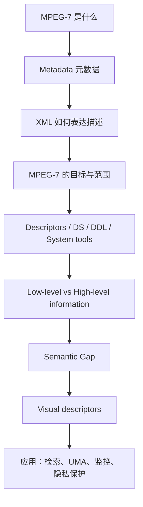
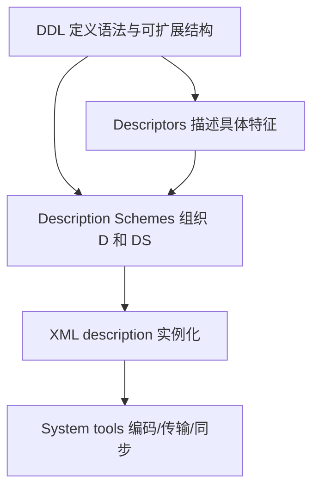
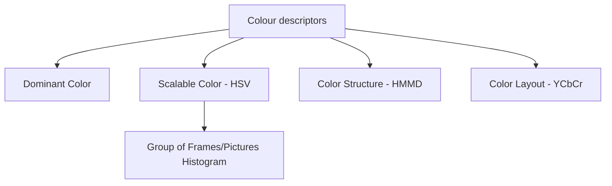
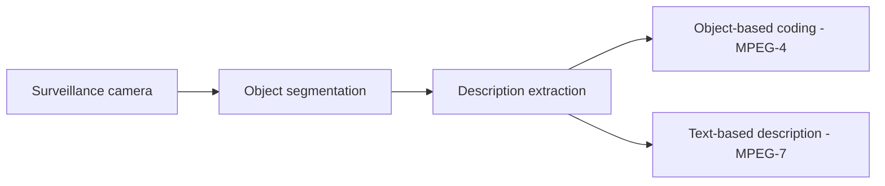

> [!info] 课件来源
> 原始课件：[[课程笔记/图像与视频处理/附件/Part 4 - Image Compression (JPEG2000), Image Sequences, MPEG7/4-3_MPEG7_Updated.pdf]]  
> 本笔记对应 **图像与视频处理 Part 4 的第 3 个 PPT：MPEG-7**。它承接 [[课程笔记/图像与视频处理/Part 4/Part 4 - PPT 1：Image Compression|Part 4 - PPT 1：Image Compression]] 和 [[课程笔记/图像与视频处理/Part 4/Part 4 - PPT 2：Image Sequences|Part 4 - PPT 2：Image Sequences]]：前两节关注“如何压缩图像 / 视频”，本节关注“如何描述多媒体内容，使其可搜索、可索引、可理解、可自适应传输”。

---

# Part 4 - PPT 3：MPEG-7

## 0. 本节课的整体主线

这节课的主题是 **MPEG-7: Multimedia Content Description Interface**，即多媒体内容描述接口。

它的核心不是压缩视频，而是：

> 用标准化的 metadata 描述图像、音频、视频中的内容，使多媒体数据可以被搜索、索引、过滤、摘要、可视化和自适应传输。

可以按下面这条主线理解：



一句话概括：

> [!summary] 核心理解
> **MPEG-1/2/4 主要处理多媒体内容本身的编码；MPEG-7 处理“关于内容的描述”，也就是 bits about the bits。**

---

## 1. MPEG-7 是什么

### 1.1 基本定义

课件给出的定义是：

> MPEG-7 is the international standard for "Multimedia Content Description" and it has been ratified by ISO in 2001.

中文理解：

> **MPEG-7 是用于多媒体内容描述的国际标准，2001 年由 ISO 批准。**

它和更常见的 MPEG-2、MPEG-4 不同：

| 标准 | 主要关注点 |
|---|---|
| MPEG-1 / MPEG-2 / MPEG-4 | 多媒体内容本身如何编码、压缩、播放 |
| MPEG-7 | 多媒体内容如何被描述、索引、搜索和理解 |

所以 MPEG-7 不是 MPEG-2 或 MPEG-4 的替代品，而是补充它们。

---

### 1.2 MPEG-7 不是视频压缩标准

这是本节最容易混的点。

MPEG-7：

- 不负责视频压缩；
- 不负责视频重建或播放；
- 不规定你必须怎样提取特征；
- 不规定搜索引擎必须怎样使用特征；
- 重点是用标准化方式表达多媒体内容的描述。

它做的是：

> 给视频、图像、音频加上“意义”或“可机器读取的注释”。

例如：

- 这段视频中有一个人；
- 这个人从 frame 100 移动到 frame 138；
- 这个区域的 dominant color 是某个 YUV 值；
- 这个事件是 “person entering room”；
- 这个视频摘要需要 N 个 key frames。

这些都是关于内容的 metadata。

---

## 2. Metadata：元数据

### 2.1 什么是 metadata

课件定义：

> Metadata = data about data

也就是：

> **元数据是描述数据的数据。**

例如一张图片本身是 data，而它的以下信息是 metadata：

- 拍摄时间；
- 拍摄地点；
- 图像中是否有人；
- 图像 dominant color；
- 图像中某个物体的位置；
- 图像与其他图像的相似度；
- 视频中某个对象的运动轨迹。

---

### 2.2 Metadata 的两类

课件把 metadata 分成两类：

| 类型 | 英文 | 含义 | 示例 |
|---|---|---|---|
| 低层元数据 | Low-level / content-based metadata | 从图像、视频、音频信号中自动提取的特征 | 颜色直方图、纹理、形状、运动轨迹 |
| 高层元数据 | High-level / semantic metadata | 与内容语义、概念、事件相关的描述 | “新闻主播”、“交通事故”、“足球比赛进球” |

低层特征更容易自动提取，高层语义更接近人类理解但更难自动获得。

---

### 2.3 低层与高层的直观区别

以一张新闻截图为例：

| 层级 | 描述方式 |
|---|---|
| 低层描述 | 背景是蓝色，前景区域有肤色块，存在文字区域 |
| 高层描述 | 这是一位新闻主播正在报道 Clinton's affair |

低层描述适合机器计算，高层描述适合人类检索。

这二者之间的差距就是后面要讲的 **semantic gap**。

---

## 3. 为什么需要 MPEG-7

课件给出的背景是：多媒体信息越来越多，人们越来越需要找到特定的多媒体内容。

### 3.1 多媒体检索的困难

现实中我们经常想找：

- 某个新闻事件的视频；
- 某个人出现过的镜头；
- 某种颜色或图案的衣服；
- 某个医学图像病例；
- 某段监控中的异常行为；
- 自己家庭数据库里的某张照片或视频。

但传统搜索系统主要擅长文本：

- 网页标题；
- 文件名；
- 文本标签；
- 用户手写描述。

对于图像、视频、音频本身的内容，传统文本搜索很难直接理解。

---

### 3.2 MPEG-7 的解决思路

课件强调 MPEG-7 使用组织良好的 XML structure：

> MPEG-7 provides a well organised XML structure instantiated by the values of features extracted from multimedia data.

也就是说：

1. 从多媒体数据中提取特征；
2. 把特征填入标准化 XML 结构；
3. 搜索系统可以查询这些 XML 描述；
4. 不同系统之间可以互操作。

> [!tip] 直观类比
> 原始视频像一本没有目录、没有索引的厚书；  
> MPEG-7 metadata 像给这本书加上目录、标签、章节结构、关键词和摘要。

---

## 4. MPEG-7 的应用场景

课件列出很多应用：

| 应用 | MPEG-7 的作用 |
|---|---|
| Audiovisual database browsing and retrieval | 在图像、电影、广播档案中浏览和检索 |
| Surveillance | 交通控制、生产线监控、异常事件检测 |
| Intelligent multimedia presentations | 根据内容和用户需求生成智能展示 |
| E-commerce / Tele-shopping | 搜索服装、图案、商品外观 |
| Journalism | 按事件、人物、地点检索新闻素材 |
| Education | 教学资源检索和组织 |
| Telemedicine / Bio-medical applications | 医学影像检索、远程医疗 |
| Personalized television services | 根据用户偏好推送内容或摘要 |

这些应用共同需要：

- 让多媒体内容更容易搜索；
- 让系统理解内容中的对象、事件、结构；
- 支持不同设备、带宽和用户偏好下的自适应访问。

---

## 5. XML：MPEG-7 描述的表达方式

### 5.1 XML 是什么

课件说明：

- XML provides a way to structure data using a simple grammar；
- XML structures data based upon meaning, not appearance；
- XML has two components:
  - tags；
  - data itself。

中文理解：

> XML 用标签组织数据，重点是表达数据的结构和意义，而不是显示外观。

---

### 5.2 XML 与 HTML 的区别

课件用一封信的例子说明 XML 与 HTML。

XML 示例强调意义：

```xml
<?xml version="1.0"?>
<greeting style="informal">
  <from>Chris Bates</from>
  <to>Mr. M. Mouse</to>
  <message>Hi, how are you doing?</message>
  <signature />
</greeting>
```

这里的标签表示：

- 谁发出；
- 发给谁；
- 信息内容；
- 签名。

HTML 示例强调显示：

```html
<html>
<head>
  <title>The XML Sample Written in HTML</title>
</head>
<body>
  <h2>Chris Bates</h2>
  <h2>Mr. M. Mouse</h2>
  <p>Hi, how are you doing?</p>
</body>
</html>
```

区别：

| 格式 | 重点 |
|---|---|
| XML | 数据的结构与意义 |
| HTML | 数据如何在页面中显示 |

---

### 5.3 为什么 MPEG-7 适合用 XML

因为 MPEG-7 的目标是描述内容，而不是显示内容。

XML 的优势：

- 标签结构清晰；
- 可以嵌套对象、区域、事件；
- 可被机器解析；
- 可被数据库索引；
- 标准化后便于跨系统交换；
- 可以扩展新的描述结构。

---

## 6. XML image description：图像区域描述例子

课件通过一张新闻图像说明如何逐步构建 XML 描述。

### 6.1 从非结构化图像到结构化描述

原始新闻图像是 unstructured image。人能看出：

- 背景；
- 主播；
- 话题区域；
- 屏幕文字；
- 人物位置。

但机器并不知道这些对象是什么。

MPEG-7 的思路是把图像拆成结构化区域：

```xml
<StillRegion id="news">
  ...
</StillRegion>
```

`StillRegion` 表示静态图像中的一个区域。

---

### 6.2 Spatial decomposition：空间分解

可以进一步把 `news` 分解为多个空间区域：

```xml
<StillRegion id="news">
  <SegmentDecomposition decompositionType="spatial">
    <StillRegion id="background" />
    <StillRegion id="speaker" />
    <StillRegion id="topic" />
  </SegmentDecomposition>
</StillRegion>
```

含义：

- 整张新闻图像是 `news`；
- 它按空间分解成 background、speaker、topic；
- 每个子区域可以继续拥有自己的特征和语义注释。

---

### 6.3 给区域添加 low-level feature

例如背景区域可以添加 dominant color：

```xml
<StillRegion id="background">
  <DominantColor>10 10 250</DominantColor>
</StillRegion>
```

这表示背景的主要颜色特征。

`DominantColor` 是低层视觉描述符，因为它来自像素颜色统计，而不是人工语义。

---

### 6.4 给区域添加 semantic annotation

对主播区域，可以添加文本注释：

```xml
<StillRegion id="speaker">
  <TextAnnotation>
    <FreeTextAnnotation>Journalist Judite Sousa</FreeTextAnnotation>
  </TextAnnotation>
</StillRegion>
```

这属于高层语义描述，因为它直接表达“这个人是谁”。

---

### 6.5 给区域添加 spatial mask

还可以用空间掩膜表示区域形状和位置：

```xml
<SpatialMask>
  <Poly>
    <CoordsI>5 25 10 20 15 15 10 10 5 15</CoordsI>
  </Poly>
</SpatialMask>
```

这里的 polygon 坐标定义了该区域在图像中的位置。

---

### 6.6 一个完整描述的含义

课件最终示例包含：

- `StillRegion id="news"`：整个新闻图；
- `SegmentDecomposition`：空间分解；
- `background`：包含 dominant color；
- `speaker`：包含人物文本注释和空间掩膜；
- `topic`：包含话题文本注释，如 Clinton's affair。

这说明 MPEG-7 可以把同一幅图像中的不同对象、区域、颜色、文字、语义联系起来。

---

## 7. MPEG-7 的目标

课件给出的目标：

> Standardize a content-based description of various types of multimedia information.

目的包括：

1. allowing quick and efficient search；
2. addressing a large range of multimedia applications。

也就是：

> 标准化多媒体内容描述，让搜索、检索、过滤和应用开发更快速、更高效。

---

### 7.1 “the bits” 与 “the bits about the bits”

课件用一句非常重要的话对比：

| 标准 | 表示什么 |
|---|---|
| MPEG-1 / MPEG-2 / MPEG-4 | represent the content itself，即 the bits |
| MPEG-7 | represent information about the content，即 the bits about the bits |

解释：

- 视频压缩标准关注怎样把视频变成可传输的 bitstream；
- MPEG-7 关注怎样描述这些 bitstream 里有什么内容。

> [!important] 考点
> MPEG-7 不是编码图像或视频内容本身，而是编码关于内容的描述。

---

## 8. MPEG-7 的范围：scope

课件给出一个三段式流程：


MPEG-7 标准真正规范的是中间的 **Description**。

### 8.1 非规范部分

课件明确说明：

| 部分 | 是否 MPEG-7 规范重点 | 示例 |
|---|---|---|
| Description generation | Non-normative | feature extraction、indexing、annotation tools |
| Description consumption | Non-normative | search engine、filtering tool、retrieval process、browsing device |
| Description itself | Normative core | descriptors、description schemes、DDL、syntax |

也就是说：

- MPEG-7 不强制你用什么算法提取颜色、纹理、对象；
- MPEG-7 不强制你用什么搜索算法；
- MPEG-7 只规定描述的标准结构，使不同系统能互相理解。

---

### 8.2 最小互操作原则

课件强调：

> The goal is to define the minimum that enables interoperability.

中文理解：

> MPEG-7 的目标是定义实现互操作所需的最小标准。

例如两个系统：

- 系统 A 用自己的算法提取图像 dominant color；
- 系统 B 用自己的数据库检索图像；
- 只要它们都使用 MPEG-7 标准描述格式，就能交换和理解描述。

---

## 9. MPEG-7 的核心元素

课件列出四类核心元素：

1. Descriptors (D)
2. Description Schemes (DS)
3. Description Definition Language (DDL)
4. System tools

---

### 9.1 Descriptors：描述符

课件定义：

> Descriptors represent features. They define the syntax and semantics of each feature representation.

中文理解：

> **Descriptor 描述一个具体特征，并规定该特征如何表示、表示什么意义。**

例如：

- DominantColor descriptor；
- EdgeHistogram descriptor；
- MotionTrajectory descriptor；
- RegionLocator descriptor。

Descriptor 回答：

> 一个特征值是什么形式？它代表什么？

---

### 9.2 Description Schemes：描述方案

课件定义：

> Description Schemes specify the structure and semantics of the relationships between their components, which may be both Ds and DSs.

中文理解：

> **Description Scheme 描述多个 descriptors 或其他 description schemes 之间的结构关系。**

例如：

- 一个视频由多个 segment 组成；
- 一个事件包含多个 object；
- 一个对象有 region locator、dominant color、motion trajectory；
- 一个摘要由若干 key frames 构成。

Descriptor 更像“特征字段”，Description Scheme 更像“对象结构 / 数据模型”。

---

### 9.3 DDL：Description Definition Language

DDL 用于：

- 创建新的 Description Schemes；
- 可能创建新的 Descriptors；
- 扩展和修改已有 DS。

课件说明 DDL 使用 XML Schema 作为描述数据结构的语法。

直观理解：

> DDL 是 MPEG-7 中定义“描述结构”的语言；XML 是实际描述实例的表达语法。

---

### 9.4 System tools

System tools 支持：

- multiplexing of descriptions；
- synchronization of descriptions with content；
- transmission mechanisms；
- file format；
- binary coding formats。

它们保证 MPEG-7 描述可以被传输、同步、存储和高效编码。

---

### 9.5 四个元素之间的关系



---

## 10. MPEG-7 标准组成

课件列出 MPEG-7 的标准部分：

| Part | 内容 |
|---|---|
| Part 1 | Binary Format for MPEG-7 (BiM) & Terminal Architecture |
| Part 2 | Description Definition Language (DDL) |
| Part 3 | Visual Descriptors |
| Part 4 | Audio Descriptors |
| Part 5 | Multimedia Descriptors |
| Part 6 | Reference Software |
| Part 7 | Conformance |
| Part 8 | Extraction and use of descriptions，informative |

记忆重点：

- 视觉描述符在 Part 3；
- 音频描述符在 Part 4；
- DDL 在 Part 2；
- Part 8 是 informative，说明描述的提取和使用，但不是强制规范核心。

---

## 11. MPEG-7 中什么是 normative

课件列出 normative 和 non-normative。

### 11.1 Normative 内容

MPEG-7 规范：

- Descriptors (Ds)；
- Description Schemes (DSs)；
- data structures；
- feature represented by the data structure；
- DDL；
- XML Schema；
- XML syntax for descriptions；
- Binary coding formats；
- Profiles。

也就是说，MPEG-7 规定的是“描述怎么写，结构是什么，语义是什么”。

---

### 11.2 Non-normative 内容

MPEG-7 不规范：

- extraction of descriptions；
- usage of descriptions。

例如：

- 你可以用 CNN、传统图像处理、人工标注或其他方法提取特征；
- 你可以用数据库查询、机器学习检索或规则系统使用描述；
- 只要最终描述符合 MPEG-7 结构即可。

> [!warning] 常见误解
> MPEG-7 不等于一套具体的图像分析算法，也不等于一套搜索引擎。它是描述接口和标准化语法。

---

## 12. Information levels：低层信息

课件先讲 low-level information。

### 12.1 低层信息的特点

低层信息：

- 适用于多种媒体格式；
- 用于内容浏览；
- 可通过自动方法提取；
- 描述符质量可用 retrieval rate 衡量。

例如视觉低层描述符包括：

- color；
- texture；
- shape；
- motion。

---

### 12.2 低层信息的优势

| 优势 | 解释 |
|---|---|
| 可自动提取 | 不一定需要人工标注 |
| 应用独立 | 同一特征库可用于不同检索任务 |
| 可量化比较 | 可用距离函数计算相似度 |
| 适合大规模数据 | 能处理海量图像和视频 |

---

### 12.3 低层信息的局限

课件指出两个问题：

1. 不知道哪些 descriptors 能得到特定 semantic information；
2. 不知道如何组合不同 descriptors 的 distance functions。

例如你想搜索“城市交通堵塞”：

- 颜色特征可能显示灰色道路；
- 纹理特征可能显示密集边缘；
- 运动特征可能显示车辆慢速移动；
- 但这些低层特征怎样组合成“交通堵塞”并不简单。

---

## 13. Semantic Gap：语义鸿沟

课件对 semantic gap 的解释是：

> 它描述了同一对象在不同语言或符号系统下的描述差异；在计算机科学中，它指人类活动、观察和任务被转移到计算表示时产生的差距。

更具体地说：

> 人类可以用自然语言模糊、灵活地表达上下文知识；机器需要形式化、可重复、可计算的表示。二者之间的差距就是 semantic gap。

---

### 13.1 在图像检索中的语义鸿沟

人类搜索：

> 找一张“城市交通拥堵”的图片。

机器低层特征：

- 大量灰色区域；
- 许多矩形车辆形状；
- 边缘密度高；
- 前景对象密集；
- 运动速度低。

问题是：

> 这些低层特征并不天然等于“交通拥堵”这个语义概念。

---

### 13.2 语义鸿沟的本质

| 人类语义 | 机器可见的低层线索 |
|---|---|
| 城市 | 建筑边缘、道路纹理、灰色/蓝色区域 |
| 交通堵塞 | 多个车辆形状、低速运动轨迹、密集目标 |
| 新闻主播 | 人脸区域、肤色、固定背景、文本区域 |
| 可疑行为 | 异常轨迹、停留时间、进入禁区 |
| 医学异常 | 形状变化、纹理异常、灰度分布差异 |
| 商品风格 | 颜色组合、轮廓形状、局部纹理 |

这些概念需要上下文、任务目标和知识，而像颜色、纹理、形状只是信号层面的描述。

MPEG-7 通过标准化 low-level 与 high-level descriptors，为弥合 semantic gap 提供结构，但并不彻底解决语义理解问题。

---

## 14. Information levels：高层信息

高层信息即 semantics。

### 14.1 高层信息的特点

课件说明：

- 通常通过 manual annotation；
- 对 search & retrieval 非常强大；
- 如果 annotation 符合应用需求，检索效果很好；
- 如果 annotation 与应用不匹配，则可能失败。

---

### 14.2 高层标注的局限

课件举例：

> 一幅图像到底显示的是 city、town 还是 traffic jam？

这取决于：

- 标注者的理解；
- 应用场景；
- 用户搜索意图；
- 语义层级；
- 文化和语言差异。

同一张图可能同时是：

- city；
- street；
- traffic；
- crowd；
- rush hour；
- urban scene。

如果标注时只写了 city，用户搜索 traffic jam 可能找不到。

---

### 14.3 低层组合生成高层语义

课件也提到：

> combination of visual Ds gives semantics at search time.

例如：

> 一棵树可能有 green & brown color，并且树叶区域没有固定 edge direction。

也就是说，可以通过组合多个低层视觉 descriptors，在检索时推断某种语义。

---

## 15. Visual descriptors：视觉描述符总览

课件列出 MPEG-7 视觉描述符类别。

### 15.1 Basic descriptors

包括：

- colour space；
- colour quantization；
- grid layout。

这些是其他描述符的基础。

---

### 15.2 Colour descriptors

包括：

- dominant colour；
- colour structure；
- scalable colour；
- group of frames histogram。

颜色描述符用于描述图像或视频片段中的颜色分布、主颜色、空间布局或时间聚合颜色特征。

---

### 15.3 Texture descriptors

包括：

- texture browsing；
- edge histogram；
- homogeneous texture。

纹理描述符用于表达重复纹理、边缘方向分布和区域纹理统计。

---

### 15.4 Motion descriptors

包括：

- motion activity；
- camera motion；
- motion trajectory；
- parametric motion。

这些与 [[课程笔记/图像与视频处理/Part 4/Part 4 - PPT 2：Image Sequences|Part 4 - PPT 2：Image Sequences]] 中的运动估计直接相关。

---

### 15.5 Shape descriptors

包括：

- contour shape；
- region shape；
- shape spectrum；
- 3D shape；
- region locator。

形状描述符用于表达物体轮廓、区域形状、三维形状和位置。

---

### 15.6 Faces

包括：

- face recognition。

用于人脸相关检索和识别任务。

---

## 16. Colour descriptors：颜色描述符

课件重点展开了几个颜色描述符：



---

## 17. Scalable Color Descriptor

课件说明：

- A color histogram in HSV color space；
- Histogram values are encoded by Haar Transform。

### 17.1 基本思想

Scalable Color Descriptor 本质上是 HSV 颜色空间中的颜色直方图。

HSV 分量：

- H：Hue，色相；
- S：Saturation，饱和度；
- V：Value，亮度。

直方图统计各颜色 bin 出现的频率，用于比较图像颜色分布。

---

### 17.2 为什么叫 scalable

因为直方图经过 Haar Transform 编码后，可以支持不同精度层级的表示。

直观理解：

- 粗略层级：只保留主要颜色分布；
- 更精细层级：加入更多 histogram 细节；
- 可根据检索精度和存储成本选择不同长度的描述。

---

## 18. Dominant Color Descriptor

课件说明：

- Clustering colors into a small number of representative colors；
- Can be defined for each object, regions, or the whole image。

### 18.1 表达形式

课件给出：

$$
F = \{\{c_i, p_i, v_i\}, s\}
$$

其中：

| 符号 | 含义 |
|---|---|
| $c_i$ | representative colors，代表颜色 |
| $p_i$ | percentages，各代表颜色在区域中的比例 |
| $v_i$ | color variances，颜色方差 |
| $s$ | spatial coherence，空间一致性 |

---

### 18.2 直观理解

一张图不需要保存所有颜色，可以聚类成少数主颜色：

- 蓝色背景 60%；
- 肤色区域 20%；
- 黑色文字 10%；
- 白色高光 10%。

Dominant Color Descriptor 适合：

- 区域级颜色检索；
- 商品颜色匹配；
- 图像相似性检索；
- 对象级描述。

---

## 19. Color Layout Descriptor

课件步骤：

1. Clustering the image into 8×8 blocks；
2. Deriving the average color of each block；
3. Applying DCT and encoding。

### 19.1 基本思想

Color Layout Descriptor 不仅看颜色有哪些，还看颜色在图像中的粗略空间布局。

流程：


它和 JPEG 中的 DCT 有相似思路：用少量低频系数表示整体布局。

---

### 19.2 适用场景

课件列出：

- Sketch-based image retrieval；
- Content filtering using image indexing。

例如用户画一个草图：

- 上半部分蓝色天空；
- 下半部分绿色草地；
- 中间一个红色物体。

Color Layout Descriptor 可以帮助找到颜色布局相似的图像。

---

## 20. Color Structure Descriptor

课件步骤：

- Scanning the image by an 8×8 pixel block；
- Counting the number of blocks containing each color；
- Generating a color histogram in HMMD。

### 20.1 与普通颜色直方图的区别

普通颜色直方图统计像素数量：

> 某颜色出现了多少像素？

Color Structure Descriptor 统计块：

> 有多少 8×8 block 包含这种颜色？

这样能保留一点局部空间结构信息。

---

### 20.2 主要用途

课件列出：

- Still image retrieval；
- Natural images retrieval。

它适合自然图像检索，因为自然图像中颜色通常以区域或局部结构形式出现。

---

## 21. GoF/GoP Color Descriptor

GoF/GoP 指：

- Group of Frames；
- Group of Pictures。

课件说明：

- Extends Scalable Color Descriptor to video；
- Generates the color histogram for a video segment or a group of pictures。

### 21.1 为什么需要 GoF/GoP

单张图像可以用颜色直方图描述，但视频片段包含多帧。

GoF/GoP Color Descriptor 用一个聚合描述表示一段视频的颜色分布。

---

### 21.2 计算方法

课件列出三种：

| 方法 | 含义 |
|---|---|
| Average | 对多帧颜色直方图求平均 |
| Median | 对多帧颜色直方图取中位数，更鲁棒 |
| Intersection | 取多帧共同出现的颜色成分 |

---

## 22. Generic AudioVisual Description Scheme

课件给出 Generic AudioVisual DS 的结构图。

它从 `Audiovisual DS` 出发，连接到多个 DS：

- Syntactic DS；
- Syntactic-semantic Link DS；
- Semantic DS；
- MediaInfo DS；
- MetaInfo DS；
- Summary DS；
- Model DS。

### 22.1 Syntactic DS

Syntactic DS 更关注媒体的结构：

- segment；
- region；
- segment / region relation graph。

例如：

> 这段视频分为几个 shots，每个 shot 有哪些 regions，这些 regions 空间上如何相邻。

---

### 22.2 Semantic DS

Semantic DS 更关注语义：

- event；
- object；
- event-object relation graph。

例如：

> 某个对象进入房间，触发某个事件；对象与事件之间有关系。

---

### 22.3 Summary DS

Summary DS 用于内容摘要，例如：

- key frames；
- key segments；
- 事件摘要；
- 用户偏好摘要。

这与后面 Universal Multimedia Access 中“用户想要包含 N 个 key frames 的 summary”有关。

---

## 23. 应用：Automatic content annotation

课件问：为什么需要 automatic content annotation？

### 23.1 移动设备传输

向移动设备传输多媒体内容时会遇到：

- small display size；
- restricted processing capabilities；
- limited bandwidth；
- time-varying conditions。

如果能自动标注内容，就可以：

- 只传重要对象；
- 生成简短摘要；
- 根据设备能力调整内容；
- 在带宽变化时自适应传输。

---

### 23.2 自动监控视频索引

传统视频监控依赖人工观察：

- operator 位于固定房间；
- 长时间观察很乏味；
- 容易出错；
- 事后取证搜索很慢。

自动内容标注可以：

- 检测运动；
- 标注对象；
- 记录事件；
- 建立索引；
- 方便检索某个时间、对象或事件。

---

## 24. Universal Multimedia Access：通用多媒体访问

### 24.1 基本思想

课件定义：

> Universal Multimedia Access 是从单一内容库生成同一信息的不同 presentation。

也就是：

> 同一份多媒体内容，可以根据设备、网络和用户偏好生成不同版本。

---

### 24.2 适配因素

适配 audio-visual data 到：

| 适配对象 | 示例 |
|---|---|
| client device capabilities | 屏幕大小、解码能力、计算能力 |
| computational power | 手机、平板、桌面设备性能不同 |
| bandwidth | 低带宽传低码率摘要，高带宽传完整视频 |
| user preferences | 用户想看摘要、关键帧、某类对象 |

课件给出 UserPreferenceDS 例子：

> 用户希望得到一个包含 N 个 key frames 的 summary。

---

### 24.3 与 MPEG-7 的关系

MPEG-7 提供描述：

- 哪些帧是 key frames；
- 哪些对象最重要；
- 哪些片段对应某事件；
- 用户偏好是什么；
- 内容结构如何。

系统根据这些描述进行自适应传输和展示。

---

## 25. Advanced visual surveillance：高级视觉监控

### 25.1 基本定义

课件定义 advanced video surveillance：

> 使用自动图像和音频分析技术，自动化原本需要人类操作员完成的任务。

包括：

- motion detection；
- event detection；
- target tracking；
- face detection；
- speaker identification。

这与 [[课程笔记/图像与视频处理/Part 4/Part 4 - PPT 2：Image Sequences|Image Sequences]] 中的 motion estimation 和 tracking 密切相关。

---

### 25.2 技术推动因素

课件列出：

- low-cost microprocessors processing power increasing；
- storage devices cost decreasing；
- shift from analogue to digital video cameras。

这些因素使得大量摄像头可以进行本地分析、存储、索引和网络传输。

---

## 26. Advanced surveillance 的处理流程

课件给出流程：



解释：

1. 摄像头获取场景；
2. 做 object segmentation；
3. 提取对象描述；
4. 对视觉内容本身可用 MPEG-4 object-based coding；
5. 对对象属性和语义描述可用 MPEG-7 text-based description。

---

## 27. MPEG-7 camera

### 27.1 MPEG-7 camera 的作用

课件说明 MPEG-7 camera：

- describes a scene in terms of semantic objects and their properties；
- uses semantic video analysis including tracking；
- extracts and transmits only relevant information，例如 object motion。

也就是说，摄像头不一定传完整视频，而可以传：

- 对象 ID；
- 对象位置；
- 颜色；
- 纹理；
- 运动轨迹；
- 事件标签。

---

### 27.2 Intelligent camera 架构

课件给出智能摄像头组成：

| 模块 | 作用 |
|---|---|
| Image analysis block | 在摄像头 DSP 上实现 segmentation、change detection、tracking 等算法 |
| MPEG-7 coder | 用 MPEG-7 XML 表示场景描述 |
| MPEG-7 decoder | 解析 MPEG-7 描述，提取特定应用所需信息 |

同一份 MPEG-7 XML 描述可以服务不同应用：

- virtual display；
- surveillance system；
- video editing system。

---

## 28. XML scene description 示例

课件给出一个对象级 XML 描述：

```xml
<Object id="4">
  <RegionLocator>
    <BoxPoly>Poly</BoxPoly>
    <Coords1>237 222</Coords1>
    <Coords2>230 252</Coords2>
    <Coords3>240 286</Coords3>
    <Coords4>308 287</Coords4>
    <Coords5>312 284</Coords5>
  </RegionLocator>

  <DominantColor>
    <ColorSpace>YUV</ColorSpace>
    <ColorValue1>143.4</ColorValue1>
    <ColorValue2>123.3</ColorValue2>
    <ColorValue3>128.2</ColorValue3>
  </DominantColor>

  <HomogeneousTexture>
    <TextureValue>9.02</TextureValue>
  </HomogeneousTexture>

  <MotionTrajectory>
    <TemporalInterpolation>
      <KeyFrame>100</KeyFrame>
      <KeyPos>268.6 251.7</KeyPos>
      <KeyFrame>101</KeyFrame>
      <KeyPos>262.8 241.0</KeyPos>
      ...
      <KeyFrame>138</KeyFrame>
      <KeyPos>192.9 79.0</KeyPos>
    </TemporalInterpolation>
  </MotionTrajectory>
</Object>
```

---

### 28.1 这个 XML 描述了什么

| XML 元素 | 含义 |
|---|---|
| `<Object id="4">` | 第 4 个对象 |
| `<RegionLocator>` | 对象的位置 / 形状 |
| `<DominantColor>` | 对象主颜色 |
| `<ColorSpace>YUV</ColorSpace>` | 颜色空间 |
| `<HomogeneousTexture>` | 纹理特征 |
| `<MotionTrajectory>` | 对象运动轨迹 |
| `<KeyFrame>` | 关键帧编号 |
| `<KeyPos>` | 对象在关键帧中的位置 |

这正好把本课程前面学过的区域、颜色、纹理、运动统一到标准 XML 描述中。

---

## 29. Event detection in multi-camera networks

课件提到 multi-camera networks 中的 event detection。

在多摄像头网络中：

- 同一个对象可能被多个摄像头观察；
- 不同视角提供不同信息；
- 事件可能跨摄像头发生；
- 需要把对象、轨迹和事件统一描述。

MPEG-7 可以描述：

- object；
- event；
- motion trajectory；
- camera / scene relation；
- event-object relation graph。

这有助于：

- 跨摄像头目标跟踪；
- 多视角事件检测；
- 监控系统中的警报生成；
- 事后检索。

---

## 30. CCTV 与隐私问题

课件指出 CCTV 市场庞大且增长迅速，并讨论隐私。

### 30.1 从模拟 CCTV 到数字 CCTV

Old CCTV：

- analogue video；
- videotape systems；
- forensic search slow。

Current and future CCTV：

- digital video；
- images stored on DVDs or CDs；
- can be indexed and searched easily；
- can be quickly transmitted over networks。

数字化带来效率，也带来隐私风险。

---

### 30.2 隐私风险

课件指出：

> 随着自动化和监控技术发展，高级视频监控可能产生不希望的效果：人们可能不再把它看成安全工具，而是看成对私人领域的威胁。

核心矛盾：

| 安全需求 | 隐私需求 |
|---|---|
| 需要检测异常行为 | 不希望身份被随意暴露 |
| 需要搜索和追踪对象 | 不希望个人轨迹被滥用 |
| 需要快速响应事件 | 不希望所有人被持续识别 |

---

## 31. Privacy-preserving surveillance：隐私保护监控

### 31.1 Virtual display

课件中的 MPEG-7 camera applications 包括 virtual display：

> virtual objects，例如 blobs，跟随人的运动。

也就是说，系统不显示真实人的外观，而显示抽象对象：

- blobs；
- silhouette；
- bounding boxes；
- anonymized avatars。

---

### 31.2 应用

课件列出：

- Privacy：only the behavior of the persons are transmitted；
- Checking intentions in surveillance；
- Extract various statistics without revealing identity of people。

中文理解：

> 只传输行为数据，不直接暴露个人身份。

例如：

- 统计某区域人流量；
- 检测是否有人进入禁区；
- 分析人群移动方向；
- 监测摔倒或异常行为；
- 不显示真实脸部或身体细节。

---

### 31.3 Privacy-preserving surveillance system

课件最后给出系统结构：

- input video；
- covering identities；
- behavioural data；
- personal data；
- high-level reasoning；
- operator；
- alert；
- separate authority。

核心思想：

1. 系统自动分析行为；
2. 操作员主要看到行为数据和警报；
3. 个人身份数据被隐藏或受控管理；
4. 只有在特定条件下，由独立权限访问个人数据。

这样可以在安全监控和隐私保护之间取得平衡。

---

## 32. MPEG-7 和前两节 Part 4 内容的关系

| 课程内容 | 关注点 | 与 MPEG-7 的联系 |
|---|---|---|
| [[课程笔记/图像与视频处理/Part 4/Part 4 - PPT 1：Image Compression|PPT 1：Image Compression]] | 图像如何压缩 | MPEG-7 不压缩图像，但可以描述压缩图像中的内容 |
| [[课程笔记/图像与视频处理/Part 4/Part 4 - PPT 2：Image Sequences|PPT 2：Image Sequences]] | 视频序列中的运动估计 | MPEG-7 可描述 motion trajectory、camera motion、event |
| PPT 3：MPEG-7 | 多媒体内容描述 | 把颜色、纹理、形状、运动、对象、事件写成标准 metadata |

---

## 33. 关键术语速查

| 术语 | 中文 | 核心理解 |
|---|---|---|
| MPEG-7 | 多媒体内容描述标准 | 描述内容，不压缩内容 |
| Metadata | 元数据 | data about data |
| Low-level metadata | 低层元数据 | 从信号中提取的颜色、纹理、形状、运动等 |
| High-level metadata | 高层元数据 | 人类语义、对象、事件、概念 |
| XML | 可扩展标记语言 | 用标签表达结构和意义 |
| Descriptor (D) | 描述符 | 具体特征及其语法语义 |
| Description Scheme (DS) | 描述方案 | 组织 descriptors 和关系的结构 |
| DDL | 描述定义语言 | 定义和扩展 DS / D 的语言 |
| System tools | 系统工具 | 支持编码、同步、传输、文件格式 |
| Semantic gap | 语义鸿沟 | 低层特征与高层语义之间的差距 |
| Visual descriptors | 视觉描述符 | 颜色、纹理、形状、运动、人脸等 |
| Dominant Color | 主颜色描述符 | 用少数代表颜色描述区域或图像 |
| Scalable Color | 可伸缩颜色描述符 | HSV histogram + Haar transform |
| Color Layout | 颜色布局描述符 | 8×8 块平均颜色 + DCT |
| Color Structure | 颜色结构描述符 | 统计包含某颜色的局部块 |
| GoF/GoP Color | 帧组颜色描述符 | 视频片段颜色直方图 |
| UMA | 通用多媒体访问 | 根据设备、带宽、用户偏好自适应呈现 |
| MPEG-7 camera | MPEG-7 摄像头 | 输出对象、轨迹、事件等 XML 描述 |
| Privacy-preserving surveillance | 隐私保护监控 | 传行为数据，隐藏身份数据 |

---

## 34. 最容易考 / 最容易混的点

### 34.1 MPEG-7 是否压缩视频？

不压缩。

MPEG-7 是 Multimedia Content Description Interface，关注内容描述。它补充 MPEG-1/2/4，而不是替代它们。

---

### 34.2 MPEG-7 规范的是算法吗？

不是。

MPEG-7 规范的是：

- descriptors；
- description schemes；
- DDL；
- XML syntax；
- binary coding formats；
- profiles。

它不规范：

- 如何提取描述；
- 如何使用描述。

---

### 34.3 Descriptor 和 Description Scheme 的区别

| 概念 | 作用 | 类比 |
|---|---|---|
| Descriptor | 描述一个具体特征 | 字段 |
| Description Scheme | 组织多个字段和关系 | 数据结构 / 对象模型 |

例如：

- `DominantColor` 是 descriptor；
- `Object` 中包含位置、颜色、纹理、运动轨迹，是 description scheme 层面的组织。

---

### 34.4 Low-level 与 high-level 的区别

| 类型 | 例子 | 优点 | 缺点 |
|---|---|---|---|
| Low-level | 颜色、纹理、边缘、运动 | 可自动提取 | 不直接等于语义 |
| High-level | 新闻主播、交通事故、可疑行为 | 接近人类检索 | 需要标注，依赖应用 |

---

### 34.5 Semantic gap 为什么重要

因为用户通常用语义搜索，而机器通常先获得低层特征。

用户问：

> 找交通堵塞的视频。

系统看到：

> 颜色、纹理、运动、对象轨迹。

如何把后者映射到前者，就是 semantic gap 问题。

---

### 34.6 XML 为什么适合 MPEG-7

因为 XML：

- 表达结构；
- 表达意义；
- 可嵌套；
- 可解析；
- 易搜索；
- 易标准化；
- 适合对象、区域、事件、轨迹等层级描述。

---

## 35. 复习问题

1. MPEG-7 与 MPEG-2 / MPEG-4 的主要区别是什么？
2. 为什么说 MPEG-7 是 “bits about the bits”？
3. Metadata 的 low-level 和 high-level 有什么区别？
4. XML 与 HTML 的区别是什么？为什么 MPEG-7 使用 XML？
5. MPEG-7 中 Descriptor、Description Scheme、DDL、System tools 分别是什么？
6. MPEG-7 的 normative 和 non-normative 部分分别包括什么？
7. 什么是 semantic gap？请用图像检索举例说明。
8. Dominant Color Descriptor 中 $c_i, p_i, v_i, s$ 分别表示什么？
9. Scalable Color、Color Layout、Color Structure 的主要区别是什么？
10. GoF/GoP Color Descriptor 为什么适合视频？
11. Universal Multimedia Access 如何利用 MPEG-7 metadata？
12. MPEG-7 camera 为什么有助于隐私保护监控？

---

## 36. 本节总结

本节课介绍了 MPEG-7 作为多媒体内容描述接口的核心思想。与 MPEG-1/2/4 关注音视频压缩不同，MPEG-7 关注如何用标准化 metadata 描述图像、视频、音频中的内容，从而支持检索、索引、摘要、自适应传输和智能监控等应用。

本节最重要的知识点是：

- MPEG-7 是内容描述标准，不是压缩标准；
- metadata 可分为 low-level 与 high-level；
- XML 用于表达结构化描述；
- MPEG-7 的核心元素包括 Descriptors、Description Schemes、DDL 和 System tools；
- 低层视觉描述符包括颜色、纹理、形状、运动等；
- semantic gap 是低层特征与高层语义之间的关键问题；
- MPEG-7 在 UMA、内容检索、事件检测、智能摄像头和隐私保护监控中非常有用。

> [!success] 记忆锚点
> **MPEG-7 = 标准化多媒体 metadata，让图像和视频从“能播放”变成“能被搜索、理解和自适应使用”。**
