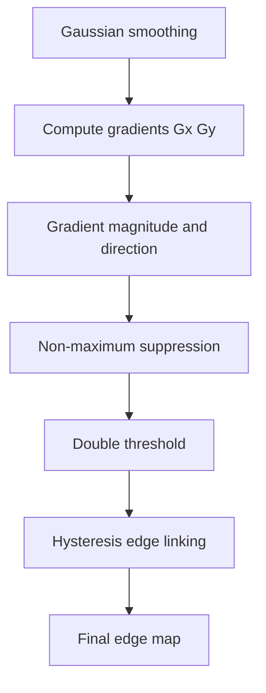
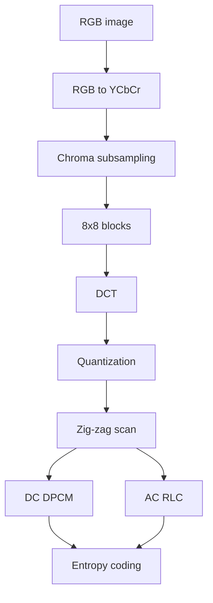

# 图像与视频处理 - 考前复习总纲

> [!important] 使用方式
> 这份文档不是只根据往年题写的，而是覆盖 **Part 1–4 全部课程笔记**。  
> 往年题只用来标记“高频/已考”方向，其他未考但课程中重要的内容也保留。

---

## 0. 考点优先级总览

| 优先级 | 内容 | 为什么重要 |
|---|---|---|
| ★★★ 必背必会 | histogram、sampling/quantization、dithering、image transformation、normalization、RGB/CMY、filtering、morphology、Moravec/Harris、motion estimation、block matching、JPEG2000 ROI | 往年题已经覆盖，且适合短答/计算 |
| ★★★ 必背必会 | gradient、Laplacian、LoG、Canny、thresholding、region segmentation | Part 3 核心，容易出流程题/解释题 |
| ★★ 很重要 | JPEG/JPEG2000 编码流程、DWT、EBCOT、layer、PSNR/SSIM | Part 4 核心，适合比较题/概念题 |
| ★★ 很重要 | colour perception、HSV/YCbCr/YUV、luminance/chrominance | 颜色章节核心，常以解释题出现 |
| ★★ 很重要 | Lucas-Kanade、aperture problem、optical flow vs motion field | 视频序列核心，可能出推导/概念题 |
| ★★ 很重要 | MPEG-7、metadata、XML、Descriptors/DS/DDL、semantic gap | Part 4 后半重点，适合短答 |
| ★ 了解但别忽略 | file formats、false colour、halftoning、PGM/PPM header、privacy-preserving surveillance | 容易出小分题 |

---

## 1. Part 1：Introduction, Image Representation, Histograms

### 1.1 Digital image / video 基本概念

#### Image

灰度图可看成二维函数：

$$
f(x,y)
$$

其中 $(x,y)$ 是空间坐标，$f(x,y)$ 是 intensity / grey level。

彩色图像可看成三个通道：

$$
I(x,y)=[R(x,y),G(x,y),B(x,y)]
$$

#### Video

视频可以看成随时间变化的图像函数：

$$
f(x,y,t)
$$

其中 $t$ 是时间或 frame index。

#### Pixel

Pixel 是数字图像的最小空间采样单位。数字图像本质上是二维矩阵：

$$
g(i,j)
$$

其中 $i,j$ 是离散行列坐标。

---

### 1.2 图像文件大小

未压缩图像大小：

$$
\text{Size(bits)} = W \times H \times C \times b
$$

$$
\text{Size(bytes)} = \frac{W \times H \times C \times b}{8}
$$

其中：

| 符号 | 含义 |
|---|---|
| $W$ | width |
| $H$ | height |
| $C$ | number of channels |
| $b$ | bits per channel |

8-bit RGB 图像通常：

$$
C=3,\quad b=8
$$

所以：

$$
\text{Size(bytes)} = W \times H \times 3
$$

> [!example]
> 一张 $1000\times1000$ 的 RGB 8-bit 图像，未压缩大小约为 $1000\times1000\times3=3,000,000$ bytes，即约 3 MB。

---

### 1.3 Sampling 与 quantization

| 概念 | 中文 | 改变什么 | 影响 |
|---|---|---|---|
| Sampling | 采样 | 空间坐标连续 $\to$ 离散 | 决定 spatial resolution |
| Quantization | 量化 | 强度值连续 $\to$ 离散 | 决定 intensity resolution |

#### Spatial resolution

空间分辨率表示图像在空间上采样得多密。像素越多，能表示的空间细节越多。

#### Intensity resolution

强度分辨率表示灰度或颜色强度可以分成多少级。例如 8-bit 灰度图有：

$$
2^8=256
$$

个灰度级，即 0 到 255。

---

### 1.4 Dithering / halftoning / false contouring

#### False contouring

量化级数太少时，连续灰度变化会变成明显条带，称为 false contouring。

#### Dithering

Dithering 会引入空间扰动或噪声，让有限灰度级看起来更平滑。

考试关键词：

> **Dithering decreases SNR but improves perceived visual quality.**

意思是：客观 SNR 下降，但主观视觉质量可能变好。

#### Halftoning

Halftoning 用黑白点的空间密度模拟连续灰度，常见于打印。

---

### 1.5 Upsampling / downsampling / interpolation

#### Upsampling

Upsampling 是增加图像分辨率，在已有像素之间插入新像素。

常见插值：

| 方法 | 特点 |
|---|---|
| Nearest-neighbour | 最近邻，快，但 blocky / jagged |
| Bilinear | 用 4 个邻居线性插值，较平滑 |
| Bicubic | 用更多邻居，通常更平滑但计算更复杂 |

> [!warning]
> Upsampling 不会创造真实新细节，只是估计新像素。过度上采样会导致 blur / soft look / artifacts。

#### Downsampling

Downsampling 是降低分辨率。注意应先低通滤波，避免 aliasing。

---

## 2. Histograms：直方图

### 2.1 基本定义

灰度级：

$$
r_k,\quad k=0,1,\dots,L-1
$$

8-bit 图像：

$$
L=256,\quad r_k\in\{0,1,\dots,255\}
$$

直方图：

$$
h(r_k)=n_k
$$

其中 $n_k$ 是灰度 $r_k$ 出现的像素数。

总像素数：

$$
n=M\times N
$$

归一化直方图：

$$
p(r_k)=\frac{n_k}{n}
$$

并且：

$$
\sum_{k=0}^{L-1}p(r_k)=1
$$

---

### 2.2 如何解读 histogram

| 直方图特征 | 含义 |
|---|---|
| 集中在左侧 | dark / underexposed |
| 集中在右侧 | bright / overexposed |
| 分布范围窄 | low contrast |
| 分布范围宽 | high dynamic range / higher contrast |
| 左端 spike | black clipping / underexposure |
| 右端 spike | white clipping / overexposure |
| 多峰 | 可能存在 foreground/background 或多个区域 |

> [!important] 高频考点
> Histogram 反映的是 **intensity distribution**，不是 spatial distribution。  
> 所以旋转、平移、镜像等只改变像素位置、不改变像素值数量的操作，通常不会改变 histogram。

---

### 2.3 Colour image histogram

两种常见方式：

1. 转为 greyscale 后画 intensity histogram；
2. 分别画 R/G/B channel histograms。

如果题目强调 **using intensity histogram**，答案应写：

> Convert the colour image to greyscale, then compute the histogram of the greyscale intensity values.

---

### 2.4 Histogram enhancement

#### Histogram stretching

把原灰度范围 $[a,b]$ 拉伸到目标范围 $[c,d]$：

$$
g=c+(d-c)\frac{f-a}{b-a}
$$

#### Histogram equalization

使用累计分布函数 CDF 重新映射灰度，使输出分布更均匀：

$$
s_k=(L-1)\sum_{j=0}^{k}p(r_j)
$$

作用：增强对比度，尤其适合灰度集中在窄范围的图像。

---

## 3. Part 2：Image Transformation

### 3.1 图像变换总形式

点操作 / 强度变换：

$$
g(x,y)=T[f(x,y)]
$$

含义：输出像素只依赖输入图像对应位置或局部区域。

---

### 3.2 Algebraic transformations

常见代数操作：

| 操作 | 用途 |
|---|---|
| Addition | 图像叠加、平均降噪 |
| Subtraction | 背景去除、变化检测 |
| Multiplication | mask / shading correction |
| Division | ratio image / illumination correction |

#### Background subtraction

$$
g(x,y)=f(x,y)-h(x,y)
$$

其中 $f$ 是当前图像，$h$ 是背景图像。

---

### 3.3 Clipping 与 normalization

像素运算可能超出合法范围，例如：

$$
230+80=310>255
$$

解决方式：

| 方法 | 结果 |
|---|---|
| Clipping / clamping | 超出范围直接设为 0 或 255，可能丢失细节 |
| Normalization | 把整体重新映射到 $[0,255]$，更适合保留相对差异 |

线性 normalization：

$$
g=c+(d-c)\frac{f-a}{b-a}
$$

对于 8-bit 图像通常 $c=0,d=255$。

---

### 3.4 Geometric transformations

#### Scaling

$$
S=
\begin{bmatrix}
s_x & 0\\
0 & s_y
\end{bmatrix}
$$

Uniform scaling：

$$
s_x=s_y
$$

缩小到一半：

$$
S=
\begin{bmatrix}
0.5 & 0\\
0 & 0.5
\end{bmatrix}
$$

#### Horizontal shear

$$
Sh_x=
\begin{bmatrix}
1 & k\\
0 & 1
\end{bmatrix}
$$

对应：

$$
x'=x+ky,\quad y'=y
$$

例如 $k=0.3$：

$$
Sh_x=
\begin{bmatrix}
1 & 0.3\\
0 & 1
\end{bmatrix}
$$

#### Homogeneous translation

$$
T=
\begin{bmatrix}
1 & 0 & t_x\\
0 & 1 & t_y\\
0 & 0 & 1
\end{bmatrix}
$$

---

### 3.5 Image warping

Geometric transformation 后，输出像素位置可能不是输入图像中的整数坐标，因此需要 interpolation。

重要概念：

- Forward mapping：从输入坐标推到输出坐标，可能出现 holes；
- Inverse mapping：从输出坐标反查输入坐标，更常用；
- Interpolation：给非整数坐标估计像素值。

---

## 4. Colour Images：颜色图像

### 4.1 RGB 与 CMY

#### RGB additive model

RGB 是加色模型，常用于显示器、相机、屏幕。

#### CMY subtractive model

CMY 是减色模型，常用于打印。

RGB to CMY：

$$
\begin{bmatrix}
C\\
M\\
Y
\end{bmatrix}
=
\begin{bmatrix}
1\\
1\\
1
\end{bmatrix}
-
\begin{bmatrix}
R\\
G\\
B
\end{bmatrix}
$$

即：

$$
C=1-R,\quad M=1-G,\quad Y=1-B
$$

> [!warning]
> 这个公式默认 $R,G,B$ 已归一化到 $[0,1]$。

---

### 4.2 Trichromatic theory 与 opponent-process theory

| 理论 | 中文 | 核心 |
|---|---|---|
| Trichromatic theory | 三色理论 | 人眼有三类 cone receptors，对 R/G/B 波段敏感 |
| Opponent-process theory | 对立过程理论 | 大脑以 red-green、blue-yellow、black-white 等对立通道处理颜色 |

二者关系：

- 三色理论解释 retina 层面的光感受；
- 对立过程理论解释后续神经编码和感知现象；
- 两者互补，不矛盾。

---

### 4.3 Luminance 与 chrominance

| 概念 | 含义 |
|---|---|
| Luminance | 亮度信息 |
| Chrominance | 色度信息 |

很多图像/视频编码会分离亮度和色度，因为人眼对亮度更敏感，对色度相对不敏感。

常见颜色空间：

- RGB；
- HSV / HSI；
- YUV；
- YCbCr；
- CMY / CMYK。

---

## 5. Image Filtering：滤波

### 5.1 Noise model

噪声图像可写为：

$$
g(x,y)=f(x,y)+\eta(x,y)
$$

其中 $\eta(x,y)$ 是 noise。

---

### 5.2 SNR, MSE, PSNR

Signal-to-Noise Ratio：

$$
SNR=\frac{\text{signal power}}{\text{noise power}}
$$

Mean Squared Error：

$$
MSE=\frac{1}{NM}\sum_{x,y}[I(x,y)-I'(x,y)]^2
$$

Peak Signal-to-Noise Ratio：

$$
PSNR=10\log_{10}\left(\frac{MAX_I^2}{MSE}\right)
$$

8-bit 图像：

$$
MAX_I=255
$$

所以：

$$
PSNR=20\log_{10}\left(\frac{255}{\sqrt{MSE}}\right)
$$

> [!important]
> MSE 越小越好；PSNR 越大通常越好。  
> 但 PSNR 不一定完全符合人眼主观感知。

---

### 5.3 Linear filtering 与 convolution

线性空间滤波一般是 mask / kernel 与图像局部邻域加权求和。

常见滤波器：

| 滤波器 | 用途 | 副作用 |
|---|---|---|
| Mean filter | 平滑、去随机噪声 | 模糊边缘 |
| Gaussian filter | 平滑，权重更自然 | 模糊细节 |
| Median filter | 去 salt-and-pepper noise | 非线性，较好保边缘 |
| Sharpening filter | 增强边缘/细节 | 放大噪声 |

#### Median filter

Median filter 用邻域中值替换中心像素。

高频考点：

> Median filters are used to reduce noises while preserving edges.

---

## 6. Part 3：Edges and Segmentation

### 6.1 Edge 是什么

Edge 是图像强度发生 abrupt change 的位置。它可能对应：

- 物体边界；
- 表面法向变化；
- 深度不连续；
- 阴影；
- 光照变化；
- 纹理变化。

> [!warning]
> Edge 不一定等于 object boundary。阴影和纹理也可能产生 edge。

---

### 6.2 一阶导数：Gradient

图像梯度：

$$
\nabla f(x,y)=
\begin{bmatrix}
G_x\\
G_y
\end{bmatrix}
=
\begin{bmatrix}
\frac{\partial f}{\partial x}\\
\frac{\partial f}{\partial y}
\end{bmatrix}
$$

梯度幅值：

$$
|\nabla f|=\sqrt{G_x^2+G_y^2}
$$

近似：

$$
|\nabla f|\approx |G_x|+|G_y|
$$

梯度方向：

$$
\theta=\operatorname{atan2}(G_y,G_x)
$$

常见差分模板：

$$
[-1,1]
$$

$$
[-1,0,1]
$$

---

### 6.3 二阶导数：Laplacian 与 LoG

一维二阶差分：

$$
f''(x)\approx f(x+1)-2f(x)+f(x-1)
$$

模板：

$$
[1,-2,1]
$$

Laplacian 用于检测 zero-crossing，但对噪声敏感。

LoG = Laplacian of Gaussian：

1. 先 Gaussian smoothing；
2. 再 Laplacian；
3. 找 zero-crossing。

作用：降低噪声影响后再检测边缘。

---

### 6.4 Canny Edge Detector

Canny 的三个目标：

1. low error rate；
2. good localization；
3. single response。

流程必背：



#### Non-maximum suppression

沿梯度方向比较邻居，只保留局部最大响应，使边缘变细。

#### Hysteresis thresholding

双阈值：

- high threshold：强边缘；
- low threshold：弱边缘；
- 与强边缘相连的弱边缘保留；
- 孤立弱边缘删除。

---

### 6.5 Thresholding 与 region-based segmentation

Global thresholding：

$$
g(x,y)=
\begin{cases}
1,& f(x,y)>T\\
0,& f(x,y)\le T
\end{cases}
$$

Local / adaptive thresholding：

$$
T=T(x,y,p(x,y),f(x,y))
$$

Region-based segmentation 的思想：

- 同一区域内部应具有相似属性；
- 不同区域之间应有明显差异；
- 可用 region growing、split and merge 等方法。

---

## 7. Interest Points：兴趣点

### 7.1 好的 interest point 特征

好特征应具备：

- repeatability；
- localization accuracy；
- distinctiveness；
- robustness；
- invariance / covariance；
- scale awareness。

用途：

- matching；
- tracking；
- image registration；
- object recognition；
- panorama / mosaicing。

---

### 7.2 Moravec operator

Moravec 的思想：比较中心窗口与若干方向 shifted windows 的差异。

常见响应：

$$
E_{u,v}(x,y)=\sum_{(a,b)\in W}
\left[I(x+a+u,y+b+v)-I(x+a,y+b)\right]^2
$$

Moravec value：

$$
M(x,y)=\min_{(u,v)\in D}E_{u,v}(x,y)
$$

如果所有方向差异都大，说明该点更可能是 corner。

局限：

- 只检查离散方向；
- 矩形窗口粗糙；
- 对 edges 敏感；
- 对噪声和方向变化不够稳定。

---

### 7.3 Harris corner detector

局部自相关近似：

$$
E(u,v)\approx
\begin{bmatrix}
u & v
\end{bmatrix}
M
\begin{bmatrix}
u\\
v
\end{bmatrix}
$$

Second moment matrix：

$$
M=\sum_{x,y}w(x,y)
\begin{bmatrix}
I_x^2 & I_xI_y\\
I_xI_y & I_y^2
\end{bmatrix}
$$

Harris response：

$$
R=\det(M)-k(\operatorname{trace}(M))^2
$$

其中：

$$
\det(M)=\lambda_1\lambda_2
$$

$$
\operatorname{trace}(M)=\lambda_1+\lambda_2
$$

特征值解释：

| $\lambda_1,\lambda_2$ | 区域类型 |
|---|---|
| 都小 | flat region |
| 一个大一个小 | edge |
| 都大且接近 | corner |

---

## 8. Morphology：形态学

### 8.1 基本概念

Binary image：

$$
I(x,y)\in\{0,1\}
$$

Support：

$$
A=\{(x,y)\mid I(x,y)=1\}
$$

Structuring element：用于探测图像局部结构的小模板。

---

### 8.2 Fit 与 hit

Fit：

$$
B_z\subseteq A
$$

Hit：

$$
B_z\cap A\ne\varnothing
$$

---

### 8.3 Erosion

$$
A\ominus B=\{z\mid B_z\subseteq A\}
$$

直观：结构元素完全 fit 前景时输出 1。

效果：

- shrink foreground；
- remove small foreground noise；
- separate touching objects；
- enlarge holes。

---

### 8.4 Dilation

$$
A\oplus B=\{z\mid \hat{B}_z\cap A\ne\varnothing\}
$$

直观：结构元素 hit 前景时输出 1。

效果：

- expand foreground；
- fill small gaps；
- repair breaks；
- may merge nearby objects。

---

### 8.5 Opening 与 closing

Opening：

$$
A\circ B=(A\ominus B)\oplus B
$$

先 erosion 后 dilation。

用途：

- remove small bright specks；
- smooth boundary；
- break thin connections。

Closing：

$$
A\bullet B=(A\oplus B)\ominus B
$$

先 dilation 后 erosion。

用途：

- fill small holes；
- close small gaps；
- connect narrow breaks。

> [!important] 高频场景匹配
> remove small bright noise = opening。  
> fill holes / close gaps = closing。  
> repair breaks = dilation 或 closing。  
> separate touching objects = erosion。

---

## 9. Part 4：Image Compression / JPEG2000

### 9.1 压缩基本指标

Bits per pixel：

$$
\text{bpp}=\frac{\text{compressed bits}}{\text{number of pixels}}
$$

Compression ratio：

$$
\text{compression ratio}=
\frac{\text{original bits}}{\text{compressed bits}}
$$

---

### 9.2 JPEG 编码流程



关键点：

- JPEG 是 lossy；
- 主要损失来自 quantization；
- 人眼对高频和色度不敏感；
- 高频 DCT 系数量化后容易变 0；
- Zig-zag 让低频在前，高频在后，便于 RLC。

---

### 9.3 JPEG2000

JPEG2000 使用 DWT 而不是 8×8 DCT。

优势：

- lossy / lossless 都支持；
- high compression ratio；
- no typical 8×8 blocking artifacts；
- progressive transmission；
- ROI coding；
- resolution / quality scalability。

---

### 9.4 DWT 小波分解

二维 DWT 产生四个子带：

| 子带 | 含义 |
|---|---|
| LL | low-low，低分辨率近似图 |
| LH | 一个方向低频、一个方向高频 |
| HL | 另一方向细节 |
| HH | high-high，对角线/高频纹理 |

多层分解继续对 LL 做 DWT，因此可实现 multiresolution。

---

### 9.5 Dead-zone quantization

JPEG2000 小波系数量化：

$$
q_j(m,n)=
\operatorname{sign}(y_j(m,n))
\left\lfloor
\frac{|W_j(m,n)|}{\Delta_j}
\right\rfloor
$$

Dead-zone 指 0 附近有更宽的区间量化为 0，使小系数更容易变成 0，提高压缩率。

---

### 9.6 EBCOT, Tier, Layer

EBCOT = Embedded Block Coding with Optimized Truncation。

| 概念 | 作用 |
|---|---|
| Code-block | 每个 sub-band 中独立编码的小块 |
| Bit-plane | 从 MSB 到 LSB 按位平面编码 |
| Tier-1 | 对 code-block 做 bit-plane arithmetic coding |
| Tier-2 | 组织 bitstreams 成 packets/layers/codestream |
| Layer | 从各 code-block 收集 coding passes，逐层提升质量 |

JPEG2000 progressive coding 可按：

- resolution；
- SNR / quality；
- spatial location；
- ROI；
- arbitrary progression。

---

### 9.7 ROI coding

Region of Interest coding：

- 允许非均匀质量分配；
- ROI coded with higher quality than background；
- 背景可更强压缩；
- 同码率下重要区域更清晰。

Static ROI：

- defined at encoding time；
- suitable for storage, fixed transmission, remote sensing。

Dynamic ROI：

- defined interactively during client/server progressive transmission；
- dynamic generation of layers matching user request；
- suitable for telemedicine, PDAs, mobile communication。

---

### 9.8 MAE, MSE, PSNR, SSIM

MAE：

$$
MAE=\frac{1}{n}\sum_{i=1}^{n}|y_i-x_i|
$$

MSE：

$$
MSE=
\frac{1}{mn}
\sum_{i=0}^{m-1}
\sum_{j=0}^{n-1}
[I(i,j)-K(i,j)]^2
$$

PSNR：

$$
PSNR=10\log_{10}\left(\frac{MAX_I^2}{MSE}\right)
$$

SSIM：

$$
SSIM(x,y)
=
\frac{
(2\mu_x\mu_y+c_1)(2\sigma_{xy}+c_2)
}{
(\mu_x^2+\mu_y^2+c_1)(\sigma_x^2+\sigma_y^2+c_2)
}
$$

> [!note]
> PSNR 简单但不总符合主观质量；SSIM 更关注 structure、luminance、contrast。

---

## 10. Image Sequences：图像序列

### 10.1 Motion field vs optical flow

| 概念 | 含义 |
|---|---|
| Motion field | 真实 3D motion 投影到 2D image plane |
| Optical flow | 图像 brightness pattern 的 apparent motion |

二者不一定相同，因为光照、阴影、反射、遮挡都会影响 optical flow。

---

### 10.2 Brightness constancy

基本假设：

$$
I(x,y,t)=I(x+\Delta x,y+\Delta y,t+\Delta t)
$$

一阶 Taylor expansion：

$$
I(x+\Delta x,y+\Delta y,t+\Delta t)
\approx
I+I_x\Delta x+I_y\Delta y+I_t\Delta t
$$

得到 optical flow constraint：

$$
I_xV_x+I_yV_y+I_t=0
$$

这是一个方程两个未知数，因此导致 aperture problem。

---

### 10.3 Lucas-Kanade

Lucas-Kanade 假设小窗口内 motion vector 相同。

矩阵形式：

$$
A\mathbf{v}=\mathbf{b}
$$

最小二乘：

$$
(A^TA)\mathbf{v}=A^T\mathbf{b}
$$

展开：

$$
\begin{bmatrix}
\sum I_x^2 & \sum I_xI_y\\
\sum I_xI_y & \sum I_y^2
\end{bmatrix}
\begin{bmatrix}
V_x\\
V_y
\end{bmatrix}
=
-
\begin{bmatrix}
\sum I_xI_t\\
\sum I_yI_t
\end{bmatrix}
$$

与 Harris 相同：

$$
M=A^TA
$$

判断：

- 两个特征值都小：flat，不适合；
- 一个大一个小：edge，aperture problem；
- 两个都大：corner/high texture，适合。

---

### 10.4 Block matching

当前帧 block 在参考帧 search window 中找最相似 block。

SAD：

$$
SAD(d_x,d_y)=
\sum_{(x,y)\in B}
\left|
f(x,y,t)-f(x-d_x,y-d_y,t-\Delta t)
\right|
$$

MSE：

$$
MSE(d_x,d_y)=
\frac{1}{|B|}
\sum_{(x,y)\in B}
\left(
f(x,y,t)-f(x-d_x,y-d_y,t-\Delta t)
\right)^2
$$

搜索范围 $\pm p$ 时 full search 候选数量：

$$
(2p+1)^2
$$

例如 $p=7$：

$$
15^2=225
$$

---

## 11. MPEG-7

### 11.1 MPEG-7 是什么

MPEG-7 = Multimedia Content Description Interface。

它不是 compression standard，而是 metadata / content description standard。

对比：

| 标准 | 关注 |
|---|---|
| MPEG-1/2/4 | content itself，即 the bits |
| MPEG-7 | information about content，即 bits about the bits |

---

### 11.2 Metadata

Metadata = data about data。

| 类型 | 含义 | 示例 |
|---|---|---|
| Low-level metadata | 从信号提取的特征 | colour, texture, shape, motion |
| High-level metadata | 语义概念 | event, object, person, traffic jam |

Semantic gap：低层特征和高层语义之间的差距。

---

### 11.3 MPEG-7 elements

| 元素 | 作用 |
|---|---|
| Descriptor (D) | 描述具体 feature 的语法和语义 |
| Description Scheme (DS) | 组织 D 和 DS 之间的结构关系 |
| DDL | Description Definition Language，用于定义/扩展 DS 和 D |
| System tools | 支持同步、传输、文件格式、binary coding 等 |

MPEG-7 规范的是 description 本身，不规范 feature extraction 和 search engine。

---

### 11.4 Visual descriptors

| 类别 | 例子 |
|---|---|
| Basic | colour space, colour quantization, grid layout |
| Colour | dominant colour, scalable colour, colour structure, colour layout, GoF/GoP histogram |
| Texture | edge histogram, homogeneous texture |
| Shape | contour shape, region shape, 3D shape, region locator |
| Motion | motion activity, camera motion, motion trajectory, parametric motion |
| Face | face recognition |

Dominant Color：

$$
F=\{\{c_i,p_i,v_i\},s\}
$$

其中 $c_i$ 是代表颜色，$p_i$ 是比例，$v_i$ 是方差，$s$ 是空间一致性。

---

## 12. 必背公式总表

| 主题 | 公式 |
|---|---|
| 文件大小 | $\text{Size(bits)}=W\times H\times C\times b$ |
| Histogram | $h(r_k)=n_k$ |
| Normalized histogram | $p(r_k)=n_k/n$ |
| Histogram equalization | $s_k=(L-1)\sum_{j=0}^{k}p(r_j)$ |
| Normalization | $g=c+(d-c)\frac{f-a}{b-a}$ |
| RGB to CMY | $C=1-R,\ M=1-G,\ Y=1-B$ |
| Noise model | $g=f+\eta$ |
| MSE | $MSE=\frac{1}{NM}\sum[I-I']^2$ |
| PSNR | $PSNR=10\log_{10}\frac{MAX_I^2}{MSE}$ |
| Gradient magnitude | $|\nabla f|=\sqrt{G_x^2+G_y^2}$ |
| Gradient direction | $\theta=\operatorname{atan2}(G_y,G_x)$ |
| Laplacian 1D | $f''(x)\approx f(x+1)-2f(x)+f(x-1)$ |
| Harris matrix | $M=\sum w\begin{bmatrix}I_x^2&I_xI_y\\I_xI_y&I_y^2\end{bmatrix}$ |
| Harris response | $R=\det(M)-k(\operatorname{trace}M)^2$ |
| Erosion | $A\ominus B=\{z\mid B_z\subseteq A\}$ |
| Dilation | $A\oplus B=\{z\mid \hat B_z\cap A\ne\varnothing\}$ |
| Opening | $A\circ B=(A\ominus B)\oplus B$ |
| Closing | $A\bullet B=(A\oplus B)\ominus B$ |
| bpp | $\text{bpp}=\frac{\text{compressed bits}}{\text{pixels}}$ |
| Compression ratio | $\frac{\text{original bits}}{\text{compressed bits}}$ |
| JPEG2000 quantizer | $q_j=\operatorname{sign}(y_j)\left\lfloor |W_j|/\Delta_j\right\rfloor$ |
| Optical flow | $I_xV_x+I_yV_y+I_t=0$ |
| Lucas-Kanade | $(A^TA)v=A^Tb$ |
| Block matching SAD | $\sum |f(x,y,t)-f(x-d_x,y-d_y,t-\Delta t)|$ |
| Block matching MSE | $\frac{1}{|B|}\sum(f-f')^2$ |

---

## 13. 重要算法流程速背

### 13.1 Canny

1. Gaussian smoothing；
2. compute gradients；
3. gradient magnitude and direction；
4. non-maximum suppression；
5. double threshold；
6. hysteresis edge linking。

### 13.2 Harris

1. 计算 $I_x,I_y$；
2. 构造 second moment matrix；
3. 计算 $R=\det(M)-k(\operatorname{trace}M)^2$；
4. threshold；
5. non-maximum suppression；
6. 输出 corners。

### 13.3 Morphological cleaning

- small foreground noise：opening；
- holes / gaps：closing；
- broken objects：dilation；
- touching objects：erosion。

### 13.4 JPEG

RGB to YCbCr → chroma subsampling → 8×8 blocks → DCT → quantization → zig-zag → DC DPCM / AC RLC → entropy coding。

### 13.5 JPEG2000

Pre-processing → DWT → dead-zone quantization → Tier-1 EBCOT → rate control → Tier-2 bitstream organization。

### 13.6 Lucas-Kanade

Brightness constancy → Taylor expansion → window constraint → least squares → check eigenvalues of $A^TA$。

### 13.7 Block matching

Divide into blocks → define search window → compute SAD/MSE for candidates → choose minimum → output motion vector。

### 13.8 MPEG-7 content description

Feature extraction / annotation → descriptors and description schemes → XML description → search / retrieval / filtering / adaptive delivery。

---

## 14. 往年题高频提醒

> [!note] 这部分只是“高频提醒”，不是全部复习范围。

| 题型 | 常考内容 | 答题关键词 |
|---|---|---|
| True/False | false colour, dithering, logarithmic brightness, median filter | purpose, SNR vs perceived quality, non-linear filter |
| Histogram | low contrast, exposure, chessboard histogram, rotation invariance | intensity distribution, no spatial info |
| Upsampling | 定义、必要性、坏处 | interpolation, new pixels, no real detail |
| Transform | subtraction, normalization, shear, scaling | algebraic, clipping, matrix |
| Colour | RGB to CMY, trichromatic, opponent-process | additive/subtractive, cones, opponent pairs |
| File format | PGM header | P5, comment, width height, max value |
| Morphology | dilation, opening | repair breaks, merge objects, remove specks |
| Interest points | Moravec, Harris | SAD/SSD, minimum, continuous window, edge vs corner |
| Motion | Taylor expansion, block matching | partial derivatives, SSD/MSE minimum |
| JPEG2000 | ROI | non-uniform quality, static/dynamic ROI |

---

## 15. 专业单词 / 术语表

### 15.1 基础图像与表示

| English | 中文 |
|---|---|
| retrieval | 检索 |
| image acquisition | 图像采集 |
| digital image | 数字图像 |
| pixel | 像素 |
| coordinate | 坐标 |
| spatial resolution | 空间分辨率 |
| intensity resolution | 强度分辨率 |
| approximation | 近似 |
| sampling | 采样 |
| quantization | 量化 |
| dithering | 抖动 |
| halftoning | 半色调 |
| false contouring | 伪轮廓 |
| interpolation | 插值 |
| upsampling | 上采样 |
| downsampling | 下采样 |
| zooming | 放大/缩放 |
| shrinking | 缩小 |
| blocky | 块状效应 |
| jagged edges | 锯齿边缘 |
| artifact | 伪影 |
| reveal | 揭示、显示 |

### 15.2 Histogram / enhancement

| English | 中文 |
|---|---|
| histogram | 直方图 |
| intensity | 强度 |
| contrast | 对比度 |
| contrast adjustment | 对比度调整 |
| underexposed | 曝光不足 |
| overexposed | 曝光过度 |
| dynamic range | 动态范围 |
| histogram stretching | 直方图拉伸 |
| histogram equalization | 直方图均衡化 |
| clipping | 截断/裁剪 |
| normalization | 归一化 |

### 15.3 Transformation / filtering

| English | 中文 |
|---|---|
| algebraic transformation | 代数变换 |
| geometric transformation | 几何变换 |
| affine | 仿射 |
| image warping | 图像变形 |
| shear | 剪切 |
| scaling | 缩放 |
| displacement | 位移 |
| filter | 滤波器 |
| convolution | 卷积 |
| smoothing | 平滑 |
| sharpening | 锐化 |
| median filter | 中值滤波 |
| Gaussian filter | 高斯滤波 |
| preserve | 保持 |
| blur | 模糊 |
| detrimental | 有害的 |

### 15.4 Colour

| English | 中文 |
|---|---|
| hue | 色调 |
| saturation | 饱和度 |
| brightness | 亮度感知 |
| lightness | 明度 |
| luminance | 亮度信号 |
| chrominance | 色度信号 |
| achromatic | 无彩色的 |
| perceptually uniform | 感知均匀 |
| JND / Just Noticeable Difference | 最小可觉差 |
| receptor | 感受器 |
| cone | 锥状细胞 |
| rod | 杆状细胞 |
| trichromatic theory | 三色理论 |
| opponent-process theory | 对立过程理论 |
| additive colour model | 加色模型 |
| subtractive colour model | 减色模型 |

### 15.5 Edges / segmentation

| English | 中文 |
|---|---|
| edge | 边缘 |
| contour | 轮廓 |
| abrupt change | 突变 |
| edge-profile | 边缘轮廓 |
| ramp | 斜坡 |
| slope | 斜率 |
| gradient | 梯度 |
| Laplacian | 拉普拉斯算子 |
| zero-crossing | 过零点 |
| suppression | 抑制 |
| non-maximum suppression | 非极大值抑制 |
| hysteresis thresholding | 滞后阈值 |
| segmentation | 分割 |
| region growing | 区域生长 |
| thresholding | 阈值化 |

### 15.6 Interest points / morphology

| English | 中文 |
|---|---|
| interest point | 兴趣点 |
| detector | 检测器 |
| descriptor | 描述符 |
| matching | 匹配 |
| repeatability | 可重复性 |
| invariant | 不变的 |
| covariant | 协变的 |
| photometric | 光度的 |
| geometric | 几何的 |
| occlusion | 遮挡 |
| clutter | 杂乱背景 |
| morphology | 形态学 |
| structuring element | 结构元素 |
| erosion | 腐蚀 |
| dilation | 膨胀 |
| opening | 开运算 |
| closing | 闭运算 |
| complementation | 补集 |
| disjoint | 不相交 |
| diagonal | 对角线 |

### 15.7 Compression / video / MPEG-7

| English | 中文 |
|---|---|
| compression | 压缩 |
| lossy | 有损 |
| lossless | 无损 |
| bitstream | 比特流 |
| quantization | 量化 |
| entropy coding | 熵编码 |
| wavelet | 小波 |
| sub-band | 子带 |
| bit-plane | 位平面 |
| layer | 层 |
| region of interest / ROI | 感兴趣区域 |
| motion estimation | 运动估计 |
| motion compensation | 运动补偿 |
| optical flow | 光流 |
| motion field | 运动场 |
| aperture problem | 孔径问题 |
| block matching | 块匹配 |
| metadata | 元数据 |
| semantic gap | 语义鸿沟 |
| XML description | XML 描述 |
| surveillance | 监控 |
| privacy-preserving | 隐私保护的 |
| rendering | 渲染 |

---

## 16. 最后 24 小时复习清单

- [ ] 默写 histogram 公式、归一化公式、histogram equalization。
- [ ] 看到 histogram 能判断 dark/bright/low contrast/underexposed/overexposed。
- [ ] 默写 RGB to CMY。
- [ ] 默写 scaling、horizontal shear、translation homogeneous matrix。
- [ ] 默写 MSE、PSNR。
- [ ] 默写 gradient magnitude/direction。
- [ ] 默写 Canny 六步。
- [ ] 能解释 LoG 为什么先 Gaussian 后 Laplacian。
- [ ] 默写 Harris matrix 和 response。
- [ ] 会用特征值判断 flat/edge/corner。
- [ ] 会区分 erosion/dilation/opening/closing。
- [ ] 会根据场景选择 morphology 操作。
- [ ] 默写 JPEG 编码流程。
- [ ] 会解释 JPEG2000 DWT、layer、ROI。
- [ ] 默写 optical flow constraint。
- [ ] 会做 Taylor expansion motion estimation 题。
- [ ] 会做 SSD/MSE block matching。
- [ ] 会解释 MPEG-7 不压缩视频，而是描述内容。
- [ ] 背专业单词表中的高频术语。

---

## 17. 答题模板

### 17.1 概念解释题

```text
[Concept] means ...
It is used for ...
The key idea is ...
One advantage is ...
One limitation / side effect is ...
```

### 17.2 计算题

```text
Formula:
...
Substitution:
...
Calculation:
...
Therefore:
...
```

### 17.3 场景选择题

```text
I would use [method/operation].
This is because [reason matched to problem].
The steps are [step 1] followed by [step 2].
The expected result is [effect].
A possible side effect is [risk].
```

---

## 18. 复习建议

1. 不要只背中文解释，要能写出英文关键词，比如 **histogram**, **normalization**, **dilation**, **ROI**, **optical flow**, **metadata**。
2. 计算题一定写过程。Taylor、MSE、SAD、Moravec 都有过程分。
3. 对比题要写清楚“目的”和“副作用”。例如 dilation 可修复断裂，但可能合并物体。
4. 看到“quality”题目，要判断是在问客观指标 MSE/PSNR，还是主观感知 SSIM/HVS。
5. 往年题高频内容优先复习，但 Part 3 和 Part 4 的 Canny、Harris、JPEG2000、Lucas-Kanade、MPEG-7 都应准备短答。
